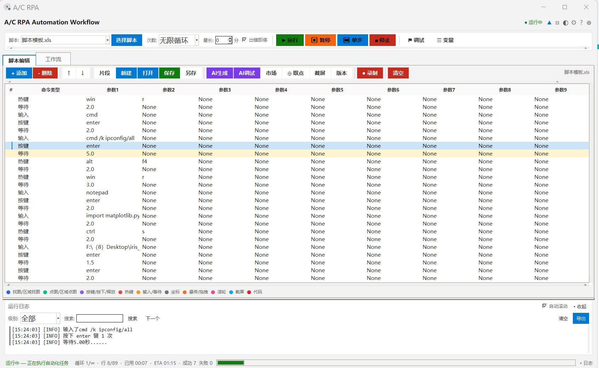
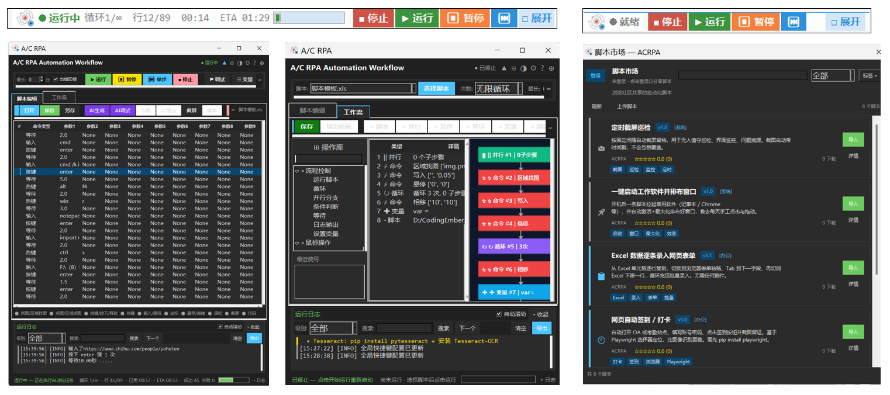
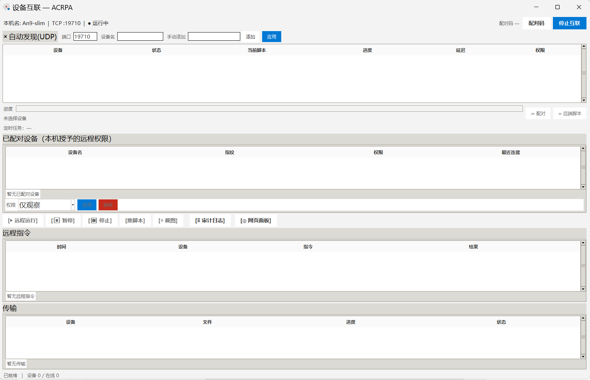
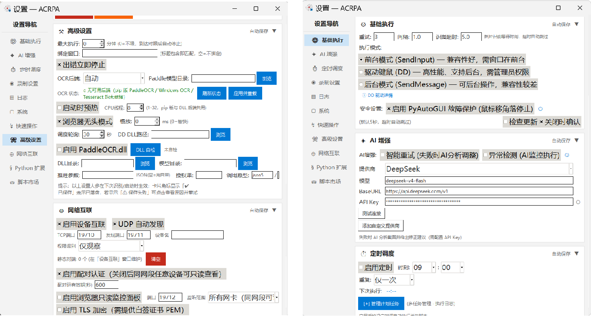
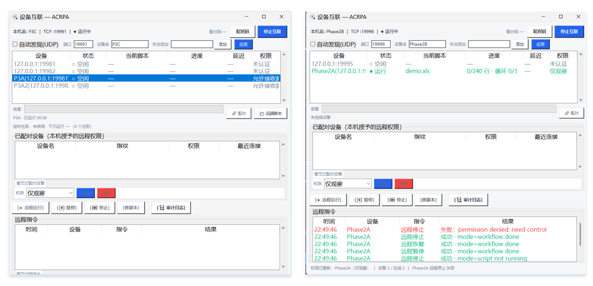

# ACRPA — 桌面自动化工作流工具

> **当前版本**：`v0.1.28-beta`（预发布 / Pre-release） · 许可证 **MIT** · 平台 **Windows x64**

把操作步骤写进一张 Excel 表格（或用「录制」跑一遍），剩下的交给电脑 —— 图像识别定位、窗口管理、OCR、浏览器自动化、工作流编排、NetLink 多机互联、定时任务与本地 AI 增强全部内置。单文件便携版，免安装，双击即用。

- 项目主页：[`index.html`](index.html) · English：[`index.en.html`](index.en.html)
- 下载：[GitHub Release](https://github.com/yohoten/acrpa/releases/tag/v0.1.28-beta) · [Gitee 发行版](https://gitee.com/yohoten/ACRPA/releases)



## 目录

- [核心特点](#features)
- [下载与校验](#download)
- [快速开始](#quickstart)
- [脚本与模板](#templates)
- [脚本市场](#market)
- [脚本格式与命令总表](#script-format)
- [配置说明](#config)
- [多设备局域网互联（NetLink）](#netlink)
- [软件更新](#update)
- [DD 驱动增强（可选）](#dd-driver)
- [常见问题](#faq)
- [合规与使用边界声明](#compliance)
- [详细文档](#docs)
- [界面截图](#screenshots)
- [更新日志](#changelog)
- [联系](#contact)
- [许可证](#license)

---

<a id="features"></a>
## ✨ 核心特点

- **轻量冷启动**：基于 Python + tkinter + pyautogui，占用小，便携版无需安装。
- **Excel 脚本驱动**：把步骤写进 `.xls` 表格即可运行，也能用「录制」自动生成。
- **图像识别定位**：全屏 / 区域找图，精度可调，支持 OpenCV 降级与 LRU 图像缓存。
- **窗口管理**：直接操作 Windows 窗口（激活 / 关闭 / 最小化 / 最大化 / 等待 / 相对坐标），无需图像识别，速度比找图快一个量级。
- **OCR 文字识别**：识别文字、等待文字、点击文字，后端可选 Paddle / WinRT / Tesseract。
- **浏览器自动化**（可选，需 `pip install playwright`）：打开网页、点击元素、填写表单、等待元素、截图、执行 JS、读写 Cookie。
- **工作流编排**：多脚本串联 + 可视化流程图（节点 / 连线 / 拖拽）+ 流程控制命令（如果 / 循环 / 跳出）。
- **变量系统**：设置变量、读取剪贴板、字符串处理、数学运算，支持复杂数据处理。
- **AI 增强**：视觉定位（AI 找图 / AI 识别界面）、智能重试、异常检测、自然语言调试。
- **调试器**：断点 / 条件断点（标记旁显示表达式）/ 单步 / 变量监视 / 调用栈。
- **录制回放**：含拖拽录制、滚轮录制、窗口激活录制，支持绝对坐标与窗口相对坐标两种模式。
- **定时执行**：多任务定时调度（一次 / 每天 / 每周），轮询间隔可配。
- **深浅主题与 Mini Bar**：深色模式、Mini Bar 三形态折叠悬浮条、界面缩放（`ui_scale`）。
- **代码扩展**：`Python` 命令执行 Python 代码（AST 预检 + 沙箱 + 三层超时 + 审计），权限分 `sandbox / trusted / full`。
- **多设备互联（NetLink）**：内网多机实时监控 + 远程操控 + 脚本分发，纯标准库实现、零新增依赖。



---

<a id="download"></a>
## ⬇️ 下载与校验

> ⚠️ **Beta 预发布（Pre-release）**：本版可能存在问题，建议先在同版本测试机上验证后再投入使用。
> `python_full_enabled`（Python full 权限）与 `netlink_tls`（TLS 加密）**默认关闭**。

| 渠道 | 链接 |
| --- | --- |
| GitHub（推荐） | [Release 页面](https://github.com/yohoten/acrpa/releases/tag/v0.1.28-beta) · 资产直链 [`ACRPA-v0.1.28-beta.exe`](https://github.com/yohoten/acrpa/releases/download/v0.1.28-beta/ACRPA-v0.1.28-beta.exe) |
| Gitee | [发行版列表页](https://gitee.com/yohoten/ACRPA/releases)（附件陆续补充，可先使用 GitHub 下载） |

**文件名与大小**：`ACRPA-v0.1.28-beta.exe` —— 14,047,384 字节（13.4 MiB / 14.05 MB），便携版，双击即用。

**SHA-256**：`473f1db3da347a1310213e4fd70955f111f0fc397eb9e1ee7f5913d2b2606d54`

校验命令：

```bat
certutil -hashfile "ACRPA-v0.1.28-beta.exe" SHA256
```

```powershell
Get-FileHash .\ACRPA-v0.1.28-beta.exe -Algorithm SHA256
```

### 本版更新摘要（v0.1.28-beta）

完整说明见 [`docs/releases/v0.1.28-beta.md`](docs/releases/v0.1.28-beta.md)。

**一、NetLink 多设备互联（新增，纯标准库零新增依赖）**

1. **实时多机监控**：设备列表 + 运行状态 + 当前脚本 + 进度（第几行 / 第几循环 / 已运行时长）+ 实时日志流 + 定时任务状态。
2. **零配置发现**：UDP 广播自动发现同网段设备；VLAN / 多网卡环境可退回「手动填 IP:端口」静态对端。
3. **配对认证与三档权限**：6 位配对码（默认 600s）+ `PBKDF2-HMAC-SHA256` 派生密钥 + `nonce/HMAC` 挑战应答，密钥存 Windows 凭据库、配对后免 PIN 重连；权限分「仅观察 / 允许操控 / 允许接收脚本」。
4. **远程操控**：运行 / 暂停 / 恢复 / 停止，脚本与工作流自动分叉；被控端首次操控弹确认框，指令串行化 + 全控制端广播回执。
5. **脚本分发与远端脚本管理**：64 KB 分块 + 结束帧 sha256 与大小双重校验，失败不留残留；支持多设备批量下发与「推完即运行」。
6. **远程截图 / 浏览器只读面板 / TLS / 审计日志**：截图 1 秒节流且不落盘；面板令牌鉴权、零写操作；TLS 自签 + TOFU 指纹固定；所有远程指令与截图请求写入审计日志。

**二、六项体验优化**

7. **Mini Bar 全面重做**：图标态 / 紧凑态 / 运行态三形态，尺寸可配、位置记忆、平滑动画；并修复「设置 → 系统」中部分设置此前不生效的问题。
8. **暗黑模式显示修复**：新增主题安全取值护栏 `themed()`，Toast 四类跟随主题，19 处输入框 / 文本域补齐 `insertbackground`。
9. **主界面互联按钮瘦身**：标题栏 `🌐 互联` → `🌐`。
10. **自定义 AI 提供商 / Python 代码扩展 / 字体缩放**：自定义 AI 提供商与 BaseURL（密钥入 Windows 凭据库）、新增 `Python` 命令（沙箱 + AST 预检 + 三层超时 + 审计）、命名字体 + `ui_scale` 7 档 + DPI 感知。

---

<a id="quickstart"></a>
## 🚀 快速开始

### 环境要求

- Windows x64（pywin32 为窗口管理功能的必需依赖）
- Python 3.8 及以上（本项目在 3.9 上开发与打包）
- 依赖见 [`requirements.txt`](requirements.txt)

### 从源码运行

```bash
# 1. 创建并激活虚拟环境
py -3.9 -m venv .venv
.venv\Scripts\activate

# 2. 安装依赖（清华镜像，可换成官方源）
pip install -r requirements.txt -i https://pypi.tuna.tsinghua.edu.cn/simple

# 3. 运行（在项目根目录执行）
python run.py
```

> `run.py` 会自动把项目根目录与 `src/` 加入 `sys.path` 并做依赖预检，无需手动 `cd src`。

**免源码方式**：从 Releases 下载 `ACRPA-v0.1.28-beta.exe`，双击直接运行，无需安装、无需 Python 环境。

### 版本管理

版本号统一由项目根目录的 [`VERSION`](VERSION) 文件驱动：首行写版本号，其后可写多条下载直链（按顺序尝试）与一行 `sha256:...` 校验和。

```bash
python tools/bump_version.py --patch        # 递增版本号（同步 VERSION 与 README 版本标记）
python tools/bump_version.py 0.1.29         # 或指定版本号
python tools/bump_version.py --verify       # 扫描 src/ 确认无旧版本号残留
```

打包版按 `EXE 同级目录 → 内嵌副本 → 项目根目录` 顺序查找 `VERSION`，因此可直接在 EXE 旁放一份 `VERSION` 来覆盖版本号或切换更新通道。

---

<a id="templates"></a>
## 📦 脚本与模板

- **内置场景模板 10 个**（应用内「模板」对话框直接选用）：登录流程、表单填写、数据采集、批量点击、页面截图、文件下载、窗口切换、文本编辑、滚动浏览、右键菜单。
- **`template/` 目录示例脚本 5 个 + 工作流 1 个**：`脚本模板.xls`、`发送邮件.xls`、`数据采集.xls`、`网银票载.xls`、`间隔点击.xls`、`workflow001.json`。

> ⚖️ **受监管场景模板声明**：`template/网银票载.xls` 一类面向金融机构 / 票据业务的模板，
> **仅限持牌金融机构授权员工在受控内网 / 授权范围内使用**；使用者应自行确保业务合规与相应授权。
> 详见 [`README.md`](README.md#compliance) 的「合规与使用边界声明」。



### 上手四步

1. **选择模板**：从 `template/` 目录或应用内模板对话框挑一个最接近的脚本。
2. **导入脚本**：菜单「文件 → 导入脚本」，选择 `.xls` 文件。
3. **修改参数**：按实际需求调整窗口标题、坐标、输入内容等。
4. **测试运行**：点击「运行」（或按 <kbd>F5</kbd>）查看效果。

---

<a id="market"></a>
## 🛒 脚本市场

市场支持在应用内**浏览 / 搜索 / 按分类与标签筛选**社区脚本，并**一键安装**到脚本编辑器；
上传投稿需先用 **GitHub / Gitee 个人访问令牌（PAT）** 登录（令牌仅存 **Windows 凭据库**，不落 `config.json`），
再经 **5 步上传向导**打包为 `.acrpapkg`（或旧单文件 `.xls`）并发起 PR。

- 完整操作指引（浏览 / 安装 / 登录 / 上传 / `.acrpapkg` 包格式 / 常见问题）：[`docs/marketplace-v2-使用说明.md`](docs/marketplace-v2-使用说明.md)
- 市场仓库（Gitee，客户端后端）：<https://gitee.com/yohoten/acrpa-marketplace>
- 设计文档：[`docs/marketplace-v2-design.md`](docs/marketplace-v2-design.md)

---

<a id="script-format"></a>
## 📄 脚本格式与命令总表

脚本为 Excel 文件（`.xls`，**不支持 `.xlsx`**）：第 1 行为标题，第 3 行起为命令。

| 列 | 字段 | 说明 |
| --- | --- | --- |
| A | 命令 | 操作类型（找图、按键、等待等） |
| B | 参数 1 | 主要参数（图片名、键名、秒数等） |
| C ~ G | 参数 2 ~ 6 | 辅助参数（精度、坐标、区域等） |

### 基础命令

| 命令 | 参数 | 说明 |
| --- | --- | --- |
| 找图 | `button.png, 0.96` | 全屏查找图片并悬停 |
| 区域找图 | `icon.png, 0.8, 100, 100, 500, 500, 灰度` | 限定区域查找（更快） |
| 点图 | `submit.png, 0.96` | 找到图片并点击 |
| 区域点图 | `icon.png, 0.9, 左, 上, 宽, 高, 灰度, 按键, 次数` | 限定区域找图并点击 |
| 按键 | `enter, 1` | 模拟键盘按键（可指定次数） |
| 热键 | `ctrl, c` | 组合键 |
| 输入 | `Hello World` | 剪贴板方式输入（Ctrl+V） |
| 写入 | `Hello, 0.05, auto` | 逐字输入，模式 `auto/direct/simulate` |
| 等待 | `2.5` | 延时（秒，支持随机范围 `1.0-3.0`） |
| 坐标 | `500, 300` | 点击屏幕坐标 |
| 悬停 | `500, 300` | 鼠标移动到坐标 |
| 拖拽 | `600, 400` | 鼠标拖拽到坐标 |
| 滚轮 | `-3` | 滚动（负=下，正=上） |
| 相移 | `10, -5` | 相对当前位置移动 |
| 按下 / 释放 | `shift` | 按下 / 释放按键不松开 |
| 复制 / 粘贴 | 无参数 | `Ctrl+A, Ctrl+C` / `Ctrl+A, Ctrl+V` |
| 截屏 | `shot1, 保存路径` | 截图并保存 |
| 代码 | `myscript` | 执行 `.txt` 中的 Python 代码（文件名不含后缀）；走 `py_sandbox`（AST 预检 + 超时 + 审计，失败返回 `False`） |

### 流程控制

| 命令 | 参数 | 说明 |
| --- | --- | --- |
| 如果 | `条件表达式` | 条件判断，为真则执行 |
| 否则 | 无参数 | 否则分支 |
| 结束如果 | 无参数 | 结束条件块 |
| 循环开始 | `次数` 或 `条件表达式` | 开始循环 |
| 循环结束 | 无参数 | 结束当前循环 |
| 跳出循环 | 无参数 | 立即跳出循环 |

### 窗口管理

| 命令 | 参数 | 说明 |
| --- | --- | --- |
| 激活窗口 | `记事本` | 激活指定窗口（支持模糊匹配） |
| 关闭窗口 | `无标题 - 记事本` | 关闭指定窗口 |
| 最小化窗口 | `计算器` | 最小化到任务栏 |
| 最大化窗口 | `资源管理器` | 最大化窗口 |
| 获取窗口位置 | `记事本, x, y, w, h` | 窗口坐标与大小存入变量 |
| 等待窗口 | `Chrome, 10, 存在` | 等待窗口出现 / 消失 |
| 窗口坐标 | `记事本, 100, 50` | 相对窗口左上角点击（窗口移动后仍准确） |

### 变量操作

| 命令 | 参数 | 说明 |
| --- | --- | --- |
| 设置变量 | `count, 100` | 设置变量值 |
| 读取剪贴板 | `clip_text` | 剪贴板内容读入变量 |
| 字符串处理 | `text, 截取, 0,5, result` | 截取 / 替换字符串 |
| 数学运算 | `a + b, result` | 执行数学计算并存入变量 |

### OCR 文字识别

| 命令 | 参数 | 说明 |
| --- | --- | --- |
| 识别文字 | `左, 上, 宽, 高, 变量名` | OCR 识别屏幕区域文字并存入变量 |
| 等待文字 | `提交成功, 10, 存在, 左, 上, 宽, 高` | 等待指定文字出现 / 消失 |
| 点击文字 | `提交成功, 0.9, 左, 左, 上, 宽, 高` | 找到文字位置并点击 |

### AI 增强

| 命令 | 参数 | 说明 |
| --- | --- | --- |
| AI找图 | `登录按钮, 0.8, click` | AI 分析截屏，自然语言描述找元素 |
| AI识别界面 | `ui` | AI 列出所有 UI 元素存入变量 |
| AI优化建议 | `log` | AI 分析执行数据给出优化建议 |

> 另有应用内 **[AI] 调试** 入口：自然语言提问，AI 分析日志作答。

### 工作流与代码扩展

| 命令 | 参数 | 说明 |
| --- | --- | --- |
| 运行工作流 | `workflow.json` | 调用工作流文件执行多脚本编排 |
| 工作流变量 | `var_name, value` | 设置工作流级共享变量 |
| Python | `result = 1 + 1, sandbox` | 执行 Python 代码（AST 预检 + 沙箱），权限可选 `sandbox/trusted/full` |

### 浏览器自动化（可选，需 `pip install playwright`）

> 定位统一支持 DSL（`css:` / `xpath:` / `text:` / `tag:` / `role:` / `label:` / `placeholder:` / `testid:` / `@attr` / `@@` 组合）、**链式 / 相对定位**（`A >> B` 逐级收窄；步骤 `nth:` / `first:` / `last:` / `parent:` / `next:` / `prev:` / `child:` / `filter:` / `has:`）与原生 CSS / `text=`；
> `${变量}` 在部分浏览器命令中生效，结果写回 `engine.variables`（详见下文「变量引用」）。
> 完整语法、状态表、失败短语与用法见 [`docs/浏览器使用说明.md`](docs/浏览器使用说明.md) 与 [`docs/浏览器后端增强设计.md`](docs/浏览器后端增强设计.md)。

| 命令 | 参数 | 说明 |
| --- | --- | --- |
| 打开网页 | `https://example.com` | 浏览器打开指定 URL（支持 `${变量}`） |
| 浏览器点击 | `#submit` / `text=登录` / `role:button[name=登录]` | 点击页面元素（支持定位 DSL） |
| 浏览器输入 | `#user, admin` 或 `#user, ${kw}` | 在输入框填入文本（支持 `${变量}`） |
| 等待元素 | `#loading, 10, 消失` | 等待元素 / 页面状态：出现 / 消失 / 存在 / 移除 / 可点击 / 可用 / url变动 / 标题变动（第 3 参数缺省 = 出现，`消失` → hidden） |
| 浏览器截图 | `shot1, page` / `shot1, 整页` / `h1, tag:h1, D:\shot\a.png, shot_path` | 视口 / 整页 / 元素截图，可指定保存路径并把路径写回变量 |
| 浏览器执行JS（别名 执行JS） | `document.title, page_title, 是` | 在当前页执行 JS，返回值写回变量（`是/否` 表示是否按表达式包裹） |
| 浏览器读取Cookie | `cookie_json, json, D:\out\cookies.json` | 导出上下文 Cookie（`json` / `header` / `netscape`）到变量或文件 |
| 浏览器设置Cookie | `cookie_json` 或 `D:\in\cookies.json, .example.com` | 从变量或文件注入 Cookie，可指定兜底域名 |
| 切换框架 | `#pay` / `2` / `main` | 进入 iframe（DSL 定位 / 第 N 个 / `main`/`主文档` 回顶层） |
| 返回主框架 | 无参数 | 回到顶层 frame（等价 `切换框架, main`） |
| 新建标签页 | `https://example.com/report`（可空） | 新建标签页并切换为活动页，刷新 `browser_url`/`browser_title` |
| 切换标签页 | `0` / `报表` / `example.com` | 按序号（0 基）/ 标题 / URL 包含匹配切换活动标签页 |
| 关闭标签页 | 无参数 / `1` | 关闭当前或指定序号标签页（关活动页自动回退到剩余页） |
| 等待下载 | `D:\out, 报表, 30, dl_path` | 等待下载完成并保存，绝对路径写回变量（缺省 `浏览器下载路径`） |
| 浏览器上传 | `tag:input@type=file, D:\a.pdf, D:\b.pdf` | 对 `input[type=file]` 设置本地文件（多文件，路径支持 `${变量}`） |
| 连接已开浏览器（别名 接管浏览器） | `http://127.0.0.1:9222`（可空=用配置） | 通过 CDP 接管已开 Chrome/Edge（需 `--remote-debugging-port` 启动） |
| 开始监听 | `/api/login, xhr`（可空） | 监听网络响应入队（抓包），URL 包含 / `/正则/`，资源类型过滤 |
| 等待数据包 | `/api/token, 1, 20, token_json` | 等待并取回命中数据包，JSON 列表写回变量或落盘 |
| 停止监听 | 无参数 | 停止监听并清空队列（幂等） |
| 启动浏览器录制 | 无参数 | 调用 playwright codegen 并把结果转为 DSL 追加（需 playwright CLI） |

> 新增配置项（`config.json`，默认值均不改变既有行为）：`browser_wait_timeout`、`browser_poll_interval`、
> `browser_full_page_screenshot`、`browser_js_timeout`、`browser_retry`、`browser_retry_interval`、`browser_silent`；
> P1/P2 补充：`browser_download_dir`、`browser_download_timeout`、`browser_download_overwrite`、`browser_screenshot_dir`、
> `browser_cdp_endpoint`、`browser_listen_max`、`browser_listen_default_timeout`、`browser_user_agent`。

### 变量引用

使用 `${variable_name}` 引用变量。**注意：桌面端（`src/engine.py`）的替换只在以下三处生效**：

1. `如果` / `循环开始` 的**条件表达式**
2. `数学运算` 的**表达式**
3. `浏览器输入` 的**文本**

> 另有：**浏览器命令**在 [`browser_backend.py`](src/browser_backend.py) 内自行解析 `${变量}`
> （`打开网页` 网址、`浏览器输入` 文本、`浏览器截图` 与 `浏览器读取Cookie` 的保存路径、`浏览器设置Cookie` 的来源），
> 并把结果写回 `engine.variables`：目标变量名；`打开网页` 另写 `browser_url` / `browser_title`；
> `浏览器截图` 默认写 `浏览器截图路径`；任意浏览器命令失败写 `browser_last_error` / `browser_last_message`。

```text
如果        ${count} > 10            # ✅ 条件表达式
数学运算     ${index} + 1, index      # ✅ 表达式
浏览器输入   #keyword, ${kw}          # ✅ 浏览器输入
输入        ${username}              # ❌ 不会替换，会原样粘贴出 "${username}"
```

也就是说，桌面端 `输入` / `写入` 命令**无法**直接输出变量内容；需要把变量值发到桌面应用时，请改用 `浏览器输入`，或设计成不含变量的步骤。

---

<a id="config"></a>
## ⚙️ 配置说明

配置文件为程序目录下的 `config.json`（首次运行自动生成）。以下默认值取自 `src/state.py` 的配置 schema：

```json
{
  "dark_mode": false,             // 深色模式
  "retry_max": 3,                 // 命令失败最大重试次数
  "retry_interval": 1.0,          // 重试间隔（秒）
  "image_timeout": 5.0,           // 图像查找超时（秒）
  "stop_on_error": true,          // 出错时立即停止
  "api_key": "",                  // AI 密钥，例如 sk-xxxxxx
  "api_model": "deepseek-v4-flash",
  "ai_smart_retry": false,        // AI 智能重试（需 API Key）
  "ai_anomaly_detect": false,     // AI 异常检测（需 API Key）
  "minimize_to_tray": false,      // 关闭时最小化到系统托盘
  "mini_bar_enabled": true        // 启用 Mini Bar 折叠模式
}
```



### 常用配置项

| 键 | 默认值 | 含义 |
| --- | --- | --- |
| `dark_mode` | `false` | 深色模式 |
| `retry_max` | `3` | 命令失败最大重试次数 |
| `retry_interval` | `1.0` | 重试间隔（秒） |
| `image_timeout` | `5.0` | 图像查找超时（秒） |
| `stop_on_error` | `true` | 脚本出错时立即停止 |
| `max_execution_minutes` | `0` | 最长执行时间（分钟，0 = 不限） |
| `bound_window_title` | `""` | 全局绑定窗口标题（空 = 不绑定） |
| `failsafe` | `true` | 鼠标移到屏幕左上角急停 |
| `input_mode` | `"sendinput"` | 输入模式 `sendinput` / `dd` / `sendmessage` |
| `use_dd_driver` | `false` | 启用 DD 驱动（需自备 DLL，见下文） |
| `api_key` / `api_model` | `""` / `"deepseek-v4-flash"` | AI 密钥与模型 |
| `ai_smart_retry` / `ai_anomaly_detect` | `false` | AI 智能重试 / 异常检测 |
| `sched_enabled` / `sched_poll_interval` | `false` / `30` | 定时调度开关与轮询间隔（秒） |
| `log_level` | `1` | 日志级别 `0=DEBUG 1=INFO 2=WARNING 3=ERROR` |
| `log_retention_days` | `7` | 日志保留天数 |
| `recording_mode` | `"absolute"` | 录制模式 `absolute`（绝对坐标）/ `relative`（窗口相对） |
| `ocr_preferred_backend` | `"auto"` | OCR 后端 `auto` / `paddle` / `winrt` / `tesseract` |
| `browser_headless` | `true` | 浏览器无头模式 |
| `minimize_to_tray` | `false` | 关闭时最小化到系统托盘 |
| `mini_bar_enabled` / `mini_bar_width` / `mini_bar_opacity` | `true` / `430` / `80` | Mini Bar 开关、宽度（px）、透明度（%） |

### NetLink 配置项

| 键 | 默认值 | 含义 |
| --- | --- | --- |
| `netlink_enabled` | `false` | 启用设备互联 |
| `netlink_port` | `19710` | TCP 监听端口 |
| `netlink_device_name` | `""` | 本机显示名（空 = 取主机名） |
| `netlink_perm_level` | `"observe"` | 权限档 `observe` / `control` / `script` |
| `netlink_autodiscover` | `true` | UDP 自动发现开关 |
| `netlink_discovery_port` | `19711` | UDP 发现端口 |
| `netlink_static_peers` | `[]` | 手动填写的静态对端 `IP:PORT` |
| `netlink_require_auth` | `true` | 启用配对认证 |
| `netlink_pin_ttl` | `600` | 配对码有效期（秒） |
| `netlink_confirm_control` | `true` | 首次远程操控需被控端确认 |
| `netlink_script_dir` | `""` | 允许远程运行的脚本目录（空 = 程序目录 `scripts/`） |
| `netlink_audit_days` | `0` | 审计日志保留天数（0 = 跟随日志保留天数） |
| `netlink_web_enabled` | `false` | 启用浏览器只读面板 |
| `netlink_web_port` | `19712` | 面板监听端口 |
| `netlink_web_bind` | `"0.0.0.0"` | 面板监听地址 |
| `netlink_tls` | `false` | TLS 加密（默认关闭） |
| `netlink_tls_cert` / `netlink_tls_key` | `""` | TLS 证书 / 私钥 PEM 路径 |
| `netlink_tls_pins` | `[]` | 已固定的对端证书指纹（`sha256` hex，TOFU） |

### v0.1.28 新增配置项（10 项）

| 键 | 默认值 | 含义 |
| --- | --- | --- |
| `mini_bar_height` | `28` | Mini Bar 高度 24–48（步进 4） |
| `mini_bar_pos` | `""` | Mini Bar 最近位置 `"x+y"` |
| `ai_provider` | `""` | AI 提供商 id（空 = 自动推断） |
| `ai_base_url` | `""` | AI BaseURL（空 = 用预设） |
| `ai_model` | `""` | 覆盖模型名（空 = 用 `api_model`） |
| `ai_custom_providers` | `[]` | 自定义提供商 `[{id, name, base_url, models}]` |
| `python_default_perm` | `"sandbox"` | Python 命令默认权限 `sandbox` / `trusted` / `full` |
| `python_full_enabled` | `false` | 是否允许 `full` 权限（默认关闭） |
| `python_timeout` | `30` | Python 代码超时（秒） |
| `ui_scale` | `1.0` | 界面缩放 0.8–1.5 |

> 另：**P0 安全修复批次**新增开关 `legacy_code_command`（默认 `false`）：置 `true` 时
> `代码` 命令回退旧的 `exec` 行为且**失去全部安全护栏**，仅作临时过渡、建议尽快移除；
> 详见 [Python 代码扩展使用说明](docs/python扩展使用说明.md) §12。

---

<a id="netlink"></a>
## 🌐 多设备局域网互联（NetLink）

> 已随 v0.1.28-beta 提供独立 EXE 下载（见上文「下载与校验」）。定位：内网多机协同 —— 一台机器即可监控多台机器的运行状态，远程运行 / 暂停 / 停止，批量下发脚本，手机浏览器也能查看进度。

完全基于 Python 标准库实现，**零新增依赖**，PyInstaller 打包体积几乎不变。

### 功能矩阵（三档权限）

| 能力 | 说明 | 最低权限 |
| --- | --- | --- |
| 多机实时监控 | 设备列表 + 运行状态 + 当前脚本 + 进度（第几行 / 第几循环 / 已运行时长）+ 实时日志流 + 定时任务状态 | 仅观察 |
| 零配置发现 | UDP 广播自动发现同网段设备；VLAN / 多网卡环境可退回「手动填 IP:端口」静态对端 | 仅观察 |
| 配对认证 | 被控端生成 6 位配对码（默认有效期 600s）；控制端输入即可配对；PIN 不上网，走 `PBKDF2-HMAC-SHA256` 派生密钥 + `nonce/HMAC` 挑战应答；连续 5 次错误锁定连接；密钥存 Windows 凭据库（不写 `config.json`）；配对后免 PIN 重连 | — |
| 远程操控 | 运行 / 暂停 / 恢复 / 停止；**被控端首次操控弹确认框**（可「允许并记住此设备」）；**自动区分脚本与会话**（脚本走 `pause_event`、工作流走 `WorkflowEngine._pause_event`，已分叉）；指令串行化 + 全控制端广播回执 | 允许操控 |
| 审计日志 | 所有远程指令与截图请求写入 `logs/netlink_audit_YYYYMMDD.log`（谁 / 何时 / 什么 / 结果），可按天数自动清理 | 允许操控 |
| 脚本分发 | 把本地 `.xls/.xlsx/.json`（单文件上限 32 MB）推送到被控端 `<脚本目录>/received/`；64 KB 分块 + 逐块序号 + 结束帧 sha256 与大小双重校验；失败不留残留文件；支持**多设备批量下发**；可「推完即运行」 | 允许接收脚本 |
| 远端脚本管理 | 查看被控端脚本清单（区分「脚本目录 / 已接收」）并直接远程运行 | 允许接收脚本 |
| 远程截图 | 抓取被控端屏幕缩略图（默认 640 宽、质量 60；上限 1280 宽 / 质量 80），1 秒节流，图像只在内存编码传输不落盘 | 允许操控 |
| 浏览器只读面板 | 内置 `http.server` 单页面板（默认端口 19712，**默认关闭**），手机 / 平板浏览器可直接看多机进度与日志；令牌鉴权（查询串 / Cookie / `Authorization: Bearer` 三形式）；**面板零写操作** | — |
| TLS 可选加密 | 基于 stdlib `ssl` 的自签证书加密通道（需自备 PEM），对端证书 `sha256` 指纹 **TOFU 固定**，指纹不符直接拒连；**默认关闭** | — |

三档权限：**仅观察** / **允许操控** / **允许接收脚本**。



### 设计要点

- **对等架构**：不设独立服务器，每个 ACRPA 实例内嵌一个节点，同时具备 Server（被连）与 Client（主动连）角色，同一条 TCP 连接全双工对等。
- **零新增依赖**：纯标准库（`socket` / `threading` / `ssl` / `hashlib` / `hmac` / `http.server` 等），PyInstaller 体积几乎不变。
- **不侵入执行引擎**：`engine.py / workflow.py / scheduler.py` 三文件**零改动**；通过既有的 `state` 状态量（`quit2` / `pause_event` / `exec_state`）与 `root.after` 回到主线程执行。
- **崩溃隔离**：所有网络线程为 daemon，网络层异常不影响本地自动化；日志镜像通过 `utils` 的 sink 机制，总线未启动时零开销。

### 快速上手

1. 两台同网段 Windows 机器各装 ACRPA，分别在 **设置 → 网络互联** 里勾选「启用设备互联」，填写不同的设备名（端口保持默认）。
2. 被控端把权限设为「允许操控」（需要传脚本则设为「允许接收脚本」）。
3. 在设备互联窗口（主界面 **🌐** 按钮）里，被控端点「配对码」查看 6 位码；控制端点「🔗 配对」输入该码。
4. 配对成功后设备表会自动出现对方并实时刷新进度与日志（无需任何手工订阅）。
5. 选中设备即可使用 `▶ 远程运行 / ⏸ 暂停 / ⏹ 停止 / 推脚本 / 📂 远端脚本 / 📷 截图`；被控端首次会弹确认框。

---

<a id="update"></a>
## ⇪ 软件更新

程序启动 3 秒后自动检查新版本（可在「设置 → 系统」中关闭）。发现新版本时状态栏显示「新版本 vX.Y.Z 可用 — 点击更新」，点击进入更新窗口：

1. **检查** —— 依次尝试 GitHub Releases API → 纯文本清单镜像（raw.githubusercontent → jsDelivr → Gitee）。两个关键设计：
   - **不会因单个来源不可达就定论**：旧实现只有一个 Gitee 地址，一旦不可达就把异常吞成「已是最新」。现在会明确区分「无更新 / 网络故障 / 清单损坏」，且某个来源报出的版本不比本机新时不会立刻收工，而是继续探测其余来源取版本最高者 —— 避免某个镜像缓存落后（实测 jsDelivr 的分支别名、Gitee 镜像都会滞后）把真实的新版本静默吞掉。
   - **传输双栈**：`requests` 因证书校验失败时自动改用系统证书库重试。在启用 TLS 拦截的企业网络里，`requests` 自带的 certifi 验不过代理自签证书，而系统证书库可以 —— 只走 `requests` 会让两个权威来源永久不可达，只剩会缓存旧版本的镜像可用。
2. **下载** —— 按候选直链逐个尝试（清单声明的直链 → Release 约定推导 → 仓库内 `dist/` 副本），显示进度与体积；落盘后校验 sha256（清单提供时）、体积与 ZIP/EXE 容器格式，拒绝 HTML 错误页与半截包，并**复核包内 `VERSION`** —— 镜像返回旧包时自动换源，而不是装错版本。Release 约定推导同时覆盖 `v0.1.26` 与 `v0.1.26.0` 两种 tag 写法，避免因 tag 约定不一致 404。
3. **更新** —— 便携版可直接「🚀 立即重启更新」：程序退出 → 校验包内版本号 → 以 `.new` 中转原子替换主程序与 `VERSION` → 自动重启。**只替换主程序，配置、脚本、模板、日志一律不动。**

手动入口：「设置 → 快速操作 → 关于 ACRPA → ⇪ 检查更新」。更新包保存在程序目录的 `updates/` 下（保留最近一个，其余自动清理）。

**版本号来源**：项目根目录 `VERSION` 文件 —— 首行是版本号，其后可写多条下载直链（按顺序尝试）与一行 `sha256:...` 校验和。打包版按 `EXE 同级目录 → 内嵌副本 → 项目根目录` 顺序查找，因此可直接在 EXE 旁放一份 `VERSION` 来覆盖版本号或切换更新通道。

> 仓库内 `dist/ACRPA.zip` 是唯一**不带版本信息**的兜底通道，历史发布包甚至没有包内 `VERSION` 可供复核。因此它只在 `VERSION` 配置了 `sha256` 时才被使用 —— 否则宁可报错也不会静默装上旧包。建议发版时用 `--write-sha256` 把校验和写进 `VERSION`。
>
> 注意区分两份 `VERSION`：**项目根目录**那份带 `sha256` 行，是给客户端读的清单；**发布包内**那份只保留版本号与直链 —— 校验和描述的是包本身，写进被校验的产物里必然自相矛盾（写进去哈希就变了），因此发版工具在打包时会把它剔除。

**发版流程**：

```bash
python tools/bump_version.py --patch              # 1. 递增版本号（同步 VERSION + README 标记）
python build.py --clean                            # 2. 打包
python tools/make_release.py --write-sha256        # 3. 生成 dist/ACRPA.zip + 校验和 + 回填 VERSION + Release 说明
python tools/publish_release.py --exe              # 4. 建草稿 Release → 上传附件 → 发布（一条命令）
python tools/make_release.py --no-zip --purge-cdn main   # 5. 清 CDN 缓存
```

> **第 4 步为什么必须走工具**：本仓库启用了 release 不可变，已发布的 Release 既不能改正文也不能再加附件（直接 POST 附件会得到 `422 Cannot upload assets to an immutable release.`），因此顺序必须是「建草稿 → 上传 → 发布」。另外，**一个 tag 一旦被某个已发布的 Release 占用过就不可复用** —— 即便那个 Release 已被删除，重新发布仍会报 `tag_name was used by an immutable release`。届时需换 tag（常见做法是在版本号后补第四段，如 `v0.1.26.0`）并同步改 `VERSION` 的直链；工具的 tag 正是从直链推导的，改直链即改 tag，不会再撞车。

发布时需注意三点（均由实测踩坑得出）：

1. **Release tag 必须与 `VERSION` 声明的直链一致**。客户端优先走 Releases API 并直接采用 API 返回的直链与体积，因此只要 tag 与正文对得上就不会出错。tag 由 `publish_release.py` 从直链自动推导，不要手工按 `v<版本号>` 拼。
2. **Gitee 镜像需单独 push**，本地 `origin` 指向 Gitee 而推送目标常是 `github`，两者是两个仓库。实测 Gitee 的 raw 路径对 `dist/` 下的大文件返回 403，故仅作最后兜底。
3. **jsDelivr 会缓存分支别名**：推送新 `VERSION` 后实测仍持续返回旧版本号（按提交哈希访问才即时生效，但客户端无从预知哈希）。因此发版后要执行第 5 步清缓存，否则只能走 jsDelivr 的网络会被这份落后的清单告知「已是最新」。

---

<a id="dd-driver"></a>
## 🆕 DD 驱动增强（可选）

ACRPA 自 v0.1.22 起支持 **DD 驱动**作为高性能输入后端：

**优势**

- ✅ 内核级模拟、后台低干扰输入，失败可回退到 PyAutoGUI；
- ✅ 后台操作，无需激活窗口，输入速度提升。

**快速启用**

1. 从 [官方仓库](https://github.com/ddxoft/master) 下载 `dd.54900.dll`；
2. 放入 `lib/dd_driver/` 目录；
3. 在 `config.json` 中设置 `"use_dd_driver": true`；
4. 以管理员身份运行程序。

> 📦 **关于 DD DLL 再分发（说明 / 建议）**：仓库内 [`lib/dd_driver/dd63330.dll`](lib/dd_driver/dd63330.dll) 的**再分发需遵守其原始许可**，
> 本仓库不对其授权方式作任何变更或授予；**建议使用者自行获取并放置**符合许可的 DLL。
> 本说明仅记录现状与建议，不构成本任务对任何文件的删除或变更。

**Excel 示例**

```
写入,Hello World,0.02,direct    # 使用 DD_str 直接输入（最快）
写入,你好世界,0.05,simulate     # 模拟按键（支持中文）
写入,Test@#$%,0.02,auto         # 自动选择最佳方式
```

---

<a id="faq"></a>
## ❓ 常见问题

**找不到图片？**

- 检查图片路径、识别精度（建议 0.8 ~ 0.95）、目标窗口是否置前。

**图像识别慢？**

- **优先使用窗口管理命令**代替图像识别，速度快 10–100 倍；
- 使用区域找图缩小范围、降低精度、减小图片尺寸。

**脚本格式错误？**

- 必须使用 `.xls` 格式（不支持 `.xlsx`），可用 Excel「另存为」转换。

**录制不准确？**

- 录制前关闭无关窗口，操作速度平稳，完成后手动修正脚本。

**窗口管理功能不可用？**

- 确保已安装 pywin32：`pip install pywin32`；
- 以管理员身份运行 ACRPA 可获得更好效果。

**AI 功能不可用？**

- 在「设置 → AI 增强」填写 `api_key`（或选择自定义提供商与 BaseURL）；密钥存入 Windows 凭据库，不写进 `config.json`。

**NetLink 搜不到设备？**

- 确认两端都在同一网段且已勾选「启用设备互联」；
- VLAN / 多网卡环境请在「静态对端」里手动填写 `IP:端口`；
- 检查 Windows 防火墙是否放行 TCP `19710` 与 UDP `19711`。

---

<a id="docs"></a>
## 📚 详细文档

**入门**

- [使用说明](使用说明.txt)
- [脚本模板](template/脚本模板.xls)

**NetLink 多设备互联**

- [总览与部署指南](docs/netlink-总览与部署指南.md)
- [配对与权限说明](docs/netlink-配对与权限说明.md)
- [远程操控使用说明](docs/netlink-远程操控使用说明.md)
- [脚本分发使用说明](docs/netlink-脚本分发使用说明.md)
- [远程截图说明](docs/netlink-远程截图说明.md)
- [网页只读面板说明](docs/netlink-网页只读面板说明.md)
- [TLS 加密说明](docs/netlink-TLS加密说明.md)

**扩展与其他**

- [Python 代码扩展使用说明](docs/python扩展使用说明.md)
- [版本发布说明](docs/releases/v0.1.28-beta.md)

**脚本市场**

- [使用说明（浏览 / 安装 / 登录 / 上传 / 包格式）](docs/marketplace-v2-使用说明.md)
- 市场仓库（Gitee，客户端后端）：<https://gitee.com/yohoten/acrpa-marketplace> —— 索引 `index.json` + `scripts/*.xls` + `packages/*.acrpapkg`
- 投稿手册（仓库位置与分支、index.json 字段、xls 格式、上传流程、自检清单）：见该仓库 `README.md`
- 客户端代码：`src/marketplace.py`（`MARKETPLACE_REPO` / `MARKETPLACE_INDEX`，固定读取 **master** 分支的 raw 文件）

---

<a id="screenshots"></a>
## 🖼 界面截图

| 文件 | 画面 |
| --- | --- |
| `img/image1.png` | 脚本编辑界面 |
| `img/image2.png` | 执行编辑界面 |
| `img/image3.png` | 工作流可视化编排 |
| `img/image4.png` | 设置页导航 |
| `img/image5.png` | 深色模式界面 |
| `img/netlink-devices.png` | 设备互联窗口：设备列表 + 运行状态 + 当前脚本 + 进度 + 实时日志流 |
| `img/netlink-pairing.png` | 配对流程：被控端配对码弹窗 + 控制端配对输入 + 首次操控确认框 |
| `img/netlink-webui.png` | 浏览器只读面板：多机进度卡片 + 日志流 |

---

<a id="changelog"></a>
## 🗒️ 更新日志

- **v0.1.28-beta**（2026-10-01）**Beta 预发布** —— 新增 **NetLink 多设备互联**（内网多机实时监控 + 零配置 UDP 发现 + 6 位配对码与 `PBKDF2-HMAC-SHA256` 挑战应答 + 三档权限 + 远程运行 / 暂停 / 恢复 / 停止 + 脚本分发与远端脚本管理 + 远程截图 + 浏览器只读面板 + TLS 可选加密 + 审计日志，纯标准库零新增依赖），并落地 **六项体验优化**（Mini Bar 三形态重做、暗黑模式显示修复、互联按钮瘦身、自定义 AI 提供商 / 模型 / BaseURL、Python 代码扩展、字体与显示缩放）。本版为预发布，可能存在问题，建议先在同版本测试机验证；`python_full_enabled` 与 `netlink_tls` 默认关闭。独立 EXE 已在 GitHub Release 提供下载（`ACRPA-v0.1.28-beta.exe`，14,047,384 字节）。完整说明见 [`docs/releases/v0.1.28-beta.md`](docs/releases/v0.1.28-beta.md)。

- **v0.1.27**（2026-09-13）以 v0.1.25 为基线重建，修复 v0.1.26 的不稳定接线 —— 在 v0.1.25 稳定基线上分组重放 v0.1.26 的改进并逐个验证，同时修正 v0.1.26 的两处接线缺陷：`_update_pending` 全局缺失，导致 `_periodic` 每 100 ms 抛 `NameError`、状态栏与执行进度刷新链路中断；`show_update_dialog` 未导入，导致点击状态栏触发 `NameError`、更新入口失效。保留 v0.1.26 的全部优点：更新机制重构（GitHub Releases API 多源降级、完整语义化版本比较、sha256 与体积 / 容器校验、便携版一键重启自更新、打包版版本号来源修复）、engine 命令失败语义与工作流错误传播（`stop_on_error` / 重试 / 并行失败）、发布工具链（`tools/make_release.py`、`tools/publish_release.py`、`bump_version.py`）、`res/` 等构建资源纳管与文档。另将运行时产物 `recent.json` / `recent_workflow.json` 加入忽略。

- **v0.1.26**（2026-09-13）更新机制重构 —— 修复打包后版本号失真（EXE 此前只查项目根目录，冻结后必然回退到内置值，永远自报 v0.1.24，导致更新判断与「关于」页面全部失真）；检查环节改为多源降级（GitHub Releases API → raw / jsDelivr / Gitee 清单镜像）；版本比较改为完整语义化实现，支持 `v` 前缀、位数不齐与预发布后缀（此前 `0.1.26-beta` 会因 `int()` 抛错被静默判为无更新）；检查结果结构化，明确区分无更新 / 网络故障 / 清单损坏，不再把网络异常伪装成「已是最新」；某来源报出的版本不比本机新时继续探测其余来源取最高者，避免镜像缓存落后把真实新版本静默吞掉；传输改为 requests → 系统证书库双栈，修复企业 TLS 拦截环境下两个权威来源永久不可达；下载支持多候选直链逐个重试、流式进度、sha256 与体积 / 容器格式校验，并复核包内 `VERSION`、兼容四段 tag 写法；无 sha256 时不再使用不带版本信息的 `dist/` 兜底通道，避免静默装上旧包；新增便携版一键重启自更新（只替换主程序与 `VERSION`，不触碰用户数据）；新增 `tools/make_release.py` 发版助手（含 CDN 缓存清理）与 `tools/publish_release.py` 发布助手（草稿 → 上传 → 发布三段式，适配本仓库 release 不可变；tag 由 `VERSION` 直链推导，避免复用被占用过的 tag），`bump_version.py` 现同步 README 版本标记。另修复 `engine` 命令失败静默成功、`stop_on_error` 与重试失效问题。详见 [`docs/releases/v0.1.26.md`](docs/releases/v0.1.26.md)。

- **v0.1.25**（2026-08-10）工作流 Tab 深度定制（操作库分类树 + 搜索 + 最近使用、command / variable / loop / log 新节点、统一配置表单、右键复制 / 粘贴 / 禁用 / 注释、外层循环次数与最长执行时间控制、执行高亮、变量管理）；工作流引擎支持新节点及 `enabled` / `comment` 跳过；设置页导航与快捷键列表优化；版本号全局统一管理（`bump_version.py`）；README / 使用说明在线优先打开；修复启动崩溃 / 最近使用失效 / 内联编辑 popdown 崩溃 / 找图 OpenCV 降级 / 暗黑模式工作流控件不变色 / 打包缺失模块。

- **v0.1.24**（2026-08-09）设置页新增「高级设置」与操作逻辑优化；工作流拖拽节点崩溃修复；设置页 Tab 改为标题栏右侧 ⚙ 按钮；AI 模型下拉框改用统一模型注册表；DD DLL 路径配置真正生效；修复 claude 模型端点映射错误；清理冗余代码。

- **v0.1.23**（2026-07-20）模板选择对话框改为上下布局（上横向滚动按钮 + 下预览含滚轴）；托盘切换异常保护（防止闪退和崩溃）；恢复默认设置按钮改为绿色；修复录制后脚本未加载到编辑器的 Bug；修复 `card_log` 变量名冲突；修复 emoji 的 Tcl 兼容性。

- **v0.1.22**（2026-07-20）结构化日志升级（LogLevel 分级 / 日期时间戳 / 每日轮转 / 自动清理）；设置页重构为 6 张独立卡片（基础执行 / AI 增强 / 定时调度 / 日志 / 系统 / 快速操作）；脚本编辑工具栏新增录制按钮；新增日志配置项；借鉴 AutomationOperation 优化。

- **v0.1.21**（2026-07-18）系统托盘图标（`Shell_NotifyIcon` + `WNDPROC` 子类化）；Mini Bar 折叠模式（置顶悬浮状态条）；托盘右键菜单（恢复 / 退出）；托盘气泡通知；Mini Bar 拖拽 / 主题同步 / 状态实时更新；修复 `minimize_to_tray` 无恢复入口缺陷。

- **v0.1.20**（2026-07-17）工作流流程图可视化（节点 + 连线 + 拖拽）；窗口相对坐标体系；录制增强（拖拽 / 滚轮 / 窗口激活）；条件断点 UI 增强（标记旁显示表达式）；图像缓存 LRU 淘汰；预编译正则优化；`state.py` Model 层变更通知；打包排除 turtle 模块。

- **v0.1.19**（2026-07-16）AI 增强模块 —— 视觉定位（AI 找图 / AI 识别界面）、智能重试、异常检测、流程优化建议、自然语言调试。

- **v0.1.18**（2026-07-06）OCR 文字识别命令、脚本市场面板、调试器增强（执行计时 / 跳过行 / 运行到光标 / 变量就地编辑）、打包体积优化。

- **v0.1.17**（2026-07-05）集成 DD 驱动 v63330，添加高性能输入后端支持；优化设置界面 UI，新增 DD 驱动配置选项；完善打包配置，自动包含 DLL 文件；创建 DD 驱动集成文档与测试脚本。

- **v0.1.16**（2026-07-05）修复 `sys.exit()` 问题，实现统一退出清理机制；优化程序稳定性，完善资源释放流程。

- **v0.1.15**（2026-06-05）集成 DD 驱动作为可选后端，实现「写入」命令双模式输入（direct / simulate），支持自动回退到 PyAutoGUI。

- **v0.1.14**（2026-05-24）优化图色识别和 OCR 功能说明。

- **v0.1.13**（2026-05-19）优化 AI 生成器和模板，提升脚本规范与 win 命令。

---

<a id="contact"></a>
## 📮 联系

- 邮箱：yoho12138@aliyun.com
- QQ 交流群：**682075338**（扫码加入，二维码见 `res/qq-group.jpg`）
- 微信：扫码添加（二维码见 `res/wechat_qrcode.png`）
- 欢迎提出建议、报告 Bug、参与共建。

---

<a id="compliance"></a>
## ⚖️ 合规与使用边界声明

> 本节以**中性、审慎**的措辞说明工具的能力边界与使用者责任，不构成任何形式的授权或免责承诺。
> 使用者应在**合法合规、获得授权**的前提下使用本工具；因使用方式不当导致的一切后果由使用者自行承担。

**1. 输入模拟（DD 驱动）**

- DD 驱动作为高性能输入后端，定位为 **后台低干扰输入**：在内核层模拟输入、无需激活目标窗口，失败可回退 PyAutoGUI。
- 本工具**不以规避任何检测 / 风控机制为卖点**，也不提供针对特定系统绕过其安全策略的能力；
  请勿将其用于违反目标系统使用条款的场景。

**2. 受监管场景模板**

- `template/网银票载.xls` 一类面向金融机构 / 票据业务的模板，**仅限持牌金融机构授权员工在受控内网 / 授权范围内使用**。
- 使用者应自行确认业务授权与合规要求，并承担相应责任。

**3. 脚本市场供应链**

- 市场**远程下发脚本等同于一条代码 / 内容分发通道**：安装即意味着在本地运行第三方提供的脚本。
- 当前客户端对包模式（`.acrpapkg`）**仅有 sha256 完整性校验**，用于确认「下载内容与索引声明一致」，
  **不能证明来源可信**；**作者签名与客户端验签为后续规划项**。
- 因此**请谨慎安装未签名 / 来源不明的脚本**，安装前建议先查看详情中的作者、依赖与文件清单。

**4. 隐私（AI 找图 / AI 识别界面）**

- 「AI 找图」「AI 识别界面」等功能会把**整屏截图**编码后**上传到所配置的云端 AI 服务**进行分析。
- 截图中可能包含**网银表单、聊天窗口、验证码、个人身份信息**等敏感内容。
- 请在使用前将界面切换到**不涉敏的区域**（或对截图区域做脱敏），避开敏感窗口；
  这是使用该功能的**合规底线**。

**5. DD DLL 再分发**

- 仓库内 `lib/dd_driver/dd63330.dll` 的**再分发需遵守其原始许可**；本仓库不对其授权方式作任何变更或授予。
- **建议使用者自行获取并放置**符合许可的 DLL。本声明仅记录现状与建议，不构成对该文件许可的授予。

**6. NetLink 暴露面**

- NetLink 的多机互联（UDP 发现 / TCP 控制 / 远程截图 / 脚本分发 / 浏览器只读面板）面向**企业内网**，
  存在端口暴露与权限管理带来的风险，**请勿在不可信网络或公网环境直接开放**。
- 详见 [`docs/netlink-总览与部署指南.md`](docs/netlink-总览与部署指南.md) 及同目录各 `docs/netlink-*.md` 专项说明
  （配对与权限 / 远程操控 / 脚本分发 / 远程截图 / 网页只读面板 / TLS 加密）。

---

<a id="license"></a>
## 📄 许可证

[MIT](LICENSE) © 2026 yohoten
