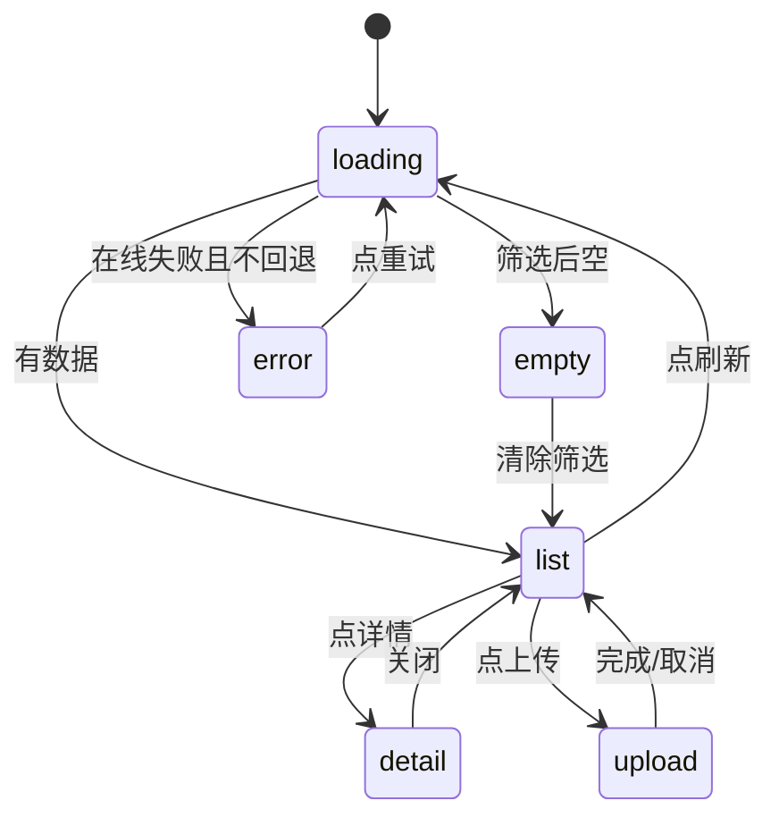

# ACRPA 脚本市场 v2 — 详细技术设计文档

> 状态：待评审（Architect 产出，供 Code 子任务照此实现）
> 范围：**仅新增/改造设计**。本文档不修改任何 `src/` 现有源码。
> 事实基准：截至本设计，`src/marketplace.py`、`src/ACRPA.py` 市场段、`src/state.py`、`src/utils.py`、`src/engine.py`、`src/updater.py`、`src/settings_window.py` 已逐行核对。

---

## 0. 现状核对结论（含与任务描述的冲突标注）

所有关键事实已用工具逐行核实，结论如下。**凡与任务描述冲突处，以实际代码为准并在此标注。**

| 事实 | 核对结果 | 证据 |
|---|---|---|
| 市场窗口入口 | `_open_marketplace()` 自建 `Toplevel`，`geometry("600x520+400+80")`，`grab_set()` | [`_open_marketplace`](src/ACRPA.py:3073)、[`geometry`](src/ACRPA.py:3077)、[`grab_set`](src/ACRPA.py:3080) |
| 列表卡片 | Canvas+Scrollbar 自绘 Frame，卡片在 `_refresh_script_list` 内动态生成 | [`canvas`](src/ACRPA.py:3117)、[`_refresh_script_list`](src/ACRPA.py:3149)、[卡片生成](src/ACRPA.py:3175) |
| 安装入口 | `_import_script` 后台线程下载 → `_editor_load_xls` | [`_import_script`](src/ACRPA.py:3224)、[`_editor_load_xls`](src/ACRPA.py:3242) |
| 工具栏按钮绑定 | `_btn(toolbar_inner,"市场",_open_marketplace,"#059669","white")` | [ACRPA.py:3343](src/ACRPA.py#L3343) |
| `ScriptInfo` | `__init__(data)` 解析 14 字段；**无 `from_dict`，只有 `to_dict`（第54行）** | [`ScriptInfo`](src/marketplace.py:35)、[`to_dict`](src/marketplace.py:54) |
| ⚠️ 冲突1 | 任务描述称 `from_dict`(55)。**实际为 `to_dict`(54)，`from_dict` 不存在。** 本设计新增 `from_dict` 类方法以保持对称，且不破坏 `__init__(dict)` | 同上 |
| ⚠️ 冲突2 | 任务字段列表漏写 `preview`。**实际字段含 `preview`（第51行）。** 本设计保留 | [`preview`](src/marketplace.py:51) |
| `download_script(script_id, save_dir)` | URL 拼接 `{MARKETPLACE_REPO}/scripts/{filename}`，直接写文件，**无 sha256** | [`download_script`](src/marketplace.py:216)、[URL](src/marketplace.py:253) |
| `fetch_index` | `requests.get(timeout=10)`，失败回退内置库，`CACHE_TTL=3600` | [`fetch_index`](src/marketplace.py:147)、[CACHE_TTL](src/marketplace.py:22) |
| 常量 | `MARKETPLACE_REPO`、`MARKETPLACE_INDEX` | [marketplace.py:20](src/marketplace.py#L20) |
| 远程 index.json | 顶层 `{name,updated,scripts[]}`，6 条；条目字段与 `ScriptInfo` 对齐，**无 pkg/sha256/url** | `.tmp_recon/index.json` |
| 图片解析 | 执行时 `img = "{}/{}.png".format(script_dir, 名)`，路径 `z` 为脚本目录 | [`_image_search_loop`](src/engine.py:842)、[img 拼接](src/engine.py:855) |
| `execute_script` | `engine.execute_script(rows_data, state.script_dir)` | [ACRPA.py:1298](src/ACRPA.py#L1298) |
| 凭据库 | `cred_write/cred_read/cred_delete(target,...)` 已通用化；`_CRED_TARGET="ACRPA/api_key"` | [`cred_write`](src/state.py:239)、[`cred_read`](src/state.py:260)、[`cred_delete`](src/state.py:280) |
| 配置持久化 | `_config_schema`(16-111) + `load_config`(304) + `save_config`(326)；`api_key` 明文被剥离只进凭据库 | [`_config_schema`](src/state.py:16)、[`save_config`](src/state.py:326) |
| 校验/下载可复用 | `_sha256_of`(556)、`_verify_file`(564，体积/魔术字节/sha256)、`format_size`(544)、`download_package`(588)、`_download_one`(642，requests+urllib 双栈) | [updater.py:556](src/updater.py#L556) 起 |
| utils 主题/尺度 | `themed()`(134)、`fit_pt()`(212)、`scaled()`(228)、`PAD/PI`(297)、`create_card`(304)、`_btn`(309)、`attach_tooltip`(355)、`apply_theme`(362)；**无 radius、无统一 spacing 表** | [utils.py:108](src/utils.py#L108) 起 |
| 命令注册表 | `commands.register()`(5)、`commands.list_names()`(16) | [commands.py:5](src/commands.py#L5)、[commands.py:16](src/commands.py#L16) |
| 版本事实源 | `version_info.VERSION`；`_FALLBACK_VERSION="0.1.26"` | [version_info.py:33](src/version_info.py#L33) |
| 依赖 | `requests/xlrd/xlwt/pywin32/Pillow/pyautogui/pyperclip/urllib3/certifi`（**playwright 未列入 requirements，为可选**） | `requirements.txt` |
| 账号代码 | 全仓**无任何账号/登录/OAuth 代码**（确认） | 全仓检索 |

**结论：可直接采信任务事实，仅两处命名需修正（见 ⚠️ 行）。**

---

## 1. `.acrpapkg` 包格式规范

### 1.1 容器

- `.acrpapkg` **= 标准 ZIP 归档**（`zipfile`，`ZIP_DEFLATED`），文件名 **纯 ASCII**，扩展名固定 `.acrpapkg`。
- 选择 ZIP 的理由：`zipfile` 为 Python 标准库、零新依赖；`updater._verify_file` 已用魔术字节 `PK\x03\x04` 校验 ZIP，可直接复用同款校验思路；ZIP 便于人工解包审阅。
- 命名约定：`<id>-<version>.acrpapkg`（版本号进文件名 → 规避 Gitee raw CDN 缓存，见 §9.2）。

### 1.2 目录布局（包内，全部为相对路径，使用 `/` 分隔）

```
<id>-<version>.acrpapkg   (ZIP)
├── manifest.json                      # 必需，位于根
├── README.md                          # 可选，投稿说明/使用说明
├── scripts/
│   └── <entry>.xls                    # 必需，脚本主体（二进制 Excel）
└── images/
    └── *.png                          # 可选，脚本引用的图像资源（引擎同目录查找）
```

**硬约束（`unpack` 强制）：**包内条目只允许落在白名单前缀 `manifest.json`、`README.md`、`scripts/`、`images/` 之下；其它顶层前缀一律拒绝。

### 1.3 `manifest.json` 完整 schema

```json
{
  "manifest_version": 1,
  "id": "off_clipboard_form_entry",
  "name": "Excel 数据逐条录入网页表单",
  "description": "从 Excel 单元格逐行复制，切换到浏览器表单粘贴……",
  "category": "办公",
  "author": "ACRPA",
  "version": "1.1.0",
  "tags": ["Excel", "录入", "表单", "批量"],
  "icon": "📋",
  "requires": [],
  "entry": "scripts/off_clipboard_form_entry.xls",
  "images": ["images/btn_submit.png", "images/field1.png"],
  "readme": "README.md",
  "created_at": "2026-10-01T12:00:00Z",
  "min_app_version": "0.1.26",
  "script_sha256": "3f2a...64hex...",
  "signature": null
}
```

| 字段 | 类型 | 必填 | 说明 |
|---|---|---|---|
| `manifest_version` | int | ✅ | 清单格式版本。当前支持 `1`。见 §1.4 |
| `id` | str | ✅ | 唯一标识。**不得以 `builtin_` 开头**；`^[a-z][a-z0-9_]{2,49}$` |
| `name` | str | ✅ | 展示名，≤60 字符 |
| `description` | str | ✅ | 简介，≤300 字符 |
| `category` | str | ✅ | **四选一**：`办公`/`财务`/`系统`/`其他` |
| `author` | str | ✅ | 作者标识，≤40 字符 |
| `version` | str | ✅ | 语义化版本 `MAJOR.MINOR[.PATCH]`，`^\d+(\.\d+){1,2}$` |
| `tags` | str[] | ⭕ | ≤8 个，单个 ≤16 字符 |
| `icon` | str | ⭕ | Emoji 或短字符（市场卡片图标位）；空则用分类色条 |
| `requires` | str[] | ⭕ | 依赖标记，取值集合 `{"pywin32","ocr","playwright","dd_driver"}`（**仅作展示/前置提示，不在 v2 自动安装依赖**） |
| `entry` | str | ✅ | 包内 `.xls` 相对路径，必须命中 `scripts/` 前缀且实际存在于包内 |
| `images` | str[] | ⭕ | 包内 `.png` 相对路径列表（须命中 `images/`）。**安装时会被拍平到脚本同目录**（见 §2.1） |
| `readme` | str | ⭕ | 包内 README 相对路径 |
| `created_at` | str | ⭕ | ISO8601 UTC；由 `pack()` 自动写入 |
| `min_app_version` | str | ⭕ | 兼容最低 ACRPA 版本；缺省视为无下限。与 `version_info.VERSION` 比对 |
| `script_sha256` | str | ⭕ | **`entry` 文件内容**的 sha256（包内单文件完整性）；由 `pack()` 自动写入 |
| `signature` | str/null | ⭕ | 预留签名位（v2 不校验，统一写 `null`；未来 HMAC/Ed25519） |

> 注意区分两种 sha256：manifest 里的 `script_sha256` = **包内 .xls** 的哈希；index.json 条目里的 `sha256` = **整个 .acrpapkg** 的哈希（见 §2.3）。命名刻意不同以免混淆。

### 1.4 版本号与向后兼容策略

- **`manifest_version` 只增不改语义**：读取方遇到 `manifest_version > SUPPORTED_MANIFEST_VERSIONS[-1]` 时**拒绝安装**并给出「请升级 ACRPA」提示；遇到未知的**可选**字段则**忽略**（前向兼容）。
- `SUPPORTED_MANIFEST_VERSIONS = (1,)`。
- 未知必填字段缺失 → 校验失败（`PackageError`）。
- **双轨兼容（关键）**：市场条目存在两代形态：
  - **包模式（v2）**：条目含 `pkg` 字段 → 走 `.acrpapkg` 下载-校验-解包安装。
  - **旧单文件模式（v1）**：条目只有 `filename` → 保持现有 `download_script` 行为（下载单个 `.xls` 到 `save_dir` 平铺）。
  - 二者**同时存在时优先 `pkg`**，并在日志中 warning 提示。
  - 现存 `index.json` 6 条脚本均为 v1 形态，**无需改动即可继续工作**（这是不破坏线上兼容的核心）。

### 1.5 安全硬约束（`unpack` 必须全部满足，任一违反即整体拒绝）

1. **sha256 前置校验**：若调用方传入 `expected_sha256`，先对整个 `.acrpapkg` 计算 sha256，不符立即 `PackageError`，**不打开 ZIP**。
2. **防 zip-slip（路径穿越）**：
   - 拒绝含 `..` 路径段的成员；拒绝绝对路径（`os.path.isabs`、以 `/` 或 `\` 开头）；拒绝 Windows 盘符（`^[A-Za-z]:`）；
   - 用 `posixpath.normpath` 规范化成员名后，再与目标根做 `os.path.normpath(os.path.join(root, member))`，**断言结果位于 `root + os.sep` 之内**（`_is_within`）；
   - 拒绝符号链接成员（`(info.external_attr >> 16) & 0xA000 == 0xA000`）。
3. **体积/数量上限**：
   - `MAX_FILE_COUNT = 256`；条目数超限拒绝。
   - `MAX_UNPACK_BYTES = 64 * 1024 * 1024`（解压后总字节上限，按 `ZipInfo.file_size` 累加预判 + 实际解压累计双重校验）。
   - `MAX_SINGLE_FILE = 64 * 1024 * 1024`。
   - 单条压缩比 > 200:1 且 `file_size > 1MB` 视为疑似 zip bomb，拒绝。
4. **白名单前缀**：成员必须命中 `{manifest.json, README.md, scripts/**, images/**}`。
5. **结构校验**：根存在 `manifest.json`；JSON 可解析；`manifest_version` 受支持；必填字段齐备；`entry` 命中白名单且实际存在于包内；`images[]` 每项存在于包内。
6. **原子安装**：先解压到 `dest_dir` 同级临时目录 `.<id>.tmp-<pid>`，全部校验通过后再 `os.replace`/整目录移动到最终目录；**任一步失败则清理临时目录并保持现场不变**。
7. **只读落盘**：安装产物（`.xls/.png/manifest.json/README.md`）不回写任何可执行代码路径；不执行包内任何内容。

---

## 2. 新增/改造模块 API（函数签名级）

### 2.1 新模块 `src/script_package.py`

职责：`.acrpapkg` 的打包、解包、校验、哈希。**零第三方依赖**（`os/json/zipfile/hashlib/shutil/tempfile/time/re/posixpath`）。

```python
class PackageError(Exception): ...

# ── 常量 ──
MANIFEST_NAME = "manifest.json"
PKG_EXT = ".acrpapkg"
SUPPORTED_MANIFEST_VERSIONS = (1,)
ALLOWED_PREFIXES = ("manifest.json", "README.md", "scripts/", "images/")
CATEGORIES = ("办公", "财务", "系统", "其他")
MAX_FILE_COUNT = 256
MAX_UNPACK_BYTES = 64 * 1024 * 1024
MAX_SINGLE_FILE = 64 * 1024 * 1024
MAX_COMPRESS_RATIO = 200

# ── 哈希 ──
def compute_sha256(path) -> str:
    """分块(1MB)计算文件 sha256，返回 64 位小写 hex。"""

# ── manifest 构建/校验 ──
def build_manifest(script_path, meta, images=None,
                   manifest_version=1, app_min_version="") -> dict:
    """由 meta(dict: id/name/description/category/author/version/tags/icon/requires)
       与脚本文件路径生成规范化 manifest（含 entry/created_at/script_sha256）。
       meta 缺字段用默认值补；不对合法性做最终裁决（交 validate_manifest）。"""

def manifest_errors(manifest) -> list:
    """返回问题字符串列表（空=通过）。纯函数，便于单测。"""

def validate_manifest(manifest, app_version=None) -> None:
    """问题列表非空则 raise PackageError('; '.join(errors))。"""

# ── 打包 ──
def find_local_images(script_path, names=None) -> list:
    """收集与 script_path 同目录的 .png（names 非空则只取指定名）。"""

def pack(script_path, manifest=None, images=None, out_path=None,
         meta=None) -> tuple:
    """打包 → (pkg_path, sha256)。
       - manifest 为 None 时由 meta+script_path 构建；
       - images 为 None 时自动 find_local_images(script_path)；
       - out_path 为 None 时输出到 script_path 同目录 <id>-<version>.acrpapkg；
       - 内部：写 scripts/<basename> + images/* + manifest.json + README.md(若有)，
         再 compute_sha256 输出包并返回。"""

# ── 解包/安装 ──
def read_manifest(pkg_path) -> dict:
    """只读 manifest（不改磁盘），用于上传前置校验/详情预览。"""

def unpack(pkg_path, dest_dir, expected_sha256=None) -> dict:
    """安全解包到 dest_dir 并返回 manifest。
       执行 §1.5 全部安全约束；失败 raise PackageError 且不残留半成品。"""

def install_package(pkg_path, dest_dir, expected_sha256=None,
                    flatten_images=True) -> dict:
    """面向市场的高层安装：
       - unpack 到 dest_dir；
       - flatten_images=True 时把 images/ 下所有 .png 复制为 dest_dir/<name>.png，
         使 engine 的 `{script_dir}/{名}.png` 可直接命中；
       - 返回 manifest 追加 `_install` 键：
         {"script_path": <绝对路径>, "dir": <安装目录>, "files": [...]}。"""

# ── 内部安全工具（单测直接覆盖）──
def _safe_member(name) -> str:        # 规范化+穿越校验，违规 raise PackageError
def _is_within(base, target) -> bool: # target 是否位于 base 之内
def _check_limits(infolist) -> None:  # 数量/体积/压缩比
```

**安装落点约定**：市场安装到 `os.path.join(<save_dir>, "market_scripts", <id>)`，脚本与图片同目录。`state.script_dir` 指向该目录，`state.filename` 指向该目录下的 `.xls`。

### 2.2 扩展 `src/marketplace.py`

**保持所有旧签名不变**（`fetch_index()`、`search_scripts(kw, scripts=None)`、`download_script(script_id, save_dir)`）。

```python
# ── 常量新增 ──
MARKETPLACE_PKG_DIR = MARKETPLACE_REPO + "/packages"   # 包存放目录约定
MIN_APP_VERSION = "0.1.26"

# ── ScriptInfo 新增可选字段 ──
#   self.pkg = data.get("pkg", "")              # 包相对路径
#   self.sha256 = data.get("sha256", "")        # 包 sha256
#   self.size = data.get("size", 0)             # 包字节数
#   self.url = data.get("url", "")              # 可选直链覆盖
#   self.min_app_version = data.get("min_app_version", "")
# to_dict() 同步补齐以上键。
@property
def is_package(self) -> bool:
    return bool(self.pkg)

@classmethod
def from_dict(cls, data) -> "ScriptInfo":
    """新增类方法（保持与 to_dict 对称）；内部实现即 cls(data)。"""

# ── 下载/安装 ──
def resolve_download_url(info) -> str:
    """解析下载地址：info.url > MARKETPLACE_PKG_DIR/<pkg>（包模式）
       > MARKETPLACE_REPO/scripts/<filename>.xls（旧模式）。"""

def download_script(script_id, save_dir, progress=None, cancel=None) -> str:
    """【向后兼容扩展】
       - script_id 未命中缓存 → 自动 fetch_index() 后重查；
       - builtin_* → 沿用 _generate_builtin_script；
       - info.is_package → 下载 pkg→sha256 校验→install_package 到
         save_dir/market_scripts/<id>/ → 返回该目录下 .xls 绝对路径；
       - 否则 → 旧单文件路径（平铺 save_dir），行为与返回值语义不变。
       仍返回 .xls 路径，故 ACRPA._import_script 无需改动。"""

def install_package(pkg_path, dest_root, expected_sha256=None) -> dict:
    """薄封装 script_package.install_package；供 UI 与测试直接调用。"""

def check_update(script_id, local_version) -> bool:
    """远端 version > local_version 时返回 True（供 market_auto_check_update）。"""

# ── 通用下载（可选，复用 updater 语义）──
def _download_file(url, dest_path, progress=None, cancel=None,
                   expected_sha256="", expected_size=0, timeout=30) -> tuple:
    """流式下载 + (ok, msg)。失败清理 .part。"
       可选：requests 失败时回退 updater._open_urllib_stream 双栈。"""
```

**影响范围**：`_import_script`(ACRPA.py:3224) 调用点无需改签名；`download_script` 返回值仍为 `.xls` 路径。包模式下 `state.script_dir` 将被设为子目录，图片随脚本自动可用。

### 2.3 `index.json` v2 条目形态（兼容扩展，非破坏）

```json
{
  "id": "off_clipboard_form_entry",
  "name": "Excel 数据逐条录入网页表单",
  "description": "……",
  "category": "办公",
  "author": "ACRPA",
  "version": "1.1.0",
  "downloads": 0, "rating": 0.0, "rating_count": 0,
  "tags": ["Excel", "录入"], "icon": "📋", "preview": "",
  "requires": [],
  "pkg": "packages/off_clipboard_form_entry-1.1.0.acrpapkg",
  "sha256": "……64hex（整个 acrpapkg）……",
  "size": 23456,
  "url": "",
  "min_app_version": "0.1.26"
}
```

旧条目（无 `pkg`）继续走单文件路径。`fetch_index` 解析逻辑无需改（`ScriptInfo` 已容错解析新字段）。

### 2.4 新模块 `src/accounts.py`

职责：市场账号 token 的安全存取与校验。**token 只进 Windows 凭据库，绝不写 config.json / 日志。**

```python
class AccountError(Exception): ...

PROVIDERS = ("gitee", "github")
_API = {
    "gitee":  {"verify_url": "https://gitee.com/api/v5/user"},
    "github": {"verify_url": "https://api.github.com/user"},
}
_CRED_PREFIX = "ACRPA/market"          # target = "ACRPA/market/<provider>_token"

def _cred_target(provider) -> str: ...  # "ACRPA/market/gitee_token"

def save_token(provider, token) -> bool:
    """state.cred_write(_cred_target(provider), token)；不落盘明文。"""
def get_token(provider) -> str | None:
    """state.cred_read(_cred_target(provider))。"""
def clear_token(provider) -> None:
    """state.cred_delete(_cred_target(provider))。"""
def has_token(provider) -> bool: ...
def list_logged_in() -> list:
    """无网络，仅凭据库探测，返回已存 token 的 provider 列表。"""

def verify_token(provider, token=None) -> dict:
    """校验 token 并返回 user_info（不持久化）。
       Gitee : GET verify_url?access_token=<t>（Header 亦带 Authorization: token <t>）
       GitHub: GET verify_url  Header Authorization: token <t>、User-Agent: ACRPA/x
       返回 {"provider","login","name","avatar_url","id"}（字段做 provider 差异归一）。
       网络/401/403 → raise AccountError，错误信息经过脱敏（不含 token 明文）。"""

def login(provider, token) -> dict:
    """verify_token → 成功则 save_token → 返回 user_info。"""
def logout(provider) -> None:
    """clear_token + 清 state.MARKET_USERNAME（若当前 provider 匹配）。"""
def current_user(provider) -> dict | None:
    """有 token 则 verify_token 返回 user_info，否则 None；网络异常返回 None。"""
```

**安全规约**：`log1()` 调用一律不打印 token；异常消息用 `_redact()` 替换为 `***`；`save_token` 失败（凭据库不可用）→ raise `AccountError`，**不回退到明文文件**。

### 2.5 新模块 `src/market_upload.py`

职责：把本地脚本打包成 `.acrpapkg`，经 Gitee/GitHub OpenAPI 建分支→提交→发 PR。

```python
class UploadError(Exception): ...

DEFAULT_REPO = {"gitee": ("yohoten", "acrpa-marketplace"),
                "github": ("yohoten", "acrpa-marketplace")}

def prepare_package(script_path, meta, images=None, out_path=None) -> tuple:
    """= script_package.pack + validate_manifest；返回 (pkg_path, sha256, manifest)。"""

def upload_index_patch(index_text, manifest, sha256, size,
                       pkg_rel_path) -> str:
    """把/更新一条 v2 条目合并进 index.json 文本，返回新文本。
       已存在同 id → 原地替换（保留 downloads/rating）；不存在 → 追加。"""

def generate_pr_body(manifest) -> str:
    """生成 PR 正文：脚本简介 + 自检清单（id/分类/文件存在/真 .xls/命令注册）。"""

def upload(provider, pkg_path, meta, *, owner=None, repo=None,
           base_branch="master", token=None, progress=None) -> dict:
    """主入口。返回 {"pr_url","pr_number","branch","pkg_path"}。
       progress(stage:str, done:int, total:int) 回调，stage ∈
       {"verify","branch","upload_pkg","upload_index","pull","done"}。
       流程见 §2.5.1。"""

def upload_package(*args, **kwargs):  # = upload 别名，语义友好
```

#### 2.5.1 OpenAPI 调用序列

**Gitee**（`https://gitee.com/api/v5`）：
1. 校验：`GET /user?access_token=<t>`（复用 `accounts.verify_token`）。
2. 建分支：`POST /repos/{owner}/{repo}/branches`
   body `{"access_token":<t>, "refs":"<base_branch>", "branch_name":"<branch>"}`。
3. 提交包：`POST /repos/{owner}/{repo}/contents/{path}`
   body `{"access_token":<t>, "content":base64(pkg), "message":"add: <id> v<ver>", "branch":"<branch>"}`。
4. 提交 index：`POST /repos/{owner}/{repo}/contents/index.json`
   body `{"access_token":<t>, "content":base64(new_index), "message":"chore: index update <id>", "branch":"<branch>", "sha":<旧index sha>}`（需先 `GET .../contents/index.json?ref=<base>` 取 sha）。
5. 发 PR：`POST /repos/{owner}/{repo}/pulls`
   body `{"access_token":<t>, "title":"[script] <name>", "head":"<branch>", "base":"<base_branch>", "body":<pr_body>}` → 取 `html_url`。

**GitHub**（`https://api.github.com`，Header `Authorization: token <t>` + `User-Agent`）：
1. 校验：`GET /user`。
2. 取基点：`GET /repos/{owner}/{repo}/git/ref/heads/{base}` → `object.sha`。
3. 建分支：`POST /repos/{owner}/{repo}/git/refs` body `{"ref":"refs/heads/<branch>","sha":<sha>}`。
4. 提交文件：≤1MB 用 `PUT /repos/{owner}/{repo}/contents/{path}` body `{"message","content":base64,"branch"}`；**>1MB 走 Git Data API**（`POST /git/blobs` → `POST /git/trees` → `POST /git/commits` → `PATCH /git/refs/heads/<branch>`）。
5. 发 PR：`POST /repos/{owner}/{repo}/pulls` body `{"title","head","base","body"}` → `{"html_url","number"}`。

**错误处理**：非 2xx → 读 `message/errors` 字段构造 `UploadError`（脱敏）；`401` → 提示重新登录；`403/404` → 提示仓库/权限问题；网络超时逐源重试 1 次。

**体积策略**：ACRPA 脚本 + 少量 png 通常数十 KB，Gitee/GitHub contents API 足够；GitHub >1MB 走 Git Data API；Gitee >几 MB 在 UI 给出「建议改用 git push」提示（不静默失败）。

### 2.6 `src/state.py` 新增配置项

在 `_config_schema` 追加（**全部非敏感**）：

```python
# ── 脚本市场 v2 ──
("market_provider",          "gitee",   str),  # 上次登录/上传所用 provider
("market_username",          "",        str),  # 展示用登录名（非密钥）
("market_auto_check_update", True,      bool), # 打开市场时后台查更新
("market_install_dir",       "",        str),  # 自定义安装根目录（空=CONFIG_PATH 同级）
("market_last_category",     "全部",    str),  # UI 记忆：上次分类筛选
("market_index_cache_ttl",   3600,      int),  # 索引缓存秒数（覆盖 CACHE_TTL 常量）
```

⚠️ token **不在此列**，只进凭据库（与 `api_key` 同款安全策略，实现见 `save_config` 对 `api_key` 的剥离手法，见 [`save_config`](src/state.py:326)）。

### 2.7 `src/utils.py` 最小共享 tokens（纯新增，不改现有符号）

```python
# ── 间距/尺寸设计令牌（设计 px，运行时经 ui_scale/dpi 派生）──
TOKENS = {
    "sp_xs": 4, "sp_sm": 8, "sp_md": 12, "sp_lg": 16, "sp_xl": 24,
    "radius": 6, "radius_sm": 4, "radius_lg": 10,
    "ctrl_h": 26, "ctrl_h_sm": 22, "ctrl_h_lg": 30,
    "gap": 8, "gap_tight": 4, "card_pad": 10,
    "icon_sm": 16, "icon_md": 24, "icon_lg": 40,
    "card_min_h": 84, "bar_h": 4,
}

def tk_px(value) -> int:
    """设计 px → 实际 px = scaled(value)（含 dpi_factor*ui_scale）。"""
    return scaled(value)

def sp(key_or_px) -> int:
    """间距访问器：key_or_px 为 TOKENS 键名 → scaled(TOKENS[k])；为数字 → scaled(n)。"""

def radius(token="radius") -> int: return sp(token)
def ctrl_h(token="ctrl_h") -> int: return sp(token)
def gap(token="gap") -> int: return sp(token)
def icon_size(token="icon_md") -> int: return sp(token)
```

**兼容性**：以上均为**追加**，不修改 `scaled/fit_pt/PAD/PI/create_card/_btn/themed` 的任何现有语义。

⚠️ **尺度口径说明（须在实现中统一）**：字体走 `fit_pt`（**不含** `dpi_factor`，因 `tk scaling` 已处理 pt→px）；而 `sp()` 走 `scaled`（**含** `dpi_factor`）。市场窗口的**内部留白**应跟随字体 → 用「字号线」；**命中尺寸/图标**应跟随 DPI → 用 `scaled` 线。为避免双重放大争议，`sp()` 默认走 `scaled`，并在市场窗口注释标注：**留白若与文字行高强相关，优先用 `gap`/`ctrl_h`（走 scaled）保持一致**，实测三档 DPI 后再决定是否需要 `sp_pt()`（仅 ui_scale）补线——本文档将 `sp_pt` 列为**可选待定项**，不纳入首批实现。

---

## 3. 市场窗口 UI 设计

### 3.1 落地位置与宿主解耦

**新增模块 `src/market_window.py`**（把市场窗口从 5421 行的 `ACRPA.py` 中抽出，便于独立自测），对外暴露：

```python
def open_marketplace(root, on_install, *, host=None) -> None:
    """打开市场窗口。
       root       : Tk 主窗口
       on_install : callable(fp) -> None  安装成功后主线程回调（把脚本载入编辑器）
       host       : 可选适配器，提供 toast/after/retheme 钩子；缺省用 utils.show_toast
    """
def close_marketplace() -> None: ...   # 若已打开则关闭（单例）
def retheme_marketplace() -> None: ...  # 主题切换后重建语义色（供主程序 apply_theme 后调用）
```

`ACRPA.py` 侧改造（**仅 3 行量级**）：
- `_open_marketplace()`([`3073`](src/ACRPA.py#L3073)) 体替换为调用 `market_window.open_marketplace(root, _market_on_install)`；
- 新增 `_market_on_install(fp)`：即原 `_on_done` 逻辑（设 `state.filename/script_dir`、`script_name_var.set`、`edit_file_label.config`、`_editor_load_xls(fp)`、`show_toast`）；
- 主题切换处（调用 `apply_theme` 之后）追加 `market_window.retheme_marketplace()`。
- 工具栏绑定 [`3343`](src/ACRPA.py#L3343) **不变**。

### 3.2 完整 widget 树

```
Toplevel market_dlg   title=脚本市场 — ACRPA   minsize=640x520   grab_set()
├─ row0 header_frame
│   ├─ avatar_btn            登录状态区（未登录=「登录」按钮；已登录=头像/首字母圈 + 用户名）
│   ├─ lbl_title             「脚本市场」FONT_TITLE
│   ├─ lbl_sub               「浏览社区共享的自动化脚本」FONT_SMALL  fgm
│   ├─ search_entry          Entry(StringVar)  ebg/fgb  ← 输入即筛（trace_add）
│   ├─ category_combo        ttk.Combobox 只读 值=全部/办公/财务/系统/其他
│   └─ tag_filter_btn        「标签 ▾」下拉多选（chips，可选，P1）
├─ row1 action_bar
│   ├─ btn_refresh           「刷新」  _btn
│   ├─ btn_upload            「上传脚本」 _btn（未登录时点击直接弹登录）
│   └─ sort_combo            「排序 ▾」下载量/评分/最新（可选）
├─ row2 body_frame  (weight=1)  ← 四态容器，同一网格位切换
│   ├─ state_loading         Label + ttk.Progressbar(mode=indeterminate)
│   ├─ state_empty           「没有找到匹配的脚本」+ btn_clear_filter
│   ├─ state_error           lbl_err(红/err) + btn_retry
│   └─ state_list            list_frame(highlightthickness=1 bd 描边)
│       ├─ canvas  (bgc, highlightthickness=0)
│       ├─ scrollbar (SCROLLBAR_KW 风格)
│       └─ inner = scripts_inner   ← 卡片动态生成
├─ row3 statusbar_frame
│   ├─ status_label          StringVar 例「共 6 个脚本 · 已登录 Gitee: yohoten」
│   └─ progress_thin         细进度条（下载/安装时显示）
├─ popup account_menu        Tk Menu：使用 Gitee 登录 / 使用 GitHub 登录 /
│                            当前账户：<login> / 注销 / 帮助
├─ popup token_dialog        输入 Personal Access Token（show="*"）+ 帮助链接
├─ popup detail_popup        详情（见 §3.5）
└─ popup upload_dialog       上传向导（见 §3.6）
```

**四态切换**：内部 `_set_state(name)` 对 4 个 Frame 执行 `grid()/grid_remove()`（同一 `row2/column0` 位）。业务状态由数据源驱动：加载开始→`loading`；结果为空→`empty`；异常→`error`；有数据→`list`。

### 3.3 卡片布局（自绘 Frame，随主题/缩放自适应）

```
card = create_card(scripts_inner)      # 统一描边，无硬编码色
bind <Enter>/<Leave> → 悬停：card.configure(bg=themed('cardhover 的浅色化')或 'acl')
├─ colorbar   Frame(width=tk_px(TOKENS.bar_h), bg=CATEGORY_COLOR[category])
│              CATEGORY_COLOR = {办公:themed('ac'), 财务:themed('wn'),
│                                系统:themed('fgm'), 其他:themed('bd')}
├─ icon_lbl   Label(text=icon 或分类 emoji, FONT_ICON_MD, fg=themed('ac'))
├─ main_col
│   ├─ title_row
│   │   ├─ lbl_name     FONT_TITLE   fgt
│   │   ├─ chip_version 「v<version>」FONT_TINY  fg=themed('fgm') bg=themed('acl')
│   │   └─ chip_category 「[<category>]」FONT_TINY fg=themed('ac') bg=themed('bgc')
│   ├─ lbl_desc   FONT_SMALL  fgb  wraplength=自适应宽度  justify=left
│   ├─ meta_row
│   │   ├─ lbl_author  「<author>」  FONT_TINY fgm
│   │   ├─ lbl_stars   「★★★★☆ 4.8 (126)」FONT_SMALL fg=themed('wn')
│   │   └─ lbl_dl      「<downloads> 下载」FONT_TINY fgm   (right)
│   └─ tag_row   tags[:4]，chip：FONT_TINY fg=fgb bg=themed('acl')
├─ action_col
│   ├─ btn_import  _btn(card,"导入",…)  主色 themed('sc')
│   ├─ btn_detail  _btn(card,"详情",…)
│   └─ btn_uploaded_badge（若 s.is_package 显示小「包」角标）
```

**自适应规则**：
- 文字用 `FONT_*` 命名字体（随 `ui_scale` 由 `init_fonts`/`set_ui_scale` 统一 fontconfigure，见 [`set_ui_scale`](src/utils.py:274)）。
- 间距用 `gap()/ctrl_h()/sp()`（§2.7）；尺寸用 `tk_px(...)`。
- 卡片 `wraplength`：在 `canvas` 的 `<Configure>` 回调用 `canvas.winfo_width() - 固定列宽` 动态重设，避免缩放/拉伸时描述溢出。
- 缩放变更：`set_ui_scale` 只改字体，**不改已建 widget 的像素 padding**。策略：市场窗口在 `ui_scale` 变更回调中**重建卡片列表**（销毁 `scripts_inner` 子项后重绘），保证 padding 同步；最简实现为「关闭重开即刷新」，P1 再接入 listener 热刷新。

### 3.4 四种状态

| 状态 | 触发 | 呈现 | 动作 |
|---|---|---|---|
| 加载中 | 打开窗口 / 点刷新 | `state_loading`：spinner 文案「正在加载脚本库…」+ indeterminate 进度 | 完成→切 list/empty/error |
| 空态 | 筛选/搜索后 0 条 | `state_empty`：「没有找到匹配的脚本」+「清除筛选」 | 点清除→重置搜索/分类 |
| 错误态 | `fetch_index` 抛错且无内置回退（或强制在线失败） | `state_error`：`themed('err')` 文案 + 「重试」按钮 | 点重试→重新加载 |
| 正常 | 有数据 | `state_list`：卡片列表 + status 计数 | — |

> 说明：现有 `fetch_index` 在失败时会**静默回退内置库**（[`fetch_index`](src/marketplace.py:177)）。v2 增加 `fetch_index(force_refresh=True, allow_builtin_fallback=False)` 可选参数，使 UI 能区分「真在线数据」与「离线回退」，否则错误态永不出现。**该参数为新增可选参数，默认值保持旧行为，不破坏现有调用。**

### 3.5 详情弹窗 `detail_popup`

```
Toplevel detail   ~420x360   transient(dlg)
├─ icon + name (FONT_TITLE)
├─ 作者 / 版本 / 分类 行
├─ description（wraplength，可滚动）
├─ 标签 chips
├─ requires 行（有则示「需要: ocr, pywin32」+ 安装提示，themed('wn')）
├─ 文件清单（若 is_package：manifest.entry + images[] + size(KB)）
├─ preview 图（有 preview URL → 后台 requests 下载 + PIL 缩略；无 → 占位框）
└─ 底部 [导入到编辑器]  themed('sc')  +  [在浏览器打开 README]
```

### 3.6 登录菜单与账号区

- `account_menu`（`tkinter.Menu`，`post` 于 `avatar_btn`）：
  - 「使用 Gitee 登录」/「使用 GitHub 登录」→ 打开 `token_dialog`；
  - 「当前账户：<login>」（已登录时可用，点击复制/查看）；
  - 「注销」→ `accounts.logout(provider)` + 刷新账号区；
  - 「如何获取 Token？」→ 打开帮助 URL。
- `token_dialog`：`Entry(show="*")` + 提示「仅存本机凭据库，不上传」+ `[确定]`。
  确定 → 后台线程 `accounts.login(provider, token)` → 成功：写 `state.MARKET_PROVIDER/MARKET_USERNAME` + `save_config()` + 刷新账号区 + toast；失败：`messagebox` 展示脱敏错误。
- 账号区状态来源：`accounts.list_logged_in()`（无网络）+ `state.MARKET_USERNAME`（展示）。

### 3.7 上传向导 `upload_dialog`

单窗口多步（`step 1..5`），每步在后台线程执行、`root.after` 回主线程更新 UI：

```
Toplevel upload   ~560x520
├─ step1 选择脚本
│   [选择 .xls] → path_lbl ；自动 find_local_images 展示「同目录图片: N 个」
├─ step2 元数据表单
│   id / name / description / category(combo 四选一) / author / version /
│   tags(逗号分隔) / icon / requires(多选) / min_app_version
│   实时校验：id 不以 builtin_ 开头；category 合法；命令名均在 commands.list_names()
├─ step3 打包预览
│   manifest.json 预览(只读 Text) + [打包] → 显示 pkg 路径 / size / sha256
├─ step4 登录校验
│   显示当前账户；未登录 → [登录]（内联 token_dialog）
├─ step5 上传
│   Progressbar(determinate) + 阶段文本（校验→建分支→传包→改索引→发PR）
│   完成：显示 [PR 链接]（可点击 → webbrowser.open）
└─ footer  [取消] [上一步] [下一步 / 上传]
```

**元数据校验实现**：`script_package.manifest_errors()` 负责结构与字段；UI 额外用 `commands.list_names()` 校验脚本内命令均已注册（读取 `.xls` 行0跳过、行1标题、行2+取命令列，参照 [`_editor_load_xls`](src/ACRPA.py:2346) 的读取方式与 `ScriptData.from_xlrd_row_values`）。

### 3.8 主题与缩放（零硬编码颜色）

- **全部颜色**经 `themed(token)` 实时取（[`themed`](src/utils.py:134)），禁止字面量 hex；分类色条亦映射到 token。
- 卡片描边用 `create_card`（[`create_card`](src/utils.py:304)）；按钮用 `_btn`（[`_btn`](src/utils.py:309)）或同类文本控件。
- 主题切换：主程序 `apply_theme` 会重绑 `C`（[`apply_theme`](src/utils.py:362)）；市场窗口提供 `retheme_marketplace()` 递归重设所有已缓存 widget 的 `bg/fg`（窗口持有一份 widget 引用清单）；未打开时为空操作。
- 双主题验收：明/暗各截一张，断言无残留浅/深色块。

---

## 4. 文件级变更清单

### 新增文件

| 文件 | 内容 | 影响范围 | 回归测试 |
|---|---|---|---|
| `src/script_package.py` | 包格式打包/解包/校验/哈希（§2.1） | 新，被 marketplace/upload 引用 | ✅ 必须（单测覆盖 zip-slip/sha256/限额/round-trip） |
| `src/accounts.py` | 凭据存取与 token 校验（§2.4） | 新，被 market_window/upload 引用 | ✅ 必须（凭据读写、伪造 token 失败） |
| `src/market_upload.py` | OpenAPI 建分支+提交+PR（§2.5） | 新，被 upload_dialog 引用 | ✅ 需要（mock 请求序列） |
| `src/market_window.py` | 市场窗口全部 UI（§3） | 新，替代 ACRPA 内联窗口 | ✅ 需要（冒烟 + 双主题 + 缩放） |
| `docs/marketplace-v2-design.md` | 本设计文档 | 无 | — |
| `tools/_test_script_package.py` 等 | 测试脚本（见 §6） | 测试 | — |

### 改造文件

| 文件 | 改动点 | 新增/改动签名 | 影响范围 | 回归测试 |
|---|---|---|---|---|
| [`src/marketplace.py`](src/marketplace.py) | `ScriptInfo` 加 5 字段 + `is_package` property + `from_dict`；新增 `resolve_download_url/download_script(…progress,cancel)/install_package/check_update/_download_file`；`fetch_index` 加可选参数 | 见 §2.2 | 旧 API 签名不变；`download_script` 返回值仍为 `.xls` 路径 | ✅ 必须（旧 6 条 index 兼容路径 + 包路径） |
| [`src/state.py`](src/state.py) | `_config_schema` 追加 6 项（§2.6） | 纯追加 | 旧 config.json 读取不受影响（缺键取默认） | ✅ 需要（load/save 往返） |
| [`src/utils.py`](src/utils.py) | 新增 `TOKENS` + `tk_px/sp/radius/ctrl_h/gap/icon_size` | 纯追加 | 不改任何现有符号 | ✅ 需要（`sp` 值随 ui_scale 变化） |
| [`src/ACRPA.py`](src/ACRPA.py) | `_open_marketplace` 委托 `market_window`；新增 `_market_on_install`；主题切换处加 `retheme_marketplace()` | 见 §3.1 | 工具栏绑定不变；原内联窗口逻辑整体移出 | ✅ 必须（点「市场」可开、导入可载入编辑器） |
| `src/settings_window.py` | `_NAV_ITEMS` 追加 `("market","🛒","脚本市场")`；新增账号卡（可折叠卡 `_make_collapsible_card`） | 追加 | 导航为追加项 | ✅ 需要（设置页显示账号状态/注销） |

> **不需要改动的文件（明确）**：`src/engine.py`（图片查找逻辑已满足「同目录 png」约定）、`src/updater.py`（可选复用其校验思路，不强制改动）、`src/scriptdata.py`、`src/commands.py`。

---

## 5. 实现顺序与依赖（3 个串行批次）

依赖关系：


### 批次 1 — 基础设施（无 UI，可纯脚本自测）

顺序：`utils.TOKENS` → `state` 配置项 → `script_package.py` → `marketplace.py` 扩展 → `accounts.py`。

**验收点（独立自测）**：
1. `pack(script)` 生成 `.acrpapkg`，`compute_sha256` 与返回一致；
2. `unpack` 往返：目录结构与 manifest 一致；改一个字节后 `unpack(expected_sha256=旧)` 必须失败；
3. 构造恶意 ZIP（`../evil.xls`、绝对路径、超量文件、超大解压比）→ 全部 `PackageError`，且磁盘无残留；
4. `download_script` 对**旧 6 条 index** 走单文件路径成功；对含 `pkg` 条目走包路径、安装到 `market_scripts/<id>/` 且图片与脚本同目录；
5. `accounts.save_token/get_token/clear_token` 经凭据库往返；`verify_token` 对无效 token 抛 `AccountError` 且异常文本不含 token 明文。

### 批次 2 — 市场窗口 UI + 登录入口

顺序：`market_window.py` 骨架与四态 → 卡片/搜索/分类 → 详情弹窗 → 账号区与 token_dialog → ACRPA 委托接线。

**验收点**：
1. 主程序点「市场」打开新窗口，远端 index 正常渲染卡片；断网走 `state_error` 且「重试」可用，或回退内置库（按 §3.4 参数）；
2. 「导入」→ 包安装 → `_market_on_install` 把脚本载入编辑器且 `script_name_var/edit_file_label` 正确；
3. 明/暗主题各一张无硬编码色残留；分类色条随主题变化；
4. `ui_scale` 取 0.8 / 1.0 / 1.5 三档，窗口布局不溢出、文字不截断；
5. 已登录/未登录账号区切换正确；注销后状态刷新。

### 批次 3 — 上传向导 + 设置页账号卡

顺序：`market_upload.py` → 上传向导 5 步 → settings 账号卡 + 导航项。

**验收点**：
1. `upload()` 针对 Gitee/GitHub 的**请求序列**在 mock 下逐一断言（URL/方法/body 关键字段）；
2. 真实上传到**测试仓库**返回可点击 PR 链接，PR 内含 `packages/<id>-<ver>.acrpapkg` 与更新后的 `index.json`；
3. 脚本内存在未注册命令 → 向导在 step2 实时拦截并指出命令名；
4. 设置页显示当前账户、可注销、`market_auto_check_update` 等开关生效。

---

## 6. 测试与验证方案

### 6.1 打包/解包/安全（`tools/_test_script_package.py`）

- **round-trip**：以 `template/workday_launcher.xls` + 伪造 png 打包→解包→比对 xls 字节、manifest 字段、图片数。
- **sha256**：`expected_sha256` 正确通过、篡改一字节失败。
- **zip-slip**：手工构造含 `../evil.xls`、`/abs/evil.xls`、`C:\evil.xls`、`a/../../evil.xls` 的 ZIP → 断言 `PackageError` 且目标目录外无写入。
- **符号链接**：构造 symlink 成员 → 拒绝。
- **限额**：>256 成员、解压总字节 >64MB（构造小额高压缩比条目）、单文件超限 → 拒绝。
- **白名单**：包内含 `bin/x.exe` → 拒绝。
- **manifest**：缺 `id`、`category=非法值`、`id=builtin_x`、`entry` 不在包内 → 各自 `PackageError`；`manifest_version=2` → 拒绝。
- **min_app_version**：`> 当前 VERSION` → 拒绝并提示升级。

### 6.2 凭据（`tools/_test_accounts.py`）

- `save_token→get_token→clear_token` 往返（Windows 凭据库可用时）；无凭据库环境降级为 skip。
- `verify_token` 用 `requests_mock`/monkeypatch 造 200/401 → user_info/`AccountError`。
- **安全断言**：捕获全部 `log1` 输出，断言不含 token 子串；断言 `config.json` 中无 token 字段。
- `logout` 后 `has_token` 为 False，`state.MARKET_USERNAME` 被清。

### 6.3 上传（`tools/_test_market_upload.py`，全 mock）

- monkeypatch `accounts.verify_token` 与 `requests.*`，逐条断言：
  - Gitee：建分支 body 含 `refs/branch_name`；contents body 的 `content` 为合法 base64 且解码等于 pkg 字节；pulls 的 `head/base` 正确；返回 `pr_url`。
  - GitHub：refs 创建用返回 sha；文件 ≤1MB 走 contents、>1MB 走 blobs/trees/commits/refs。
- `upload_index_patch`：空 index 追加、同 id 原地替换且保留 `downloads/rating`。
- 错误路径：401→提示重登；403→权限提示；超时→重试 1 次后 `UploadError`。

### 6.4 UI（`tools/_smoke_market_window.py`）

- 无头/Tk 可用环境下：构造假 `fetch_index` 注入数据 → 断言卡片数、四态切换、搜索/分类筛选结果数。
- 双主题：`state.DARK_MODE` 取 True/False 各渲染一次，遍历 widget 断言颜色 ∈ 当前主题色集合（无硬编码）。
- 缩放：`utils.set_ui_scale(0.8/1.0/1.5)` 后重建列表，断言 padding/字体随动、`wraplength>0`。
- 安装联动：mock `download_script` 返回临时 `.xls`，点「导入」→ 断言 `on_install` 被调用且参数路径正确。

### 6.5 回归（必跑）

- 旧 6 条 index：`fetch_index()` → 6 条；`download_script(<legacy id>, dir)` 返回 `<dir>/<filename>.xls`（**不改旧行为**）。
- 主程序冷启动无异常；点「市场」可开；导入任一旧脚本可载入编辑器并运行。

---

## 7. 向后兼容与风险

### 7.1 向后兼容

- **index.json**：v2 为**纯增量字段**（`pkg/sha256/size/url/min_app_version`）；旧 6 条无 `pkg` → 走旧单文件路径，行为与返回值不变。
- **API**：`fetch_index/search_scripts/download_script` 旧签名全部保留；新增参数一律带默认值。
- **config.json**：新增键缺失时取 schema 默认（[`load_config`](src/state.py:304) 逐键 `c.get(key, default)`），老配置零迁移。
- **凭据**：沿用 `cred_write/cred_read/cred_delete` 通用化能力，不新增依赖。
- **Windows-only 凭据**：`cred_*` 依赖 `advapi32`；`accounts` 需容错非 Windows/无凭据库环境（`save_token` 失败即 `AccountError`，不回退明文）。

### 7.2 风险

| 风险 | 说明 | 缓解 |
|---|---|---|
| **CDN 缓存** | Gitee raw 有缓存；`index.json` 更新后可能读到旧版 | 包名带版本号（`id-version.acrpapkg`）从根上避免；`index.json` 请求加 `?t=<ts>` 或短 TTL；新增 `market_index_cache_ttl` 可调 |
| **token 安全** | 泄露/落盘 | 仅凭据库；日志脱敏；`save_config` 不落 token；错误消息脱敏 |
| **供应链/远程分发合规** | 下载并执行第三方 `.xls` 脚本存在风险与合规提示 | 市场条目展示 author/requires/来源；安装前展示将写入的路径与文件；文档与 UI 提示「仅安装可信来源脚本」；`requires` 仅提示不自动装依赖 |
| **zip-slip / zip bomb** | 恶意包写文件/炸内存 | §1.5 全套硬约束 + 原子安装 + 白名单前缀 |
| **sha256 缺失** | 旧条目无 sha256 | 包模式**要求** sha256（无则拒绝或降级为「不可校验」警告，建议拒绝）；旧模式维持现状 |
| **大包上传** | GitHub/Gitee contents API 限制 | ≤1MB 走 contents；GitHub >1MB 走 Git Data API；Gitee 大包建议 git push 并给出提示 |
| **ui_scale 口径** | 字号线 vs 像素线可能双重缩放 | §2.7 明确口径；先实测三档 DPI，必要时追加 `sp_pt()` |
| **`fetch_index` 静默回退** | 掩盖网络故障、错误态无效 | 新增 `allow_builtin_fallback` 可选参数，默认保持旧行为 |

### 7.3 事实冲突记录（供实现者知悉）

- 任务描述提及的 `ScriptInfo.from_dict`(55) 实为 `to_dict`(54)，`from_dict` 不存在 → 本设计**新增** `from_dict` 类方法。
- 任务字段清单遗漏 `preview`，实际存在（[`marketplace.py:51`](src/marketplace.py#L51)）→ 保留并在 `to_dict` 输出。
- 其余事实与代码一致，无其它冲突。

---

## 附录 A：`.acrpapkg` 完整示例

```
off_clipboard_form_entry-1.1.0.acrpapkg
├── manifest.json
├── README.md
├── scripts/off_clipboard_form_entry.xls
└── images/
    ├── field1.png
    └── submit.png
```

`manifest.json`：

```json
{
  "manifest_version": 1,
  "id": "off_clipboard_form_entry",
  "name": "Excel 数据逐条录入网页表单",
  "description": "从 Excel 单元格逐行复制，切换到浏览器表单粘贴、Tab 到下一字段、再切回 Excel 下移一行，循环完成批量录入。",
  "category": "办公",
  "author": "ACRPA",
  "version": "1.1.0",
  "tags": ["Excel", "录入", "表单", "批量"],
  "icon": "📋",
  "requires": [],
  "entry": "scripts/off_clipboard_form_entry.xls",
  "images": ["images/field1.png", "images/submit.png"],
  "readme": "README.md",
  "created_at": "2026-10-01T12:00:00Z",
  "min_app_version": "0.1.26",
  "script_sha256": "e3b0c44298fc1c149afbf4c8996fb92427ae41e4649b934ca495991b7852b855",
  "signature": null
}
```

## 附录 B：安装落点示意

```
<save_dir = os.path.dirname(state.CONFIG_PATH)>
├── config.json
└── market_scripts/
    └── off_clipboard_form_entry/           ← 包模式安装目录（state.script_dir）
        ├── off_clipboard_form_entry.xls    ← state.filename
        ├── field1.png                      ← 与脚本同目录 → engine 命中
        ├── submit.png
        ├── manifest.json
        └── README.md

<save_dir>/<legacy>.xls                      ← 旧单文件模式（平铺，行为不变）
```

## 附录 C：市场窗口状态机


