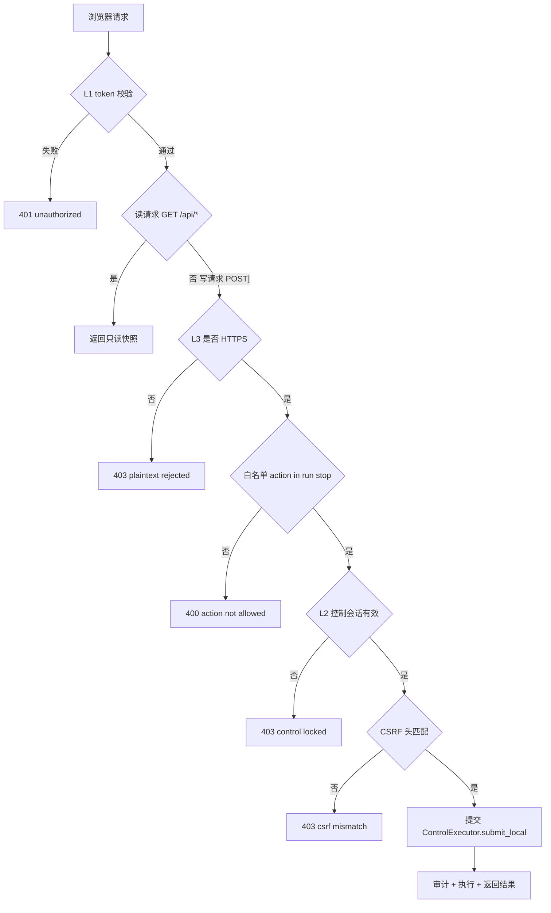
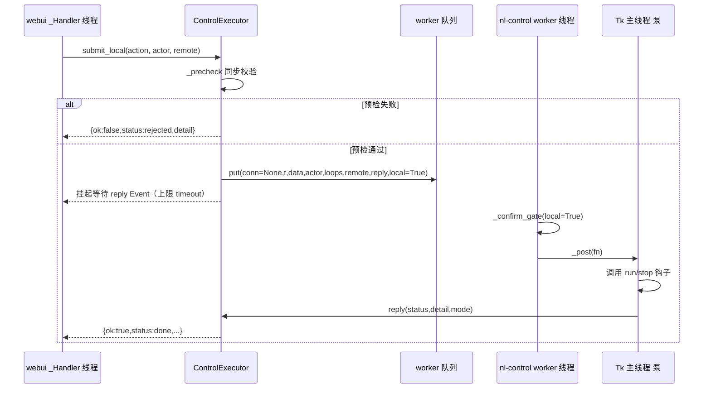
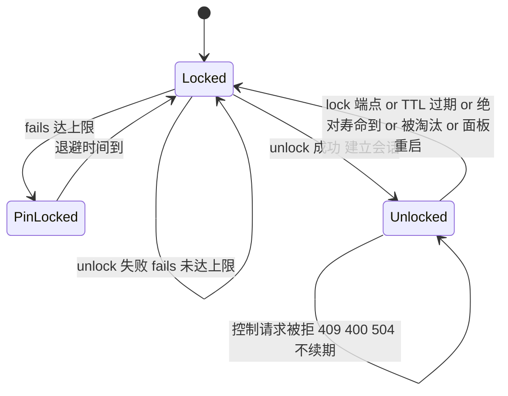

# NetLink 网页面板：从只读升级为「有限控制」+ PWA 可安装 — 技术设计

> 文档类型：架构/技术设计（**不含业务实现代码**，所有 Python 片段均为「签名/结构示意」）
> 适用版本：NetLink Phase 4（面板 Phase 4-2 的演进）
> 目标读者：实现批次（CodingAgent / SubCoding）、评审（Review）、测试（TestGuide）

---

## 0. 范围、非目标与事实基线

### 0.1 目标

1. 面板在**保持只读监控**能力不变的前提下，新增**白名单内的有限控制**：`run`（运行当前已加载脚本）/ `stop`（停止当前运行）。
2. 控制动作受**三层门槛**约束：`token`（读） → `控制 PIN 解锁的短期控制会话`（写） → `强制 HTTPS`（硬绑定）。
3. 面板升级为**可安装 PWA**：`manifest` + service worker 应用壳缓存 + 图标，支持「添加到主屏」，离线可打开并显示**最后快照**。

### 0.2 非目标（明确不做）

* **不开放** `pause` / `resume`（白名单**仅** `{run, stop}`）。
* **不开放** 远程脚本推送（`CMD_RUN_SCRIPT`）与截图、不开放配对/权限变更。
* **不引入** 任何第三方依赖（继续纯标准库 + 已打包的 PIL）。
* **不改变** 现有 token（读）三形式鉴权与令牌存储位置。
* **不降级**：控制开启时若无法建立 HTTPS，则**拒绝启用控制**，绝不回落明文。

### 0.3 事实基线（已核对代码，未标「冲突」的均与代码一致）

| 事实 | 位置 |
| --- | --- |
| `_Server(ThreadingHTTPServer)` / `_Handler(BaseHTTPRequestHandler)` | [`webui.py:333`](../src/netlink/webui.py#L333) / [`webui.py:346`](../src/netlink/webui.py#L346) |
| `WebUI.start()` / `_serve()` / `stop()` | [`webui.py:586`](../src/netlink/webui.py#L586) / [`614`](../src/netlink/webui.py#L614) / [`624`](../src/netlink/webui.py#L624) |
| `DEFAULT_PORT=19712` / 默认 bind `0.0.0.0` | [`webui.py:50`](../src/netlink/webui.py#L50) / [`495`](../src/netlink/webui.py#L495) |
| 路由全 GET，路由前先鉴权 | [`webui.py:443`](../src/netlink/webui.py#L443) / [`447`](../src/netlink/webui.py#L447) |
| 令牌三形式（query → Cookie → Bearer），常量时间比较，失败 401 | [`webui.py:429`](../src/netlink/webui.py#L429) – [`445`](../src/netlink/webui.py#L445) |
| query 令牌落 Cookie `nl_token; HttpOnly; SameSite=Lax; Path=/` | [`webui.py:368`](../src/netlink/webui.py#L368) |
| 严格只读：`do_POST/PUT/DELETE/PATCH/HEAD → 405` | [`webui.py:476`](../src/netlink/webui.py#L476) – [`486`](../src/netlink/webui.py#L486) |
| 令牌凭据库 key `ACRPA/netlink/web-token`，`token()/rotate_token()` | [`webui.py:51`](../src/netlink/webui.py#L51) / [`663`](../src/netlink/webui.py#L663) |
| 前端内联 `_PAGE`，`setInterval(refresh,2000)`，无写入口 | [`webui.py:174`](../src/netlink/webui.py#L174) / [`323`](../src/netlink/webui.py#L323) |
| 面板只 `bus.subscribe()` 更新快照，从不调用 `node.control` | [`webui.py:524`](../src/netlink/webui.py#L524) |
| 控制协议 `T_CMD_RUN/PAUSE/RESUME/STOP/RUN_SCRIPT`、回执 `ACK/ERR` | [`protocol.py:142`](../src/netlink/protocol.py#L142) |
| `_CMD_SET`、`_CONFIRM_CMDS` | [`control.py:37`](../src/netlink/control.py#L37) / [`39`](../src/netlink/control.py#L39) |
| `ControlExecutor.handle()` / `_process()` / `_do_run()` / `_do_stop()` | [`control.py:321`](../src/netlink/control.py#L321) / [`414`](../src/netlink/control.py#L414) / [`493`](../src/netlink/control.py#L493) / [`461`](../src/netlink/control.py#L461) |
| 执行在主线程 `_post()` → `root.after`，`_pump_ui` | [`control.py:159`](../src/netlink/control.py#L159) / [`137`](../src/netlink/control.py#L137) |
| `_ack_accept` 仅发起连接；`_ack_terminal` 广播；`_err` 默认广播 | [`control.py:300`](../src/netlink/control.py#L300) / [`310`](../src/netlink/control.py#L310) / [`287`](../src/netlink/control.py#L287) |
| 首次操控确认门控 `_confirm_gate` / `_confirm` | [`control.py:522`](../src/netlink/control.py#L522) / [`557`](../src/netlink/control.py#L557) |
| 审计 `AuditLog.write(actor,cmd,args,result,detail,remote)` | [`audit.py:72`](../src/netlink/audit.py#L72) |
| `new_pin/new_salt/derive_token(PBKDF2 10万轮)` | [`security.py:51`](../src/netlink/security.py#L51) / [`56`](../src/netlink/security.py#L56) / [`66`](../src/netlink/security.py#L66) |
| `AuthManager` 失败计数 `MAX_AUTH_FAILS=5` + 过载告警 + 断开 | [`security.py:40`](../src/netlink/security.py#L40) / [`541`](../src/netlink/security.py#L541) |
| `tls.server_context(cert,key)` 失败返回稳定英文原因 | [`tls.py:65`](../src/netlink/tls.py#L65) |
| 节点 TLS 启用但证书不可用 → 拒绝启动（绝不降级） | [`node.py:252`](../src/netlink/node.py#L252) – [`265`](../src/netlink/node.py#L265) |
| `state` 配置键 `netlink_web_enabled/port/bind`、`netlink_tls_cert/key/pins` | [`state.py:91`](../src/state.py#L91) – [`96`](../src/state.py#L96) |
| 门面 `start_webui/stop_webui/is_webui_running/webui_url/webui_token/rotate_webui_token` | [`__init__.py:249`](../src/netlink/__init__.py#L249) / [`305`](../src/netlink/__init__.py#L305) / [`316`](../src/netlink/__init__.py#L316) |
| 打包 `datas` 已整体纳入 `res` 目录；`PIL.Image` 已 hiddenimport（`ImageFont` 被 exclude） | [`ACRPA.spec:8`](../ACRPA.spec#L8) / [`9`](../ACRPA.spec#L9) |

**冲突/需注意点（以代码为准，已在设计中规避）**

1. **无内置自签证书生成器**。`tls.py` 只**加载** PEM；证书生成在文档中由用户用 `openssl` 完成（[`netlink-TLS加密说明.md:27`](netlink-TLS加密说明.md:27)），测试脚本 `tools/_test_netlink_tls.py` 才在外部工具可用时临时生成。→ 本设计**复用** `netlink_tls_cert` / `netlink_tls_key` 两个已有键，**不**新增证书生成能力（可选扩展见 §9.4）。
2. **`res/icon.png` 尺寸未知**，`icon-32.png` 尺寸过小。192/512 图标需**构建期生成**（首选）或运行期 PIL 缩放（次选），见 §4.3。
3. **`ImageFont` 被 spec 显式 exclude**：PIL 缩放只用 `Image.resize`，不依赖 `ImageFont`，因此运行期生成 192/512 图标在打包环境**仍可用**（但首选构建期，避免运行期开销与不确定性）。
4. **`ThreadingHTTPServer` 默认在 `__init__` 中即 `bind+activate`**，故 TLS 包裹必须在 `WebUI.start()` 构造之后、`serve_forever()` 之前完成，且**不得**用阻塞握手污染 accept 主循环（见 §2.3）。

---

## 1. 控制安全模型（核心）

### 1.1 三层门槛总览



* **L1 token（读）**：完全沿用现状（query / Cookie `nl_token` / Bearer），**不改变**。
* **L2 控制会话（写）**：由控制 PIN 解锁的**短期会话**，见 §1.2。
* **L3 强制 TLS（硬绑定）**：控制开启即面板 HTTPS，见 §2。

### 1.2 控制会话（载体 / TTL / 滑动续期 / 锁定）

**载体**：独立 Cookie `nl_ctl`，值为**不可猜测的会话 ID**（`secrets.token_urlsafe(32)`）。

| 属性 | 取值 | 理由 |
| --- | --- | --- |
| `HttpOnly` | 是 | JS 不可读，降低 XSS 窃取面（与 `nl_token` 一致） |
| `Secure` | 是（控制必然 HTTPS） | 明文下浏览器不会回传，构成第二道「明文拒绝」 |
| `SameSite` | `Strict` | 控制为同源界面操作，`Strict` 即可用且阻断绝大多数跨站写 |
| `Path` | `/` | 面板为单页应用 |
| `Max-Age` | `netlink_web_control_ttl`（默认 300s） | 与滑动续期配合 |

**服务端会话表**（进程内，受锁保护）：

```
_sessions: {sid: {
    "csrf": <token_urlsafe(32)>,   # 解锁时返回给前端，仅存内存（前端不落 localStorage）
    "created": <ts>,
    "exp": <ts>,                   # 绝对过期（滑动续期更新）
    "remote": "<ip>",              # 仅用于告警，不作为硬门槛（避免 NAT/多网卡误锁）
    "ua_hash": "<sha256(UA)[:12]>",# 仅用于告警
    "last": {"action": "run", "result": "ok", "ts": <ts>}  # 供 /api/control/status 展示
}}
```

**规则**

1. **TTL**：`exp = now + ttl`。**滑动续期**：任何一次**通过 CSRF 校验的控制写请求**把 `exp` 顺延 `ttl`；但设置**绝对上限** `MAX_SESSION_LIFE = 8h`（超过则强制重解锁，防止长期挂起的会话）。
2. **锁定**：`lock` 端点、TTL 到期、会话表被清空、面板重启 → 会话失效。
3. **容量**：`MAX_SESSIONS = 8`；超出时淘汰最早 `created` 的会话（并审计 `WEB_LOCK reason=evicted`）。
4. **不绑定 IP 为硬门槛**：IP 不一致时写审计告警 `WEB_SESSION_IP_CHANGED`，但**放行**（原因：移动设备切 Wi-Fi/多网卡会导致合法会话被误锁；真正的门是 HttpOnly+Strict Cookie + CSRF 令牌不可读）。
5. **进程内即内存态**：**不落盘**（与既有「令牌只进凭据库、不落 config」的取向一致；会话是短期的，重启即失效是可接受甚至期望的行为）。

### 1.3 控制 PIN：设置 / 存储 / 比对 / 防暴力

**存放位置**：Windows 凭据库，**新 target**（与既有命名风格一致）：

```
CONTROL_PIN_TARGET = "ACRPA/netlink/web-control-pin"
```

**存储格式**（单字符串，UTF-8）：

```
pbkdf2$<salt_hex(32)>$<dkhash_hex(64)>
```

* `salt_hex`：`security.new_salt()`（16 bytes → 32 hex）。
* `dkhash_hex`：`security.derive_token(pin, salt_hex).hex()`，即 **PBKDF2-HMAC-SHA256 / 100000 轮 / 32 字节**（复用既有原语，不新造算法）。
* **绝不落 config.json**；格式串前缀 `pbkdf2$` 预留算法演进（未来可 `argon2$` / `scrypt$`）。

**新增 `security.py` 辅助函数（签名示意）**

```python
CONTROL_PIN_TARGET = "ACRPA/netlink/web-control-pin"

def control_pin_target():                 # -> str
def has_control_pin():                    # -> bool  （凭据库可读且格式合法）
def store_control_pin(pin):               # -> bool  生成 salt + 派生 + cred_write
def verify_control_pin(pin):              # -> bool  常量时间比较 hmac.compare_digest
def forget_control_pin():                 # -> None  cred_delete
```

**PIN 规格**：`^\d{6}$`（6 位数字，与既有 `new_pin()` 一致，便于手机输入）；GUI 支持「随机生成」。

**设置/重置（仅 GUI）**：面板**不提供**任何 PIN 设置/重置接口（避免「未解锁也能改 PIN」的提权链）。仅 `netlink_window` 的网页面板对话框（§6）与 `settings_window` 提供。设置成功后：**清空所有控制会话** + 审计 `WEB_PIN_SET`。

**比对**：`verify_control_pin` 内部 `hmac.compare_digest(derive_token(pin, salt).hex(), stored_hash)`；异常一律 `False`。

**防暴力（参照 `AuthManager` 的失败计数 + 告警思路，但作用于面板全局）**

```
_locks: {"fails": int, "lock_until": ts, "last_fail": ts}
MAX_PIN_FAILS = 5          # 与 security.MAX_AUTH_FAILS 对齐
LOCK_BASE = 300            # 首次锁定 300s
LOCK_CAP  = 3600           # 锁定上限 1h，指数退避 min(LOCK_BASE * 2^(n-5), LOCK_CAP)
```

* 每次 `unlock` 失败：`fails += 1`；写审计 `WEB_PIN_FAIL`（含 `remote`）。
* `fails >= MAX_PIN_FAILS` → `lock_until = now + 退避时长`；锁定期间 `unlock` 直接 **429** 且**仍写审计** `WEB_UNLOCK result=rejected detail=locked`（防「静默拒绝」造成审计盲区）。
* 成功解锁 → `fails = 0`、`lock_until = 0`、审计 `WEB_UNLOCK result=ok`。
* 锁定与 `ui.token()` 无关：**token 正确也照样锁定**（PIN 是独立门）。
* 面板重启会清空内存计数 —— 可接受（攻击者无法重启本机进程）；如后续需持久化，可写入 `state` 或审计回放（列为可选加固）。

### 1.4 CSRF 防护

**方案：服务端绑定令牌 + 自定义请求头**（强于经典双提交 Cookie）

1. `unlock` 成功时服务端生成 `csrf`（`token_urlsafe(32)`），存入会话表，并**在响应体返回**（`{"csrf": "..."}`）。
2. 前端把 `csrf` **只放 JS 内存变量**（不写 `localStorage`、不写 Cookie），每次控制写请求携带 `X-NL-CSRF: <csrf>`。
3. 服务端在 L2 校验通过后，`hmac.compare_digest(header_csrf, session.csrf)`；不匹配 → **403 `csrf mismatch`** + 审计 `WEB_REJECT reason=csrf`。

**与 `SameSite` 的关系**

* `nl_ctl` 用 `SameSite=Strict`：跨站发起的表单/`fetch` 根本**不会带上会话 Cookie**，写请求必然落到 `control locked`。这是**第一道**防线。
* 自定义头是**第二道**防线：跨站无法在「简单请求」里带自定义头（会触发 CORS 预检），而面板**不返回任何 CORS 允许头**，因此预检必然失败。
* 因是同源 `fetch`，自定义头**不产生额外预检成本**（同源不预检）。

> 备选（若未来需要跨源嵌入，不推荐）：经典双提交 Cookie（`nl_csrf` 可读 Cookie + 同值头）。当前单页同源场景**不采用**，因为可读 Cookie 会扩大 XSS 面。

### 1.5 白名单分发

```python
_WEB_ACTIONS = {
    "run":  T_CMD_RUN,   # 运行当前已加载脚本
    "stop": T_CMD_STOP,  # 停止当前运行
}
```

* 请求体 `action` 必须先 `str().strip().lower()`，再 `in _WEB_ACTIONS`；否则 **400 `action not allowed`** + 审计 `WEB_REJECT reason=whitelist`。
* **显式拒绝** `pause` / `resume`（即使内核支持）——它们是「未开放」而非「未知」，返回体 `detail` 明确写 `pause/resume not exposed`，便于测试区分（§8）。
* 分发到内核时**只**传 `T_CMD_RUN` / `T_CMD_STOP` 的等价 `submit_local` 调用，**面板不直接构造协议消息**。

### 1.6 审计

**复用 `AuditLog`，单点写盘，不新增日志文件**（`<config>/logs/netlink_audit_YYYYMMDD.log`）。

| 事件 | cmd | actor | result | detail 示例 |
| --- | --- | --- | --- | --- |
| 解锁成功 | `WEB_UNLOCK` | `web-panel\|<ip>` | `ok` | `session=<sid[:8]> ttl=300` |
| PIN 错误 | `WEB_PIN_FAIL` | `web-panel\|<ip>` | `err` | `fails=3/5` |
| 锁定期间尝试 | `WEB_UNLOCK` | `web-panel\|<ip>` | `rejected` | `locked retry_after=287` |
| 主动锁定/超时/被淘汰 | `WEB_LOCK` | `web-panel\|<ip>` | `ok` | `reason=user\|timeout\|evicted` |
| 明文写请求 | `WEB_REJECT` | `web-panel\|<ip>` | `rejected` | `plaintext` |
| 白名单外 | `WEB_REJECT` | `web-panel\|<ip>` | `rejected` | `whitelist action=resume` |
| CSRF 失败 | `WEB_REJECT` | `web-panel\|<ip>` | `rejected` | `csrf` |
| 未解锁写请求 | `WEB_REJECT` | `web-panel\|<ip>` | `rejected` | `control locked` |
| 控制 PIN 设置/重置 | `WEB_PIN_SET` | `gui` | `ok` | `action=set\|reset` |

**`actor` / `remote` 取值**

* `actor = "web-panel|<remote_ip>"`（面板来源统一前缀 `web-panel`，便于与远端设备 `name|fp8` 区分）。
* `remote = "<ip>:<port>"`（`self.client_address`）。

**run / stop 的审计由内核产出，面板不重复写**：`submit_local` 复用 `_do_run/_do_stop`，其内部 `_audit_write(actor, T_CMD_RUN/STOP, ...)` 会以面板传入的 `actor`（`web-panel|<ip>`）落盘。→ **不绕过审计、也不双写**。

### 1.7 面板 → 控制内核的调用路径（推荐：新增本地提交入口）

**推荐方案：在 `ControlExecutor` 新增 `submit_local`，复用 `_do_run/_do_stop` 与审计；不复刻停止状态。**

理由：

1. **状态语义单点**：`_do_stop` 的「优先 `stop` 钩子 / 否则复刻 `state.quit3/quit2/running/pause_event/exec_state`」以及工作流分叉（`_workflow_active`）只应有一处实现，复刻必然漂移。
2. **审计不旁路**：`_do_run/_do_stop` 内的 `_audit_write` 天然覆盖本地面板来源。
3. **线程模型复用**：执行仍需回到 Tk 主线程（`_post` → `root.after` 泵），复用现成泵即可。

**新增/改动（签名示意）**

```python
class ControlExecutor:
    # 新增：把只读面板的本地写请求提交到既有 worker
    def submit_local(self, action, actor, remote, timeout=8.0):
        """action ∈ {"run","stop"}；返回 dict：
        {"ok":bool,"action":str,"status":"done|failed|rejected",
         "detail":str,"mode":str}
        不抛异常；不绕过审计。"""

    # 新增：把 handle() 的前置校验抽出，供 handle 与 submit_local 共用
    def _precheck(self, t, data):
        """-> (ok:bool, reason:str)；reason 与远端路径保持一致的稳定英文
        （already running / recording in progress / no script selected）"""

    # 改动：新增 reply 回调（None = 保持现有远端行为）
    def _do_run(self, conn, t, actor, data, loops, remote, reply=None): ...
    def _do_stop(self, conn, t, actor, data, remote, reply=None): ...

    # 改动：worker item 增加本地标记与回复通道
    # 旧: (conn, t, data, actor, loops, remote)
    # 新: (conn, t, data, actor, loops, remote, reply, local)
    def _process(self, item): ...

    # 改动：本地 web actor 的首次确认策略（见 §1.8）
    def _confirm_gate(self, conn, cmd, actor, remote, local=False): ...
```

**执行流程**



**关键点**

* `conn=None` 时：`_ack_terminal` / `_err(broadcast=True)` **不依赖 conn**（内部走 `node.broadcast`），因此远端控制台仍能看到终态回执，状态一致；仅 **不能** 调 `_ack_accept`（本地面板不需要 accept，且它依赖 conn.send）。
* `reply` 由 `_do_run/_do_stop` 在**终态落定时**调用（`done` / `failed` / 前置 `err`）；`submit_local` 用 `threading.Event` + `timeout` 等待，**超时返回 `{ok:false,status:"rejected",detail:"execution timeout"}` 并审计**（避免 HTTP 线程被长期占用）。
* 面板 HTTP 线程**绝不**触碰 Tk（所有 GUI 交互都经 worker → `_post` → 主线程泵）。

### 1.8 首次操控确认门控（本地 web actor 策略）

**策略（默认）：PIN 解锁即视为本机所有者授权，不再弹窗。**

* 新增配置 `netlink_web_confirm_control`（bool，**默认 `False`**）。
* `_confirm_gate(..., local=True)`：
  * 若 `state.NETLINK_WEB_CONFIRM_CONTROL` 为 `False` → 直接 `return True, ""`；
  * 若为 `True` → 走与远端一致的 `_confirm()` 弹窗（保留「本机弹窗二次确认」的更严档）。
* **理由**：PIN 是「本机所有者持有的第二因子」，且面板已在 HTTPS 内；若解锁后还要人到桌面点确认，移动端使用场景直接失效（这正是本需求的动因）。同时保留 `netlink_web_confirm_control` 作为**可配置的更严档**。
* **替代方案（记录，不默认）**：
  1. **首次解锁客户端绑定**：把「已确认」记到 `state.NETLINK_CONFIRMED_PEERS` 等价的「面板客户端指纹」集合，首次弹窗、之后免弹。缺点：浏览器指纹不稳定，且需维护集合。
  2. **每次运行都弹窗**：最严，但与移动端目标冲突。
* **不与远端设备互相污染**：本地路径**不**读取/写入 `NETLINK_CONFIRMED_PEERS`（那是远端设备指纹集合），避免语义混淆。

### 1.9 并发 / 幂等 / 返回码

| 场景 | 行为 | HTTP | detail（稳定英文，供测试断言） |
| --- | --- | --- | --- |
| `run` 而 `state.running=True` | 拒绝（预检同步） | **409** | `already running` |
| `run` 而正在录制 | 拒绝 | **409** | `recording in progress` |
| `run` 而无脚本（`has_script=False`） | 拒绝 | **409** | `no script selected` |
| `stop` 而未运行 | **幂等成功** | **200** | `not running`（内核 `_do_stop` 既有语义） |
| `stop` 且正在运行 | 成功 | **200** | `done` |
| `run`/`stop` 执行抛错 | 失败终态 | **200** | `failed: <异常文本>` |
| 同动作重复快速提交 | 允许；由 worker **串行**执行；`run` 的第二次被预检拒（`already running`） | 409 | `already running` |
| 队列中有大动作导致等待超时 | 拒绝 | **504**（或 200 rejected，二选一，**取 504** 更语义化） | `execution timeout` |

* **串行化**由既有 `ControlExecutor._q` 单 worker 保证（面板与远端指令**同队列**，天然互斥）。
* **不做客户端级去重窗口**（避免「看起来成功其实被吞」）；幂等性靠上表语义表达。
* 返回体统一结构：`{"ok":bool,"action":str,"status":str,"detail":str,"mode":str}`。

---

## 2. 强制 TLS 落地

### 2.1 触发条件与联动

```
控制开启 (netlink_web_control=True)
    └─ 强制 netlink_web_tls=True（面板 HTTPS）
           └─ 复用 netlink_tls_cert / netlink_tls_key（PEM）
                  └─ tls.server_context() 失败 → 拒绝启用控制
```

* `netlink_web_tls=True` **也允许独立开启**（即只读面板也可选 HTTPS），但**控制开启时该值被强制为真**（GUI 勾选控制时自动勾上 TLS 且置灰，或提示）。
* **失败即拒绝**：`tls.server_context()` 返回 `(None, reason)` 时：
  * `WebUI.start()` **返回 False**；
  * 通过 `bus.publish(TOPIC_STATUS, {"level":"error","msg": ...})` 给出原因；
  * `_nl_log(..., "ERROR")` 记录稳定英文原因（`cert missing` / `key missing` / `cert load failed` / `tls unavailable`）；
  * **绝不**回落为明文 HTTP。

### 2.2 证书来源

* **复用** `state.NETLINK_TLS_CERT` / `state.NETLINK_TLS_KEY`（已是既有键，GUI 已有浏览按钮）。
* 允许「互联未启用 TLS，但面板开控制」：只要这两个键指向可用 PEM 即可（证书生成仍由用户/部署文档用 `openssl` 完成，见 §0.3 冲突点 1）。
* 面板与互联**共用同一个 PEM**（不同端口、各自 `SSLContext`），不额外引入证书管理。

### 2.3 实现方式：**逐连接握手（推荐）**，不在 accept 主循环握手

`ThreadingHTTPServer.__init__` 已 `bind+activate`；因此**不要**用
`srv.socket = ctx.wrap_socket(srv.socket, server_side=True)`，因为包裹后的监听 socket 的 `accept()` **同步执行 TLS 握手**，会阻塞 `serve_forever` 的 accept 主循环（恶意客户端可半开握手造成 DoS）。

**推荐：在 `_Handler.setup()` 内包裹 `self.connection`（握手发生在每连接工作线程）**

```python
class _Handler(http.server.BaseHTTPRequestHandler):
    def setup(self):
        ctx = getattr(self.server, "ssl_ctx", None)
        if ctx is not None:
            try:
                self.connection = ctx.wrap_socket(
                    self.connection, server_side=True,
                    do_handshake_on_connect=True)
            except Exception:
                # 握手失败：直接丢弃该连接，不影响其它连接与 accept 主循环
                try: self.connection.close()
                except Exception: pass
                # 置一个标记，使 handle() 立即返回（见下）
                self._tls_failed = True
                return
        http.server.BaseHTTPRequestHandler.setup(self)
```

* `self.rfile/self.wfile` 由 `StreamRequestHandler.setup()` 基于 `self.connection` 创建 → **必须在包裹之后**调用 `super().setup()`（如上）。
* `handle()`/`do_GET()`/`do_POST()` 首行判 `if getattr(self, "_tls_failed", False): return`，避免对已关闭连接读写。
* `_Server` 增加属性 `ssl_ctx`（`None` = 明文），并在 `WebUI.start()` 里显式设置。
* **明文拒绝的第二层**：`_Handler._handle()` 写路径前判 `self._is_https()`：

```python
def _is_https(self):
    if getattr(self.server, "ssl_ctx", None) is None:
        return False
    try:
        import ssl
        return isinstance(self.connection, ssl.SSLSocket)
    except Exception:
        return False
```

* 若 `netlink_web_control=True` 而 `_is_https()` 为 `False`（理论上不可达，防御性）：写端点一律 **403 `plaintext rejected`** + 审计 `WEB_REJECT reason=plaintext`。

### 2.4 新增 state 配置键（命名与 `netlink_web_*` 风格一致）

| 键 | 类型 | 默认 | 说明 |
| --- | --- | --- | --- |
| `netlink_web_control` | bool | **False** | 启用有限控制（`run`/`stop`） |
| `netlink_web_control_ttl` | int | **300** | 控制会话 TTL（秒），范围建议 60–3600 |
| `netlink_web_tls` | bool | **False** | 面板 HTTPS（控制开启时强制为 True） |
| `netlink_web_confirm_control` | bool | **False** | 本地面板控制是否也需桌面弹窗确认（§1.8） |

> **默认全部关闭** → 既有行为**完全不变**（向后兼容基线）。

### 2.5 与 PWA / 安全上下文的关系

Service Worker 与「添加到主屏」要求**安全上下文**：`https://` 或 `http://localhost`（`127.0.0.1` 亦被主流浏览器视为可信）。

| 场景 | HTTPS | PWA 可安装 | SW 可注册 | 离线快照 |
| --- | --- | --- | --- | --- |
| 控制开启（强制 TLS） | 是 | ✅ 任意主机/局域网 IP | ✅ | ✅ |
| 只读 + `netlink_web_tls=True` | 是 | ✅ | ✅ | ✅ |
| 只读 + 明文 + 经 `127.0.0.1`/`localhost` | 否 | ⚠️ 部分浏览器允许（localhost 例外） | ✅（localhost 例外） | ✅ |
| 只读 + 明文 + 经局域网 IP | 否 | ❌ | ❌ | ❌（降级为在线页面） |

* **自签证书**：浏览器会告警「不安全」；用户需手动信任/继续。**不影响** HTTPS 是否为「安全上下文」（自签仍算安全上下文，SW 可注册），但会影响用户观感。→ 文档需明确告知（§9 修订清单）。
* 前端检测：`window.isSecureContext`；若为 `false` 且 `location.hostname` 非 localhost，**隐藏安装按钮**并给出提示。

---

## 3. HTTP API 设计

### 3.0 通用约定

* **鉴权**：所有端点（除 §3.7 明示的静态端点）**先过 L1 token**；失败 401。
* **响应**：JSON 一律 `application/json; charset=utf-8`，`Cache-Control: no-store`（沿用现有 `_send`）。
* **错误体统一**：`{"ok": false, "error": "<stable_reason>", "detail": "<可读文本>"}`。
* **稳定 reason 常量**（供测试断言）：`unauthorized` / `plaintext rejected` / `control disabled` / `control locked` / `csrf mismatch` / `action not allowed` / `pin invalid` / `pin locked` / `already running` / `recording in progress` / `no script selected` / `execution timeout`。
* **写端点方法**：一律 `POST` + `Content-Type: application/json`，请求体 ≤ 4KB（超限 413）。

### 3.1 `GET /api/control/status`

* 鉴权：L1 token（**不需要**解锁）。
* 响应 200：

```json
{
  "enabled": true,
  "tls": true,
  "scheme": "https",
  "ttl": 300,
  "unlocked": true,
  "expires_in": 214,
  "csrf_required": true,
  "last_action": {"action": "run", "result": "ok", "ts": 1737000000},
  "pin_locked": false,
  "retry_after": 0
}
```

* `enabled=false` 时其余字段给安全默认（`unlocked=false`, `expires_in=0`, `last_action=null`）；**前端据此隐藏控制区**。

### 3.2 `POST /api/control/unlock`

* 请求：`{"pin": "123456"}`
* 校验顺序：L1 token → HTTPS → 控制已启用 → 未处于 PIN 锁定 → PIN 比对。
* 成功 200：

```json
{"ok": true, "csrf": "<token_urlsafe(32)>", "expires_in": 300}
```

  + `Set-Cookie: nl_ctl=<sid>; HttpOnly; Secure; SameSite=Strict; Path=/; Max-Age=300`

* 失败：
  * `401 unauthorized`（无 token）
  * `403 plaintext rejected`
  * `404 control disabled`（面板未启用控制；**不暴露**「是否设置了 PIN」）
  * `401 pin invalid`（PIN 错误；`detail` 不含任何 PIN 信息）
  * `429 pin locked` + `Retry-After: <秒>`（超过失败上限）
  * `400 bad request`（body 非 JSON / `pin` 缺失或非 6 位数字）

### 3.3 `POST /api/control/lock`

* 请求：`{}`（或省略 body）
* 成功 200：`{"ok": true, "locked": true}`
  + `Set-Cookie: nl_ctl=; HttpOnly; Secure; SameSite=Strict; Path=/; Max-Age=0`
* 幂等：未解锁时也返回 200（`locked: true`）。

### 3.4 `POST /api/control`

* 请求：`{"action": "run"|"stop", "csrf": "<token>"}`（`csrf` 亦可放 `X-NL-CSRF` 头，二者取其一，**头优先**）
* 校验顺序：L1 token → HTTPS → 控制已启用 → 会话有效（否则 403 `control locked`）→ CSRF（否则 403 `csrf mismatch`）→ 白名单（否则 400 `action not allowed`）→ 预检 → 执行。
* 成功 200：

```json
{"ok": true, "action": "run", "status": "done", "detail": "done", "mode": "script"}
```

* 失败：

| 条件 | HTTP | `error` |
| --- | --- | --- |
| 未解锁/会话过期 | 403 | `control locked` |
| CSRF 不匹配/缺失 | 403 | `csrf mismatch` |
| 明文 HTTP | 403 | `plaintext rejected` |
| 面板未启用控制 | 404 | `control disabled` |
| `action` 不在白名单（含 `pause`/`resume`） | 400 | `action not allowed` |
| `run` 时已在运行 | 409 | `already running` |
| `run` 时正在录制 | 409 | `recording in progress` |
| `run` 时无脚本 | 409 | `no script selected` |
| 执行等待超时 | 504 | `execution timeout` |
| 执行抛错 | 200 | `status="failed"` |

* 每次调用都**按 §1.6 写审计**（拒绝类写 `WEB_REJECT`；`run`/`stop` 实到内核，由内核写 `CMD_RUN/CMD_STOP`）。

### 3.5 PWA 静态端点（**免 token**，见 §3.7 说明）

| 端点 | 方法 | 响应 | 头 |
| --- | --- | --- | --- |
| `/manifest.webmanifest` | GET | 200 `application/manifest+json` | `Cache-Control: no-cache` |
| `/sw.js` | GET | 200 `application/javascript` | `Cache-Control: no-cache`、`Service-Worker-Allowed: /` |
| `/offline.html` | GET | 200 `text/html` | `Cache-Control: no-cache` |
| `/icons/icon-192.png` | GET | 200 `image/png` | `Cache-Control: public, max-age=86400` |
| `/icons/icon-512.png` | GET | 200 `image/png` | 同上 |
| `/icons/apple-touch-icon.png` | GET | 200 `image/png` | 同上 |
| `/favicon.ico` | GET | 200 `image/x-icon` | 同上（来自 `res/automation.ico`） |

### 3.6 页面 `/`

* 保留现有 token 鉴权（200 `text/html`）；追加 head 注入与 SW 注册脚本（§4.4、§5）。

### 3.7 为什么静态端点是免 token 的（明确取舍）

* **manifest / sw.js / 图标 / offline.html 不含任何业务数据或密钥**（数据全部来自 `/api/*`，仍需 token）。
* 浏览器获取 `manifest.webmanifest` 与注册 `sw.js` 时**默认不带凭据**（`same-origin` 语义在部分实现中不发送 Cookie），若要求 token 会导致**安装/注册失败**。
* 风险边界：局域网他人可看到**空壳 UI 与图标**（无数据）；`/` 与 `/api/*` 仍 401。
* **SW 只缓存非鉴权资源**，且对 `/api/*` 一律 **network-only（不缓存、不回退）** → 不会把某个会话的鉴权响应缓存给他人。

---

## 4. PWA 设计

### 4.1 `manifest.webmanifest`（示例）

```json
{
  "name": "ACRPA 监控面板",
  "short_name": "ACRPA",
  "description": "ACRPA NetLink 运行状态监控与有限控制面板",
  "lang": "zh-CN",
  "start_url": "/?src=pwa",
  "scope": "/",
  "display": "standalone",
  "orientation": "any",
  "theme_color": "#1e293b",
  "background_color": "#0f172a",
  "icons": [
    {"src": "/icons/icon-192.png", "sizes": "192x192", "type": "image/png", "purpose": "any"},
    {"src": "/icons/icon-512.png", "sizes": "512x512", "type": "image/png", "purpose": "any"},
    {"src": "/icons/icon-512.png", "sizes": "512x512", "type": "image/png", "purpose": "maskable"}
  ]
}
```

* `start_url` 不含 token（令牌由用户从 GUI 复制的完整链接携带，见 §6）；`?src=pwa` 仅用于统计/调试。
* **注意**：首次安装后从主屏打开时 `/?src=pwa` **不带 token** → 会 401。→ **设计选择**：`offline.html`/壳页在 401 时展示「请输入/粘贴访问令牌」输入框，`unlock` 与 token 都可由用户粘贴（token 只存 `sessionStorage`，不落盘）。这是 PWA 场景的**必要配套**（详见 §4.5 与 §10 批次 3）。

### 4.2 Service Worker 缓存策略

```
CACHE_VERSION = "acrpa-nl-web-v1"      # 每次发版递增（升级陷阱见 §9.5）

precache（安装时）：
  /manifest.webmanifest
  /offline.html
  /icons/icon-192.png
  /icons/icon-512.png
  /icons/apple-touch-icon.png
  /favicon.ico

fetch 路由：
  /api/*            → network-only（失败 → 503 JSON；绝不缓存/绝不回退）
  navigation(/)     → network-first；失败 → offline.html（读 localStorage 快照渲染）
  /sw.js            → network-only（保证可更新）
  其余同源 GET 静态 → cache-first + 后台 revalidate
```

* `skipWaiting()` + `clients.claim()`：加速升级生效。
* `activate`：删除所有 `CACHE_VERSION` 前缀不匹配的旧缓存（**必须**做，否则老壳页残留）。

### 4.3 图标生成策略（192 / 512）

**首选：构建期生成（推荐）**

* 新增 `res/icon-192.png` / `res/icon-512.png`（源：`res/icon.png`；若源小于 512 需先行重制）。
* `ACRPA.spec` 的 `datas` 已整体纳入 `res` 目录（[`ACRPA.spec:8`](../ACRPA.spec#L8)）→ **新图标自动随包分发，无需改 spec**。
* 生成脚本：新增 `tools/_gen_web_icons.py`（构建/开发期执行，`PIL.Image.open(...).resize((n,n), Image.LANCZOS).save(...)`）；或并入 `build.py` 前置步骤。

**次选：运行期生成（兜底）**

* 面板启动时若 `res/icon-192.png` 缺失 → 用 PIL 从 `res/icon.png` 缩放并**缓存在内存**（`bytes`，加锁），由 `/icons/*` 服务。
* 打包环境 PIL 可用（`PIL.Image` 在 hiddenimports；仅用 `Image.resize`，**不依赖**被 exclude 的 `ImageFont`）。
* 若 PIL 不可用 → 直接回退服务 `res/icon.png`（浏览器会给出尺寸不匹配的告警，但可安装）。

### 4.4 页面 head 注入点（`_PAGE` 内联 HTML）

在 `_PAGE` 的 `<head>`（现约 [`webui.py:176`](../src/netlink/webui.py#L176)–[`179`](../src/netlink/webui.py#L179) 之间）新增：

```html
<link rel="manifest" href="/manifest.webmanifest">
<meta name="theme-color" content="#1e293b">
<link rel="apple-touch-icon" href="/icons/apple-touch-icon.png">
<meta name="apple-mobile-web-app-capable" content="yes">
<meta name="apple-mobile-web-app-status-bar-style" content="black-translucent">
<meta name="apple-mobile-web-app-title" content="ACRPA">
```

在 `</body>` 前（现 [`webui.py:325`](../src/netlink/webui.py#L325)）新增 SW 注册：

```html
<script>
if ('serviceWorker' in navigator && window.isSecureContext) {
  window.addEventListener('load', function(){
    navigator.serviceWorker.register('/sw.js').catch(function(){});
  });
}
</script>
```

### 4.5 离线「最后快照」：存储取舍

**采用 `localStorage`（推荐）**，键 `acrpa.snap.v1`：

* 每次 `refresh()` 成功后写入 `{ts, summary, peers, sched}`（**不含** `/api/logs` 与任何 token）。
* `offline.html` 读取该键并渲染表格 + 顶部「⚠ 离线：显示最后快照（<相对时间>）」横幅。

**取舍说明**

| 方案 | 优点 | 缺点 | 结论 |
| --- | --- | --- | --- |
| `localStorage` | 同步简单、无迁移成本、单页纯 JS 足够 | 上限 ~5MB、仅字符串、可能被浏览器清理 | **采用**（快照 < 100KB） |
| `IndexedDB` | 容量大、结构化、可存二进制 | 代码量显著增加（无库、需回调/Promise 包装） | 仅当日志也要离线时考虑（列为可选演进） |

* **安全**：快照含设备名/脚本名/状态（非密钥），且 `localStorage` 为**同源**可见；面板本身已在 HTTPS + token 之后。**token 绝不入 localStorage**（PWA 首启粘贴的 token 只放 `sessionStorage`，见 §4.1）。
* **容量保护**：写入前 `JSON.stringify` 长度 > 200KB 则丢弃 `peers` 明细只留计数（防御性）。

### 4.6 离线 / 安装引导文案（`offline.html` 与主页面共用）

* 未安装 + 安全上下文：主页面显示 `[安装到主屏]` 按钮（监听 `beforeinstallprompt`，`preventDefault()` 后在用户点击时 `prompt()`）。
* iOS Safari（不支持 `beforeinstallprompt`）：显示文案「点击 分享 → 添加到主屏幕」。
* 非安全上下文（明文 + 非 localhost）：隐藏安装按钮，提示「安装与离线功能需通过 HTTPS 访问（请在设置中启用面板 TLS）」。
* 离线打开：`offline.html` 横幅「离线模式：显示最后快照（xx 分钟前）」+ 一个 `[重试]` 按钮。

---

## 5. 前端 UI 设计（`_PAGE` 内，沿用 `textContent` 防 XSS 风格）

### 5.1 新增 DOM 区块（`<header>` 之下、`<table>` 之上）

```
#ctlbar（控制条，`enabled=false` 时 display:none）
  ├ #ctlstate   控制状态：已锁定 / 已解锁（剩余 mm:ss）
  ├ #ctlpin     <input type="password" inputmode="numeric" maxlength="6"> + [解锁] + [锁定]
  ├ #ctlact     [运行当前脚本] + [停止]   ← 依状态禁用
  └ #ctlmsg     动作结果提示（aria-live=polite）
#pwa
  └ [安装到主屏]（仅在 beforeinstallprompt 可用时显示）
```

### 5.2 状态与交互

* **解锁态**：`run` 按钮在 `unlocked && !running && hasScript` 时可点；`stop` 在 `unlocked && running` 时可点。禁用态用 `disabled` + 灰化（与现有 `.off` 色一致）。
* **剩余时间**：`/api/control/status` 返回 `expires_in`，前端用本地 `setInterval(…,1000)` 递减显示；归零 → 自动置为「已锁定」并禁用按钮（避免用户面对「点了没用」）。
* **CSRF 保存**：解锁响应里的 `csrf` 存**模块级 JS 变量** `var ctlCsrf = ""`（不落 localStorage）。
* **动作结果**：`#ctlmsg` 用 `textContent` 写入 `status + detail`（**绝不** `innerHTML`）。
* **轮询合并**：`refresh()` 增加一次 `/api/control/status` 请求（同一 2s 周期），**仅当已 `enabled`** 时后续轮询；首次必查（用于发现 `enabled`）。→ 稳态 **4 req / 2s**（本机 localhost 开销可忽略）；若担心移动端耗电，可把控制状态降为 **5s** 一次（设计建议：`ctlPollEvery = 2` 或 `3` 个周期，默认 2 = 每 4s）。

### 5.3 无障碍与安全

* 所有动态文本 `textContent`；PIN 输入 `type="password"` + `autocomplete="off"`。
* 按钮 `disabled` 同时设置 `aria-disabled`。
* 不引入任何外部资源（保持「无 CDN、无外部请求」的既有约束）。

---

## 6. GUI 侧改动（文件级）

### 6.1 `src/netlink_window.py` — 网页面板对话框

| 位置 | 改动 |
| --- | --- |
| [`_on_web_panel` 2322](../src/netlink_window.py#L2322) | 对话框尺寸 `560x300` → `560x420`；新增三行控件：① 控制开关（`Checkbutton`，`command=self._on_web_control_toggle`）② `[设置/重置控制 PIN]` 按钮 ③ TLS/证书状态标签 |
| [`_web_refresh` 2413](../src/netlink_window.py#L2413) | 状态行追加 `https://` 与 `控制：已启用/未启用`；URL 展示改为读 `nl.webui_url()`（现已带 scheme）；新增 `TLS：自签证书 N/A — <原因>` 行 |
| [`_on_web_toggle` 2447](../src/netlink_window.py#L2447) | 启用前若 `netlink_web_control=True` 且证书不可用 → 拒绝并提示 `TLS 未就绪：<reason>`；启用失败文案补充「证书/端口」两类原因 |
| 新增 `_on_web_control_toggle` | 勾选时：若无控制 PIN → 弹 PIN 设置对话框（必填）；若证书不可用 → 提示并回退勾选；写 `state.NETLINK_WEB_CONTROL` + `save_config()` + 重启面板（`stop_webui()`/`start_webui()`） |
| 新增 `_on_web_pin_manage` | 自绘 PIN 对话框：显示 `已设置/未设置`；`[设置]`（6 位校验 + 二次确认）/`[重置]`（生成随机 PIN 并显示一次）/`[清除]`；调用门面 `netlink.set_webui_control_pin(pin)` 等 |
| 新增 `_on_web_install_hint` | 可选：展示「HTTPS 访问后在浏览器『添加到主屏』」提示文案 |
| [`_on_web_copy` 2500](../src/netlink_window.py#L2500) | 无改动（URL 已带 scheme） |

### 6.2 `src/settings_window.py` — 网络互联卡片

| 位置 | 改动 |
| --- | --- |
| [`2035`](../src/settings_window.py#L2035) 附近（TLS 区块） | 新增 `nl_web_tls_var`（`Checkbutton`「面板启用 HTTPS（控制必需）」）；新增 `nl_web_control_var`（`Checkbutton`「启用网页面板有限控制（run/stop）」）；新增 `nl_web_control_ttl_var`（`Entry`，默认 `300`）；新增 `nl_web_confirm_control_var`（`Checkbutton`「本地面板控制也需桌面确认」） |
| [`2143`](../src/settings_window.py#L2143) – [`2153`](../src/settings_window.py#L2153) | 在写入段追加：`state.NETLINK_WEB_CONTROL = bool(nl_web_control_var.get())`；`state.NETLINK_WEB_CONTROL_TTL = int(...)`（失败回退 300）；`state.NETLINK_WEB_TLS = bool(nl_web_tls_var.get()) or state.NETLINK_WEB_CONTROL`（**联动强制**）；`state.NETLINK_WEB_CONFIRM_CONTROL = bool(nl_web_confirm_control_var.get())` |
| [`2155`](../src/settings_window.py#L2155) – [`2166`](../src/settings_window.py#L2166) | 生效段：`start_webui()` 失败时（含 TLS 原因）提示具体原因；控制开关变化时先 `stop_webui()` 再 `start_webui()` |
| [`2170`](../src/settings_window.py#L2170) `_track_card_vars` | 追加新变量，参与防抖保存 |

### 6.3 `src/netlink/__init__.py` — 门面

```python
def start_webui(): ...            # 读 netlink_web_control / _control_ttl / _web_tls 传入 WebUI
def webui_control_status(): ...   # -> dict（供 GUI 展示；未运行返回 {"enabled": False}）
def set_webui_control_pin(pin): ...   # -> bool（转 security.store_control_pin + 清会话）
def clear_webui_control_pin(): ...    # -> bool
def has_webui_control_pin(): ...      # -> bool
def webui_control_enabled(): ...      # -> bool
```

* `start_webui()` 在 `ui.start()` 失败时**区分原因**（TLS/端口），并把原因回传 GUI（可经 `_webui_last_error` 模块级变量或让 `WebUI.start()` 返回 `(ok, reason)`；**建议**改为返回 `(ok, reason)` 并让门面兼容旧调用——见 §7 兼容说明）。

---

## 7. 文件级变更清单

> 约定：**所有新函数整体 `try/except`，异常只 `_nl_log`，绝不向上抛**（沿用既有风格）；`netlink` 包内**禁止**顶层 GUI import。

| # | 文件 | 类型 | 关键改动 / 新增函数（签名示意） | 影响范围 | 回归测试点 |
| --- | --- | --- | --- | --- | --- |
| 1 | [`src/netlink/webui.py`](../src/netlink/webui.py) | 改（大） | 常量：`CTL_COOKIE="nl_ctl"`、`_WEB_ACTIONS`、`MAX_PIN_FAILS`、`MAX_SESSIONS`、`MAX_SESSION_LIFE`；类 `_ControlSessionStore`（`create/get/touch/lock/lock_all/purge/last_action`）；类 `_PinGuard`（`check/`失败计数/`locked/retry_after`）；`_Handler`：`do_POST` 实装、`setup()` TLS 包裹、`_route_post`、静态端点；`WebUI`：`start()` 内 TLS 决策、`api_control_status/unlock/lock/control`、`render_page()` head 注入、`manifest()/sw_js()/offline_html()/icon_bytes(name)`、`url()` 输出 scheme | 面板全部路由与启动路径 | 见 §8 断言 1–14 |
| 2 | [`src/netlink/control.py`](../src/netlink/control.py) | 改（中） | `submit_local(action, actor, remote, timeout=8.0)`；`_precheck(t, data)`；`_do_run/_do_stop` 增 `reply=None`；`_process` item 扩展 `(conn,t,data,actor,loops,remote,reply,local)`；`_confirm_gate(..., local=False)`；`handle()` 改用 `_precheck` | 远端控制路径（须无回归）+ 本地面板路径 | 断言 15–19 + 既有 `_test_netlink_control.py` 全绿 |
| 3 | [`src/netlink/security.py`](../src/netlink/security.py) | 改（小） | `CONTROL_PIN_TARGET`、`control_pin_target()`、`has_control_pin()`、`store_control_pin(pin)`、`verify_control_pin(pin)`、`forget_control_pin()` | 凭据库新增一个 target | 断言 6–9 |
| 4 | [`src/state.py`](../src/state.py) | 改（小） | 新增 4 键：`netlink_web_control`(False)、`netlink_web_control_ttl`(300)、`netlink_web_tls`(False)、`netlink_web_confirm_control`(False) | 配置持久化 | 断言 1 |
| 5 | [`src/netlink/__init__.py`](../src/netlink/__init__.py) | 改（小） | §6.3 的 6 个门面函数；`start_webui()` 传参与失败原因回传 | GUI 调用面 | 断言 2、20 |
| 6 | [`src/netlink_window.py`](../src/netlink_window.py) | 改（中） | §6.1（`_on_web_control_toggle`、`_on_web_pin_manage`、`_web_refresh` 扩展） | 网页面板对话框 | 手工冒烟（`_smoke_netlink_window.py` 扩展） |
| 7 | [`src/settings_window.py`](../src/settings_window.py) | 改（中） | §6.2（新变量 + 写入 + 联动 + `_track_card_vars`） | 设置卡片 | 手工冒烟 |
| 8 | `res/icon-192.png`、`res/icon-512.png` | 新增资源 | 构建期生成 | 打包自动纳入 | 断言 11 |
| 9 | `tools/_gen_web_icons.py` | 新增工具 | `main()`：从 `res/icon.png` 生成 192/512 | 仅构建/开发期 | 生成后文件存在且 PNG 魔数正确 |
| 10 | `tools/_test_netlink_webui.py` | 改（扩展） | 新增 §8 断言 1–14 | 自测 | 退出码 0 |
| 11 | `tools/_test_netlink_webui_control.py` | 新增 | 真实 Tk + 假 `run/stop` 钩子的端到端（§8.3） | E2E | 退出码 0 |
| 12 | [`ACRPA.spec`](../ACRPA.spec) | 一般**不需改** | `datas` 已含 `res`；若新增图标放在别处才需改 | 打包 | `tools/_verify_netlink_package.py` |
| 13 | `docs/*.md`（6 个） | 改（实现批次） | §9.1 修订清单 | 文档一致性 | 人工核对 |

**兼容性说明（`WebUI.start()` 返回值）**

* 现状 `start()` 返回 `bool`，被 [`__init__.py:274`](../src/netlink/__init__.py#L274) 使用。为携带 TLS 失败原因，建议 **`start() -> (ok, reason)`**，并让门面同时兼容 `bool` 与 `tuple`（`res = ui.start(); ok = res[0] if isinstance(res, tuple) else res`）。→ 既有测试若断言 `is True` 会失败，**必须**同步更新 `tools/_test_netlink_webui.py`（§8 断言 2 已含）。

---

## 8. 测试方案

### 8.1 扩展 `tools/_test_netlink_webui.py`（单进程 / 无 GUI / 端口 199xx）

**环境**：沿用现有隔离（临时 `state.CONFIG_PATH`、备份/还原 `state` 属性、`cred_delete` 隔离凭据库）；**新增**备份/还原 `NETLINK_TLS_CERT/KEY/PINS`、`NETLINK_WEB_CONTROL/_TTL/_TLS/_CONFIRM_CONTROL`；新增 `CONTROL_PIN_TARGET` 的凭据库清理。

**断言清单**

| # | 断言 | 期望 |
| --- | --- | --- |
| 1 | `netlink_web_control` 默认 `False`；`netlink_web_tls` 默认 `False` | 默认全关（行为不变） |
| 2 | 未启用 TLS 且未启用控制 → 面板 HTTP 200，`url()` 以 `http://` 开头 | 向后兼容 |
| 3 | `GET /api/control/status`（带 token）→ 200 且 `enabled=false, unlocked=false` | 只读可用 |
| 4 | `POST /api/control`（带 token，未解锁）→ 403 `control locked` | 写门第一层 |
| 5 | `POST /api/control/unlock`（未启用控制）→ 404 `control disabled` | 不暴露 PIN 状态 |
| 6 | 未设置 PIN 时 `POST /api/control/unlock` → 401 `pin invalid`（或 403，按实现统一，断言两者之一并固定） | 无 PIN 不可解锁 |
| 7 | `security.store_control_pin("123456")` 后 `has_control_pin()` 为真；凭据库值以 `pbkdf2$` 开头且**不含** `123456` 明文 | 存储格式与不落明文 |
| 8 | `verify_control_pin("123456")` 真 / `"654321"` 假 | 比对正确 |
| 9 | **暴力锁定**：连续 5 次错误 unlock → 第 6 次返回 429 且 `Retry-After>0`；期间正确 PIN 亦 429（token 正确也锁） | 防暴力 |
| 10 | 解锁成功 → 200 且响应含 `csrf`、`Set-Cookie: nl_ctl=` 含 `HttpOnly`/`Secure`/`SameSite=Strict`；`/api/control/status` → `unlocked=true, expires_in<=ttl` | 会话建立 |
| 11 | `POST /api/control {"action":"run"}` 无 `X-NL-CSRF` → 403 `csrf mismatch`；错误 csrf 同 | CSRF |
| 12 | `{"action":"pause"}`（带正确 csrf）→ 400 `action not allowed`；`{"action":"foo"}` 同 | 白名单 |
| 13 | `action="run"`（无脚本）→ 409 `no script selected`；置 `state.has_script=True` 后 → 200 `status=done`（假钩子） | 预检 + 执行 |
| 14 | `action="stop"`（未运行）→ 200 `not running`；再次 `stop` 幂等 200 | 幂等 |
| 15 | `POST /api/control/lock` → 200；随后 `POST /api/control` → 403 `control locked` | 主动锁定 |
| 16 | **明文拒绝**：面板未启用 TLS（`ssl_ctx=None`）却 `netlink_web_control=True` → 所有写端点 403 `plaintext rejected`（防御层） | L3 |
| 17 | **HTTPS 握手**：用 `tls.client_context()` + `ssl.wrap` 连接 HTTPS 面板（临时自签证书，`tools/_test_netlink_tls.py` 同款生成助手）；`GET /` 200 | TLS 生效 |
| 18 | **控制强制 TLS**：`netlink_web_control=True` 且证书路径为空 → `start_webui()` 返回 False（或 `(False, "cert missing")`），端口**不可明文连** | 不降级 |
| 19 | **审计**：解锁失败/锁定/白名单拒绝/明文拒绝/run/stop 后，`AuditLog().tail()` 含对应 `cmd=WEB_*`/`CMD_RUN` 行且 `actor=web-panel\|...` | 审计完整 |
| 20 | **PWA 端点**：`GET /manifest.webmanifest`（免 token）200 且 `application/manifest+json`、JSON 含 `name/icons`；`GET /sw.js`（免 token）200 且含 `CACHE_VERSION` 与 `/api/` 不入缓存的判定；`GET /icons/icon-192.png` 200 且 PNG 魔数 `\x89PNG`；`GET /offline.html` 200 | PWA |
| 21 | 既有断言**全部保持**（13 项：默认关闭/运行态/三形式鉴权/7 API/405 边界/令牌不落 config/rotate/停止重绑/线程收敛/连带停止） | 无回归 |
| 22 | `POST /` 与 `POST /api/summary`（**非控制端点**）仍 405 | 只读边界不回退 |

**启动方式**：`python tools/_test_netlink_webui.py`（退出码 0/1）。总时长预算仍 < 60s；TLS 用例单独超时保护。

### 8.2 既有测试必须继续全绿

* `tools/_test_netlink_control.py`（远端控制/权限/串行化/审计/广播/首次确认）——`_precheck` 重构后**不得**改变其稳定英文 reason。
* `tools/_test_netlink_tls.py`、`tools/_test_netlink_auth.py`、`_test_netlink_e2e.py`、`_smoke_netlink_control_ui.py`。

### 8.3 端到端（新）`tools/_test_netlink_webui_control.py`

* 真实 `tkinter.Tk()` root（headless 环境 `skip`）+ 同进程启动 netlink + 面板（端口 199xx，临时自签证书走 HTTPS）。
* `node.set_control_hooks(run=fake_run, stop=fake_stop)`（假钩子写入共享 `dict`）。
* 用 `urllib` + `context=ssl._create_unverified_context()` 走完整链路：`status → unlock(PIN) → control(run) → 断言 fake_run 被调用 1 次且 loops=None → control(stop) → 断言 fake_stop 被调用 → 审计含两行`。
* 断言 `netlink_web_confirm_control=False` 时**不出现**任何 Toplevel 弹窗（用 `root.winfo_children()` 计数）。
* **断言并发串行**：连续 `run`/`stop` 各 2 次，worker 队列顺序执行（用假钩子的 `call_order` 断言顺序与次数）。

---

## 9. 风险与兼容

### 9.1 既有文档承诺修订清单（**实现批次执行**，本设计仅列出）

| 文档 | 位置 | 现状 | 需修订为 |
| --- | --- | --- | --- |
| [`netlink-网页只读面板说明.md`](netlink-网页只读面板说明.md) | 全文 | 「面板完全只读，不提供运行/暂停/停止任何写入口」 | 改为「默认只读；**可选**开启有限控制（仅 `run`/`stop`），需控制 PIN 解锁且强制 HTTPS」；新增控制 PIN/会话/CSRF/API 章节 |
| 同上 | [`:69`](netlink-网页只读面板说明.md:69) | 「面板不启用 TLS（明文 HTTP）」 | 改为「默认明文；**启用控制时强制 HTTPS**（复用自签证书）；仅读面板也可选 HTTPS」 |
| [`netlink-TLS加密说明.md`](netlink-TLS加密说明.md) | [`:122`](netlink-TLS加密说明.md:122) | 「webui 网页面板未加密」 | 改为「面板可选/强制 HTTPS；与互联共用 `netlink_tls_cert/key`；自签仍需用户信任」 |
| [`netlink-总览与部署指南.md`](netlink-总览与部署指南.md) | [`:144`](netlink-总览与部署指南.md:144) | WebUI「明文 HTTP · 默认关闭」 | 改为「默认关闭；可选 HTTPS；控制开启时强制 HTTPS」；新增 4 个配置键行 |
| 同上 | [`:213`](netlink-总览与部署指南.md:213) | 「UDP 发现与 WebUI 仍为明文」 | 改为「UDP 发现仍为明文；WebUI 可选/强制 HTTPS」 |
| [`netlink-配对与权限说明.md`](netlink-配对与权限说明.md) | [`:13`](netlink-配对与权限说明.md:13)、[`:23-31`](netlink-配对与权限说明.md:23) | 三档权限 + 首次操控确认（仅远端） | 追加「网页面板本地控制」的独立门（PIN + HTTPS + CSRF）与「免受首次确认门控（可配置）」说明 |
| [`netlink-phase1-验收清单.md`](netlink-phase1-验收清单.md) | [`:14`](netlink-phase1-验收清单.md:14) | 承诺「只能看」 | 追加**新验收清单**条目（或新建 phase4-webcontrol 清单），并在旧条目注明「Phase 4 演进：可选有限控制」 |
| [`releases/v0.1.28-beta.md`](releases/v0.1.28-beta.md) | [`:15`](releases/v0.1.28-beta.md:15) | 面板属 Phase 4-2 | 追加新 release 记录（面板控制 + PWA） |
| `README.md` / `img/netlink-webui.png` | — | 面板截图与描述 | 更新描述与截图（如有） |

### 9.2 `0.0.0.0` 绑定 + 控制开启的安全提示（**建议**）

* **建议：控制开启时若 `netlink_web_bind == "0.0.0.0"` → 自动收窄为 `127.0.0.1` 并 `_nl_log` 提示**；如需局域网控制，要求用户显式新增 `netlink_web_allow_remote_control=True`（默认 `False`）才允许 `0.0.0.0`。
* 理由：HTTPS + 自签 + PIN 已提供防护，但**局域网暴露「运行/停止」是高影响操作**，默认收窄是最小惊讶且符合「默认安全」；显式开关保留灵活性。
* 至少：GUI 启用控制时若 bind 为 `0.0.0.0`，**必须**弹出红色警告确认（二次确认）。
* 面板侧（可选加固）：`status` 响应回显 `bind` 与 `remote_control_allowed`，前端在 `0.0.0.0` 时显示常驻警告横幅。

### 9.3 向后兼容

| 项 | 结论 |
| --- | --- |
| 默认 `netlink_web_control=False` | 面板行为**完全不变**；不引入新路由的可见变化（仅新增只读 `status` 端点） |
| 默认 `netlink_web_tls=False` | 仍为明文 HTTP；`url()` 保持 `http://` |
| `do_POST` 由 405 改为「按路径分发」 | **非控制端点仍 405**（§8 断言 22）；`/`、`/api/summary` 的 POST 不受影响 |
| `start()` 返回值 | 见 §7「兼容性说明」，需同步测试 |
| 凭据库新增 target | 不影响既有 `ACRPA/netlink/web-token` 与 `peer/*` |
| 既有远端控制 | `_precheck` 抽取必须**逐字保留**稳定 reason（否则 `_test_netlink_control.py` 失败） |

### 9.4 其他风险

| 风险 | 影响 | 缓解 |
| --- | --- | --- |
| 自签证书浏览器告警 | 用户可能点「不安全」后仍使用 | 文档明确；PWA 安装提示「需先信任证书」；可选扩展：内置证书生成（见下） |
| 无内置证书生成器 | 用户需手工 `openssl`，启用控制门槛偏高 | 文档给出命令；后续可加 GUI「生成自签证书」按钮（需引入 `cryptography` 或调用系统 `openssl`，**本期不做**，列为演进） |
| PIN 遗忘 | 无法解锁控制 | GUI 支持「重置」；重置即清会话并写审计 |
| 手机会话频繁超时 | 体验受损 | 滑动续期 + TTL 可配（默认 300s）；GUI 提供 60/300/900 预设 |
| HTTP 线程等待执行超时 | 占用连接 | `submit_local(timeout=8.0)` + 504 |
| 面板与远端指令竞争 | 状态混乱 | **同一 worker 队列串行**，语义清晰 |
| 快照 localStorage 被清理 | 离线显示为空 | `offline.html` 友好文案；重连后自动回填 |

### 9.5 Service Worker 升级陷阱（**必须**在实现中处理）

1. **旧壳页残留**：`activate` 必须删除 `CACHE_VERSION` 不匹配的缓存，否则用户长期看到旧 UI。
2. **`/` 被 cache-first 缓存**：导航请求必须 **network-first**；否则升级后即使服务端已更新，SW 仍回旧壳页。
3. **`/sw.js` 自身不可缓存**：浏览器有 24h SW 更新检查上限；服务端 `Cache-Control: no-cache` + SW 内 `/sw.js` network-only。
4. **`/api/*` 绝不可缓存/回退**：token 会变，缓存会导致 401 假象与跨会话数据泄漏。
5. **版本号与发布联动**：`CACHE_VERSION` 应随 `state` 版本/`version_info.py` 递增（建议构建时注入或手改并纳入 release checklist）。
6. **PWA 首启无 token**：`start_url` 不带 token → 401；必须提供「粘贴访问令牌」入口（§4.1/§4.5），否则安装后不可用。

---

## 10. 建议实施批次（每批可独立自测）

### 批次 1：控制内核「本地提交」+ PIN 存储（无 GUI、无 HTTP）

* 改动：`control.py`（`submit_local`/`_precheck`/`reply`/`_process`/`_confirm_gate`）、`security.py`（6 个 PIN 函数）、`state.py`（4 个键）。
* 自测：新增 `tools/_test_netlink_webui_control_core.py`（无 HTTP，直接调 `submit_local`）+ 既有 `tools/_test_netlink_control.py` 全绿。
* 验收：`run`/`stop` 语义、预检拒绝、审计 `actor=web-panel|...`、**不弹窗**、PIN 存取与 `verify` 正确。

### 批次 2：面板控制 API + 强制 HTTPS + 会话/CSRF

* 改动：`webui.py`（`_ControlSessionStore`/`_PinGuard`/`do_POST`/TLS `setup()`/控制端点/`start()` 返回值）、`__init__.py`（门面）。
* 自测：扩展 `tools/_test_netlink_webui.py`（§8 断言 1–19、21、22）+ 新 `tools/_test_netlink_webui_control.py`（§8.3）。
* 验收：三层门槛、CSRF、白名单、明文拒绝、强制 TLS 不降级、审计、无回归。

### 批次 3：PWA + 前端 UI + GUI 侧 + 文档修订

* 改动：`webui.py`（`_PAGE` 控制区与 PWA 注入、`manifest()/sw_js()/offline_html()/icon_bytes()`）、`res/icon-192.png`/`icon-512.png`、`tools/_gen_web_icons.py`、`netlink_window.py`、`settings_window.py`、6 份文档修订。
* 自测：§8 断言 11、20 + `tools/_smoke_netlink_window.py` 扩展（PIN 设置/控制开关/URL 展示）+ 浏览器手工验收（安装、离线、控制按钮态）。
* 验收：可安装、离线显示快照、控制 UI 状态正确、文档无矛盾。

---

## 附录 A：一次完整控制流程（示例）

```text
# 1) 只读访问（沿用现状）
GET /?token=<TOKEN>                      → 200（并落 Cookie nl_token）

# 2) 查看控制状态
GET /api/control/status                  → 200 {"enabled":true,"unlocked":false,...}

# 3) 解锁（PIN）
POST /api/control/unlock {"pin":"123456"} → 200 {"ok":true,"csrf":"Xy...","expires_in":300}
                                            Set-Cookie: nl_ctl=...; HttpOnly; Secure; SameSite=Strict

# 4) 运行当前脚本
POST /api/control
  X-NL-CSRF: Xy...
  {"action":"run"}
                                          → 200 {"ok":true,"action":"run","status":"done","detail":"done","mode":"script"}

# 5) 停止
POST /api/control
  X-NL-CSRF: Xy...
  {"action":"stop"}                       → 200 {"ok":true,"action":"stop","status":"done","detail":"done","mode":"script"}

# 6) 锁定
POST /api/control/lock {}                 → 200 {"ok":true,"locked":true}
                                            Set-Cookie: nl_ctl=; Max-Age=0

# 7) 审计样例（logs/netlink_audit_YYYYMMDD.log）
[2026-01-01 10:00:01] actor=web-panel|192.168.1.23 remote=192.168.1.23:51234 cmd=WEB_UNLOCK args={"ttl":300} result=ok detail=session=a1b2c3d4
[2026-01-01 10:00:03] actor=web-panel|192.168.1.23 remote=192.168.1.23:51234 cmd=CMD_RUN args={} result=ok detail=mode=script
[2026-01-01 10:00:09] actor=web-panel|192.168.1.23 remote=192.168.1.23:51234 cmd=CMD_STOP args={} result=ok detail=mode=script done
[2026-01-01 10:00:15] actor=web-panel|192.168.1.23 remote=192.168.1.23:51234 cmd=WEB_LOCK args={} result=ok detail=reason=user
[2026-01-01 10:02:44] actor=web-panel|192.168.1.23 remote=192.168.1.23:51236 cmd=WEB_PIN_FAIL args={} result=err detail=fails=1/5
[2026-01-01 10:02:50] actor=web-panel|192.168.1.23 remote=192.168.1.23:51238 cmd=WEB_UNLOCK args={} result=rejected detail=locked retry_after=287
```

## 附录 B：状态机（控制会话）



> 说明：`Unlocked → Unlocked（被拒）` 分支表示**仅成功通过全部校验的写请求**才滑动续期；白名单外/预检失败**不**续期（避免被用于「保活」）。
