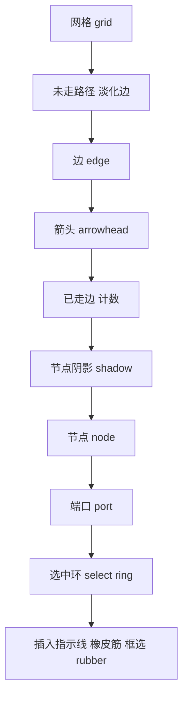
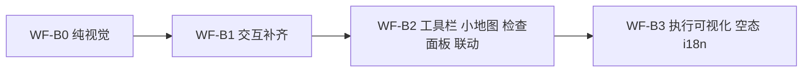

# 工作流界面美化设计方案

> 目标文件：[`src/ui/workflow_view.py`](../src/ui/workflow_view.py)、[`src/ui/flow_canvas.py`](../src/ui/flow_canvas.py)
> 领域层（只读、不改）：[`src/flow_graph.py`](../src/flow_graph.py)
> 宿主与主题：[`src/ACRPA.py`](../src/ACRPA.py)、[`src/ui/theme.py`](../src/ui/theme.py)、[`src/utils.py`](../src/utils.py)、[`src/i18n.py`](../src/i18n.py)
> 状态：**设计稿（仅文档，不改 `src/` 任何代码，不提交 git）**
> 关联文档：[`docs/UI美化设计方案.md`](./UI美化设计方案.md)（色板/字体/尺度/组件规范的唯一权威）、[`docs/ACRPA-完善路线图.md`](./ACRPA-完善路线图.md) **§11**（工作流 CFG，重点 §11.5–§11.10）、[`docs/设置窗口优化设计方案.md`](./设置窗口优化设计方案.md)（本文档结构范例）

---

## 0. 定位与边界：本文档与既有文档的关系

路线图 §11 已经把「工作流从加了箭头的列表 → 真控制流图」的**模型（A 期）、兼容（B 期）、画布（C 期）、交互（D 期）、静态分析（E 期）** 全部规划完毕，`flow_graph.py`（A 期）与 `flow_canvas.py`（C 期）已落地，D/E 期部分落地。

本文档**不是另起炉灶**，而是 **§11.6「节点形状与视觉语义」+ §11.7「图形操作规范」的视觉与交互细化落地**：把「已经做出来的功能」往「符合 `UI美化设计方案.md` 规范、暗色/高 DPI 一致、可验收」的方向收口，并补齐 §11.8/§11.9/§11.10 的组件外壳。

| 已由既有文档覆盖（不重做） | 本文档的增量 |
| --- | --- |
| 色板 Token、字体角色与尺度、`sp/scaled/ctrl_h/TOKENS`（[`UI美化设计方案.md` §2/§3](./UI美化设计方案.md)） | 画布专用视觉：节点/连线/网格/层级/缩放视觉一致性的**具体色值 + token 键** |
| 组件外观规范、深浅色草图（同上 §4/§5） | 工作流画布子系统的组件（画布工具栏 / 小地图 / 检查面板 / 空态 / 图例） |
| 焦点/悬停微观态（同上 §4.9） | 画布内命中区、hover/选中态、非法连线拒绝反馈 |
| B0–B3 视觉改造阶段（同上 §7） | 工作流画布专属分期 **WF-B0…WF-B3**（含可回滚点与验收断言） |
| §11 的模型/布局/分析算法选型 | §11.6/§11.7 的**像素级**落地口径与「已在代码中/仍未落地」的差异核对 |

**边界（硬约束，全程遵守）**：

1. 不动执行引擎 —— 执行仍走 `src/workflow.py` 树执行器；图编辑为**视图级**（路线图 §11.4:629）。
2. **不把 `_FLOW_COLORS` 迁出** `workflow_view.py`（[`workflow_view.py:193-202`](../src/ui/workflow_view.py#L193)）；画布配色真源仍归该模块。
3. 不引入任何新三方 GUI 依赖（维持 `tkinter` + `utils`/`theme` 既有栈）。
4. `flow_graph.py` 为纯逻辑层，本方案**只读不改**（渲染所需的样式全部经 `ctx` 注入）。

---

## 1. 现状体检（基于真实代码）

### 1.1 结构事实

| 部件 | 位置 |
| --- | --- |
| 工作流 Tab / 工具栏外框 | [`workflow_view.py:323-356`](../src/ui/workflow_view.py#L323) |
| 工具栏按钮组（新建/打开/保存/…/+ 脚本…） | [`workflow_view.py:361-405`](../src/ui/workflow_view.py#L361) |
| 工作流名称框 `wf_name_entry` | [`workflow_view.py:408-412`](../src/ui/workflow_view.py#L408) |
| 左：操作库 `wf_lib_frame`（宽 180） | [`workflow_view.py:421-453`](../src/ui/workflow_view.py#L421) |
| 右：`PanedWindow`（大纲 + 画布） | [`workflow_view.py:457-459`](../src/ui/workflow_view.py#L457) |
| 大纲 `wf_tree`（Treeview，tree+headings） | [`workflow_view.py:462-480`](../src/ui/workflow_view.py#L462) |
| 画布容器 `wf_flow_frame` / `wf_flow_canvas` | [`workflow_view.py:485-497`](../src/ui/workflow_view.py#L485) |
| 检查摘要标签 `wf_flow_check_lbl`（单行） | [`workflow_view.py:499-503`](../src/ui/workflow_view.py#L499) |
| 画布渲染入口 `_wf_render_flow_canvas` | [`workflow_view.py:803-901`](../src/ui/workflow_view.py#L803) |
| 回退单列渲染 `_wf_render_flowchart_legacy` | [`workflow_view.py:903-1027`](../src/ui/workflow_view.py#L903) |
| 拖拽（仅垂直） `_wf_drag_start/move/end` | [`workflow_view.py:1042-1088`](../src/ui/workflow_view.py#L1042) |
| 执行高亮刷新 `_wf_update_workflow_highlight` | [`workflow_view.py:1842-1862`](../src/ui/workflow_view.py#L1842) |
| 图形色板 / 图标 / 节点几何常量 | [`workflow_view.py:188-207`](../src/ui/workflow_view.py#L188) |
| 分层布局 `layout` / 几何常量 | [`flow_canvas.py:45-50`](../src/ui/flow_canvas.py#L45)、[`141-176`](../src/ui/flow_canvas.py#L141) |
| 节点绘制 `_draw_node` / 端口 `_draw_ports` | [`flow_canvas.py:232-291`](../src/ui/flow_canvas.py#L232)、[`529-543`](../src/ui/flow_canvas.py#L529) |
| 正/回边 `_draw_forward_edge` / `_draw_back_edge` | [`flow_canvas.py:303-330`](../src/ui/flow_canvas.py#L303) |
| 起止终结点 `_draw_terminal` | [`flow_canvas.py:333-339`](../src/ui/flow_canvas.py#L333) |
| 渲染主序 `render`（边→终结点→节点） | [`flow_canvas.py:346-403`](../src/ui/flow_canvas.py#L346) |
| 缩放/平移 `bind_zoom_pan` | [`flow_canvas.py:447-515`](../src/ui/flow_canvas.py#L447) |
| 连线交互 `bind_interactions` | [`flow_canvas.py:596-743`](../src/ui/flow_canvas.py#L596) |
| 图模型 / 静态分析 / 图编辑原语 | [`flow_graph.py:70-217`](../src/flow_graph.py#L70)、[`616-685`](../src/flow_graph.py#L616)、[`712-765`](../src/flow_graph.py#L712) |
| 宿主接线（build + get_widgets 转发别名） | [`ACRPA.py:4383-4410`](../src/ACRPA.py#L4383)、[`3478-3503`](../src/ACRPA.py#L3478) |
| 编辑 Tab 的颜色图例 `_LEGEND_ITEMS` | [`ACRPA.py:1547-1553`](../src/ACRPA.py#L1547)、[`4199-4212`](../src/ACRPA.py#L4199) |
| 语义色 token（含 `flowbg` / `gridline` / `zebra`） | [`theme.py:40-87`](../src/ui/theme.py#L40) |
| 尺寸 token `TOKENS` / `sp` / `ctrl_h` | [`utils.py:832-850`](../src/utils.py#L832)、[`858-875`](../src/utils.py#L858) |

### 1.2 视觉与交互盘点

| 维度 | 现状 | 证据 |
| --- | --- | --- |
| 节点尺寸 | `NODE_W=200 / NODE_H=36 / H_GAP=46 / V_GAP=56 / MARGIN=28`，**裸设计像素、未经 `sp()/scaled()`** | [`flow_canvas.py:45-50`](../src/ui/flow_canvas.py#L45)；`workflow_view` 侧同名常量 [`workflow_view.py:205-207`](../src/ui/workflow_view.py#L205) |
| 节点字号 | 两行文本**同一字号** `FONT_SMALL_BOLD`，无层级 | [`flow_canvas.py:288-289`](../src/ui/flow_canvas.py#L288)、[`workflow_view.py:853`](../src/ui/workflow_view.py#L853) |
| 间距 | 布局用固定 `V_GAP=56`，非 4px 网格 token | [`flow_canvas.py:141-176`](../src/ui/flow_canvas.py#L141) |
| 配色（类型色） | `_FLOW_COLORS` 8 类，值取自 Tailwind 网页色 | [`workflow_view.py:193-202`](../src/ui/workflow_view.py#L193) |
| 配色（结构色） | 阴影 `#CBD5E0`/`#334155`、禁用 `#94A3B8`、回退 `#6B7280`、节字/终结点 `#FFFFFF`/`fgm` **硬编码** | [`flow_canvas.py:258`](../src/ui/flow_canvas.py#L258)、[`53`](../src/ui/flow_canvas.py#L53)、[`52`](../src/ui/flow_canvas.py#L52)、[`288`](../src/ui/flow_canvas.py#L288)、[`383`](../src/ui/flow_canvas.py#L383) |
| 连线 | 正向 `width=2` 直线 + 三角箭头（`s=6`）；回边 `width=2` 虚线；均**硬编码宽度** | [`flow_canvas.py:303-330`](../src/ui/flow_canvas.py#L303)、箭头 [`189-200`](../src/ui/flow_canvas.py#L189) |
| 层级（z-order） | 边 → 终结点 → 节点；阴影 `tag_lower` 到节点之下 | [`flow_canvas.py:372-397`](../src/ui/flow_canvas.py#L372)、[`282`](../src/ui/flow_canvas.py#L282) |
| 画布底 | `C["flowbg"]`，缺键回退硬编码 `#F8FAFC` | [`workflow_view.py:490`](../src/ui/workflow_view.py#L490)；token 见 [`theme.py:61/79`](../src/ui/theme.py#L61) |
| 网格/吸附 | **无网格、无吸附**（`gridline` token 存在却未用于画布） | [`theme.py:65/82`](../src/ui/theme.py#L65) |
| 缩放一致性 | `canvas.scale("all", …)` **只缩放坐标**，线宽/字号不随之变化 | [`flow_canvas.py:459-476`](../src/ui/flow_canvas.py#L459) |
| 大纲 | `wf_tree` 步骤树；与画布**无选中联动**；`refresh_tree` 末尾仅全量重绘 | [`workflow_view.py:1091-1125`](../src/ui/workflow_view.py#L1091) |
| 工具栏 | 全局工具栏（非画布专用）；无缩放/fit/网格/小地图开关 | [`workflow_view.py:361-405`](../src/ui/workflow_view.py#L361) |
| 检查面板 | **单行 Label**，`wraplength=380` 硬编码，无展开/无点击定位 | [`workflow_view.py:499-503`](../src/ui/workflow_view.py#L499)、[`874-889`](../src/ui/workflow_view.py#L874) |
| 空态 | 画布居中一行文字，无模板卡片 | [`flow_canvas.py:354-359`](../src/ui/flow_canvas.py#L354)、[`workflow_view.py:907-911`](../src/ui/workflow_view.py#L907) |
| 暗色 | `flowbg` 深浅两值已就位；但阴影/禁用/连线等结构色**不随主题** | [`theme.py:52-87`](../src/ui/theme.py#L52) |
| 图例 | 工作流 Tab **无图例**；编辑 Tab 图例用 web 色且与 `_FLOW_COLORS` 不一致 | [`ACRPA.py:1547-1553`](../src/ACRPA.py#L1547) |

### 1.3 与 `docs/UI美化设计方案.md` 规范不一致处（逐条）

| # | 规范条款 | 现状违反 | 证据 |
| --- | --- | --- | --- |
| ① | §3.2 / V4「唯一尺寸源：所有窗口必须消费 `TOKENS`/`ctrl_h()`；禁止字面量」 | 画布节点几何与端口半径、箭头尺寸均为**字面量设计像素**，未经 `sp()`；字号却走 `scaled()` 字体 → 高 DPI 下文本相对节点变大 | [`flow_canvas.py:45-50`](../src/ui/flow_canvas.py#L45)、[`526`](../src/ui/flow_canvas.py#L526)、[`189-200`](../src/ui/flow_canvas.py#L189) |
| ② | §8「全项目只用 `C[...]` 与 `_darken`；禁止新增硬编码」 | 画布阴影/禁用/回退/文字色硬编码；回退渲染同样硬编码 | [`flow_canvas.py:52-53,258`](../src/ui/flow_canvas.py#L52)、[`workflow_view.py:969,985`](../src/ui/workflow_view.py#L969) |
| ③ | §4.8「sash（PanedWindow 分隔）：4px + 中心抓手点」 | `sashwidth=3` + `sashrelief="raised"` | [`workflow_view.py:457-458`](../src/ui/workflow_view.py#L457) |
| ④ | §4.9.2「hover 不得仅变暗」/ §4.5「选中态」 | 画布节点/边**无 hover 态**；选中边仅置 `width=3` 且**不回退** | [`flow_canvas.py:633-638`](../src/ui/flow_canvas.py#L633) |
| ⑤ | §2.4「强调色白名单」 | 画布橡皮筋线恒用 `ac`，合法/非法不分色 | [`flow_canvas.py:670-672`](../src/ui/flow_canvas.py#L670) |
| ⑥ | §3.1「图标一律 `Segoe UI Symbol` 单色码位」 | `_FLOW_ICONS` 混用 `[>]`（ASCII）与 ⧗/✉ 等符号，且形状语义未按 §11.6 落地（`command` 左侧色条、`variable/log` 平行四边形缺失） | [`workflow_view.py:203-204`](../src/ui/workflow_view.py#L203)、[`flow_canvas.py:263-279`](../src/ui/flow_canvas.py#L263) |

> 注：① 与 ② 是本方案**最高优先级**的两项——它们同时违反既有 UI 规范与路线图 §11.6 的节点视觉语义要求，且是「高 DPI 下画布观感崩坏」的直接根因。

---

## 2. 问题清单（分级）

**总计 17 项：P0 4 项 / P1 7 项 / P2 6 项。**

### P0（阻断观感正确性 / 直接违反既有规范）

#### P0-1 节点几何未纳入尺寸 token → 高 DPI/缩放档位下画布错乱
- **现象**：`NODE_W/NODE_H/H_GAP/V_GAP/MARGIN`（画布侧）与 `_NODE_W/_NODE_H/_NODE_GAP`（视图侧）都是字面量；而节点内文字用 `fonts.get("small_bold")`（经 `scaled()` 放大）。ui_scale 提升后，字号变大而节点矩形不变 → 两行文本溢出、行距挤压。
- **证据**：[`flow_canvas.py:45-50`](../src/ui/flow_canvas.py#L45)、[`workflow_view.py:205-207`](../src/ui/workflow_view.py#L205)、文字 [`flow_canvas.py:288`](../src/ui/flow_canvas.py#L288)、布局 [`flow_canvas.py:161-175`](../src/ui/flow_canvas.py#L161)。
- **影响**：高 DPI / `ui_scale>1` 用户画布不可读；违反 §3.2/V4。
- **建议方向**：`layout()` 接受 `node_w/node_h/h_gap/v_gap/margin/port_r` 参数（函数已具备形参，[`flow_canvas.py:141`](../src/ui/flow_canvas.py#L141)），由 `_wf_render_flow_canvas` 经 `_CTX["sp"]` 注入 `sp(200)` 等；`NODE_W` 等常量保留为**设计像素默认值**（向后兼容直接调用 `layout` 的既有测试）。

#### P0-2 禁用节点「整体变灰」违反 §11.6
- **现象**：`if not node.enabled: color = DISABLED_COLOR`（`#94A3B8`）——类型色被完全覆盖。
- **证据**：[`flow_canvas.py:239-240`](../src/ui/flow_canvas.py#L239)、`DISABLED_COLOR` [`53`](../src/ui/flow_canvas.py#L53)；回退渲染同病 [`workflow_view.py:968-969`](../src/ui/workflow_view.py#L968)。
- **影响**：禁用后**丢失类型信息**，与 §11.6「禁用态用 40% 透明度 + 删除线，而非整体变灰丢失类型色」([`路线图 §11.6:666`](./ACRPA-完善路线图.md)) 直接冲突。
- **建议方向**：保留类型色，模拟 40% 透明（Tk canvas **无 alpha** → 用「类型色与 `flowbg` 按 60:40 混合」近似，见 §4.1），叠加删除线（文本中线）。

#### P0-3 画布结构色硬编码，未走主题 token
- **现象**：阴影 `#334155`/`#CBD5E0`、禁用 `#94A3B8`、回退类型色 `#6B7280`、节点文字/终结点 `#FFFFFF`/`fgm` 全为字面量。
- **证据**：[`flow_canvas.py:52-53,258,288,383`](../src/ui/flow_canvas.py#L52)、[`workflow_view.py:844-846`](../src/ui/workflow_view.py#L844)、回退渲染 [`workflow_view.py:985`](../src/ui/workflow_view.py#L985)。
- **影响**：违反 §8「禁止新增硬编码」；暗色下阴影 `#CBD5E0` 刺眼、亮色下 `#334155` 过重。
- **建议方向**：在 `workflow_view.py` 内新增**同级**样式真源 `_FLOW_STYLE`（不迁出 `_FLOW_COLORS`），值优先取自 `C[...]`（`bd/border_strong/gridline/fgm/sc/dg/wn/flowbg`），经 `ctx["style"]` 传入 `flow_canvas`。（归属约定见 §4.5）

#### P0-4 缩放不补偿线宽/字号 → 0.4×–2.5× 视觉不一致
- **现象**：`bind_zoom_pan` 用 `canvas.scale("all", …)` 缩放坐标，**不改变 item 的 `width` 与字体**；`workflow_view` 每次重绘把 `scale` 复位为 1.0（[`workflow_view.py:862-863`](../src/ui/workflow_view.py#L862)）。
- **证据**：[`flow_canvas.py:459-476`](../src/ui/flow_canvas.py#L459)、线宽 [`306`](../src/ui/flow_canvas.py#L306)/[`319`](../src/ui/flow_canvas.py#L319)、字号 [`288`](../src/ui/flow_canvas.py#L288)。
- **影响**：缩到 0.4× 时连线相对过粗、文字仍大；放到 2.5× 时线条过细、文字未放大 → §11.7 的「缩放」体验名不副实。
- **建议方向**：把「缩放」从 canvas 坐标变换改为**渲染期缩放乘子**（`render(..., zoom=z)`，布局坐标不变），线宽 = `token * z`、字号 = `scaled(pt) * z`、端口半径 = `sp(PORT_R) * z`；`bind_zoom_pan` 保留 0.4–2.5 与光标锚点语义，改为触发重绘。

### P1（交互/信息缺失，体验明显受损）

#### P1-1 检查面板仅单行、不可展开、不可定位
- **现象**：`wf_flow_check_lbl` 一行文本 + `wraplength=380` 硬编码；只显示首条 issue。
- **证据**：[`workflow_view.py:499-503`](../src/ui/workflow_view.py#L499)、[`874-889`](../src/ui/workflow_view.py#L874)。
- **影响**：§11.8 要求「可折叠列表 + 点击定位节点高亮」，现状无法使用。
- **建议方向**：升级为可折叠 `Treeview`/`Listbox` 列表，项数 = `len(analyze(g))`，点击项 → 高亮 `issue["nodes"]`（见 §5.4）。

#### P1-2 无画布工具栏、无小地图
- **现象**：缩放/fit/自动整理/网格/小地图全部缺位；`fit_to_view` 仅把左上角 `moveto`，**不改缩放**。
- **证据**：[`flow_canvas.py:581-593`](../src/ui/flow_canvas.py#L581)；无 minimap 实现（全文）。
- **影响**：§11.7「一键自动整理、右下角 minimap」缺失。
- **建议方向**：画布右上/右下悬浮工具栏 + 右下 minimap（见 §5.1/§5.2）。

#### P1-3 非法连线无红色拒绝反馈
- **现象**：`connect()` 返回 `None` 时静默 `return "break"`，橡皮筋线颜色恒为 `ac`。
- **证据**：[`flow_canvas.py:700-711`](../src/ui/flow_canvas.py#L700)、[`670-672`](../src/ui/flow_canvas.py#L670)；拒绝原因由 [`flow_graph.can_connect`](../src/flow_graph.py#L712) 给出但**未被 UI 消费**。
- **影响**：§11.7「端口类型不匹配或非法环时显示红色拒绝反馈」未落地，用户不知为何连不上。
- **建议方向**：拖拽时按 `can_connect` 结果实时切换橡皮筋颜色（合法 `ac` / 非法 `dg`），落点无效时短暂红色闪烁 + toast。

#### P1-4 无框选/多选/插入指示线；拖拽仅垂直且全量重绘
- **现象**：`_wf_drag_move` 只改 `dy` 并 `move` 节点；`_wf_drag_end` 按 `round(dy/_NODE_GAP)` 换序后 `_wf_render_flowchart()` 全量重绘。
- **证据**：[`workflow_view.py:1049-1088`](../src/ui/workflow_view.py#L1049)。
- **影响**：§11.7「拖拽显示插入指示线」「矩形框选」缺失；全量重绘导致拖拽闪烁。
- **建议方向**：`_wf_drag_move` 只移动被拖节点图元 + 绘制插入指示线；`_wf_drag_end` 才重排布局。框选多选由画布层 `rubber` 矩形实现（与现有**建边橡皮筋**区分，后者用 `st["rubber"]`）。

#### P1-5 大纲 ↔ 画布无双向选中联动
- **现象**：`wf_tree` 选中不影响画布高亮；画布双击仅单向 `selection_set` + `see`（[`workflow_view.py:1034-1039`](../src/ui/workflow_view.py#L1034)），反向不成立。
- **影响**：§11.10 双向联动缺失；键盘用户可达性差。
- **建议方向**：`<<TreeviewSelect>>` → 画布 `tag_raise` 选中环；画布单选 → `wf_tree.selection_set`（见 §5.3）。

#### P1-6 选中边高亮不回退、节点无 hover
- **现象**：`_highlight` 置 `width=3` 后无恢复；节点无 `<Enter>/<Leave>`。
- **证据**：[`flow_canvas.py:633-638`](../src/ui/flow_canvas.py#L633)。
- **影响**：连续选边会残留多条加粗；违反 §4.9.2。
- **建议方向**：维护 `selected_edge` 上一值，切换时恢复基准线宽；节点 hover = 描边色提亮（`ac` 或 `border_strong`）内缩 1px。

#### P1-7 画布无网格/无 8px 吸附
- **现象**：`gridline` token 已就绪但画布无网格线、拖拽无吸附。
- **证据**：[`theme.py:65/82`](../src/ui/theme.py#L65)。
- **影响**：§11.7「8px 网格吸附」缺失；§11.5「坐标落盘」后手工整理无对齐依据。
- **建议方向**：可选网格背景（`gridline` 色，暗色降对比）+ 拖拽吸附到 `sp(8)` 网格（§4.3）。

### P2（打磨与一致性）

#### P2-1 空态无模板卡片
- **证据**：[`flow_canvas.py:354-359`](../src/ui/flow_canvas.py#L354)、[`workflow_view.py:907-911`](../src/ui/workflow_view.py#L907)。**建议**：空态渲染 3–4 张模板卡片（复用 `templates.py`），点击即建首节点（§5.5）。

#### P2-2 `PanedWindow` sash 未按 §4.8
- **证据**：[`workflow_view.py:457-458`](../src/ui/workflow_view.py#L457)（`sashwidth=3` + `raised`）。**建议**：`sp("sash")`(=4) + 扁平 + 中心抓手点。

#### P2-3 节点两行文本无字号层级
- **证据**：[`flow_canvas.py:288-289`](../src/ui/flow_canvas.py#L288)。**建议**：行1 = `small_bold`、行2 = `small`，行2 用 `#FFFFFF` 的 85% 亮度或 `flowbg` 混色。

#### P2-4 工作流 Tab 无图例；既有图例色与 `_FLOW_COLORS` 不一致
- **证据**：[`ACRPA.py:1547-1553`](../src/ACRPA.py#L1547)（#2563EB 等 web 色）。**建议**：新增工作流图例，色值**直接取 `get_flow_colors()`**（[`workflow_view.py:1936-1938`](../src/ui/workflow_view.py#L1936)），单一真源。

#### P2-5 状态色未落地（脉冲/边计数/未走路径淡化 30%）
- **证据**：[`flow_canvas.py:245-250`](../src/ui/flow_canvas.py#L245)（仅描边）、[`workflow_view.py:1842-1862`](../src/ui/workflow_view.py#L1842)（步骤变更即全量重绘 → 闪烁）。**建议**：见 §4.4、§5.4。

#### P2-6 i18n 未接入画布文案
- **证据**：[`workflow_view.py:185,188-190,908`](../src/ui/workflow_view.py#L185)（硬编码中文）。**建议**：经 `i18n.t()` 抽取加载态/空态/图例等**承重串**（§11.6 与 §5.6 呼应）。

---

## 3. 设计目标与原则

| 目标 | 可量化指标 |
| --- | --- |
| 与既有 Token 体系统一 | 画布所有尺寸经 `sp()/ctrl_h()/scaled()`；结构色 0 处硬编码（全部经 `ctx["style"]`） |
| 暗色/高 DPI 一致 | `ui_scale ∈ {1.0,1.25,1.5,2.0}` 与深浅两主题下，节点文字不溢出、连线对比达标 |
| 可测可断言 | 至少 8 条自动化断言（§8），逐条可在离屏跑通 |
| 可回滚 | 每期独立可发布；`use_flow_canvas` 回退开关（[`workflow_view.py:104`](../src/ui/workflow_view.py#L104)）继续有效 |
| 不破坏树执行器 | 不改 `src/workflow.py`；图编辑为视图级；`flow_graph.py` 只读 |
| 叙事一致 | 本方案 = §11.6/§11.7 的像素级落地，沿用 §11.5 布局、§11.8 分析、§11.9 可视化的既有结论 |

**原则**：

1. **复用而非重定义**：尺寸取 `TOKENS`，色取 `C[...]`，字取注入的 `fonts`（[`workflow_view.py:853`](../src/ui/workflow_view.py#L853)），文案取 `i18n.t()`。
2. **单一真源、就地归属**：`_FLOW_COLORS` 与新增 `_FLOW_STYLE` 均**留在 `workflow_view.py`**，`flow_canvas` 只消费 `ctx`。
3. **诚实标注 Tk 能力边界**：如「40% 透明」「30% 淡化」用**混色近似**（Tk canvas 无 alpha），参照 `UI美化设计方案.md` 对 `clam` 局限的处理方式（[§4.3/§4.5](./UI美化设计方案.md)）。
4. **零逻辑风险优先**：纯视觉项（WF-B0）先做，交互项（WF-B1）与组件项（WF-B2/B3）随后。

---

## 4. 视觉规范（增量）

### 4.1 节点

| 项 | 规范 |
| --- | --- |
| 尺寸 | `node_w = sp(200)`、`node_h = sp(36)`、`h_gap = sp(46)`、`v_gap = sp(56)`、`margin = sp(28)`（设计像素默认值保留在 [`flow_canvas.py:46-50`](../src/ui/flow_canvas.py#L46)，实际值由调用方 `sp()` 注入） |
| 形状（按 §11.6 补齐） | `condition` 菱形（已有）、`parallel` 双竖线容器框（已有虚线内框）、`loop` 范围框（已有左侧带）、`script/wait` 圆角矩形、**`command` = 圆角矩形 + 左侧 4px 类型色条**、**`variable`/`log` = 平行四边形**（I/O 语义，新增） |
| 圆角 | `r = radius_sm`（`sp("radius_sm")`=4）；`clam` 无真圆角 → 沿用 `_rounded_rect` 的 `smooth` 多边形（[`flow_canvas.py:183-186`](../src/ui/flow_canvas.py#L183)），但半径随缩放乘子变化 |
| 描边 | 基准 `1.5×hairline`；hover 内缩 1px 提亮；当前节点 `sc`（宽 `2×`）；错误节点 `dg`（宽 `2×`）；选中加 `ac` 外环 |
| 阴影 | 亮 `C["bd"]`、暗 `C["border_strong"]`，偏移 `sp(2)`；`tag_lower` 置于节点之下 |
| 两行文本 | 行1 = `图标 + 类型 + #序号`（`fonts["small_bold"]`）；行2 = 详情（`fonts["small"]`，色 = 与节点面混色的 85% 亮度）；`condition` 行1 追加 `then/else` 提示 |
| 禁用态（**不整体变灰**） | 填充 = `blend(类型色, flowbg, 0.4)`（模拟 40% 透明）；文本行2 叠加**删除线**（`create_line` 穿过文本中线）；描边取禁用混色；`○` 前缀保留（[`flow_canvas.py:228`](../src/ui/flow_canvas.py#L228) 的既有口径） |
| 端口 | 半径 `sp(4)`（[`flow_canvas.py:526`](../src/ui/flow_canvas.py#L526) 的 `PORT_R`）；三态：**idle** = 类型色描边、**hover** = `ac` 填充、**drag-src** = `ac` 实心 + 外环 |

> **Tk 限制说明**：`tkinter.Canvas` 的 `fill` **不支持 alpha**（仅有 `stipple` 点阵）。「40% 透明」一律以 `blend(color, flowbg, 0.4)` 混色实现，验收判定为「混色后与 `flowbg` 的通道差 ≤ 60% 原差」。

### 4.2 连线

| 状态 | 规范 |
| --- | --- |
| 正向边 | 色 = `style["edge"]`（默认 `C["fgm"]`），宽 = `token(1) * zoom`；箭头 `s = sp(6) * zoom` |
| 回边（`back_edge`） | 色 = `_FLOW_COLORS["loop"]`，`dash=(sp(4), sp(2))`，走左侧弓形（[`flow_canvas.py:315-330`](../src/ui/flow_canvas.py#L315) 保留） |
| 标签 | `e.label`（true/false/loop），`fonts["small"]`，置于中点左/上 |
| hover | 线宽 `+1×`，色提亮到 `style["edge_hover"]`（亮 `ac` / 暗 `ac`），并显示行内「×」删除按钮（§11.7） |
| 选中 | 线宽 `2×`、色 = `ac`；**必须可回退**为基准态（修复 [`flow_canvas.py:633-638`](../src/ui/flow_canvas.py#L633)） |
| 拖拽橡皮筋三态 | 合法落点 = `ac` 虚线；非法（`can_connect` 为 False 或落在非端口）= `dg` 虚线 + 目标节点 `dg` 描边；无目标 = `fgd` 虚线 |
| 线宽/颜色 token 映射 | `edge_w = sp(1)`；`edge` = `C["fgm"]`；`edge_back` = `_FLOW_COLORS["loop"]`；`edge_sel` = `C["ac"]`；`edge_reject` = `C["dg"]` |

### 4.3 画布

| 项 | 规范 |
| --- | --- |
| 背景 | `C["flowbg"]`（[`theme.py:61/79`](../src/ui/theme.py#L61)）；回退值改为 `C["bg"]`，**删除硬编码 `#F8FAFC`**（[`workflow_view.py:490`](../src/ui/workflow_view.py#L490)） |
| 网格 | 细网格 `C["gridline"]`（间距 `sp(8)`）、粗网格 = 每 5 格用 `C["bd"]`；可开关（默认关，避免噪声） |
| 吸附 | 拖拽吸附到 `sp(8)` 网格；`Alt` 临时关闭吸附 |
| 层级（自下而上） | `网格 → 未走路径（淡化）边 → 边 → 箭头 → 已走边 → 节点阴影 → 节点 → 端口 → 选中环 → 插入指示线/橡皮筋/框选` |
| 缩放 0.4×–2.5× 一致性 | 缩放改为**渲染期乘子**：`zoom=1.0` 时线宽 == `sp(1)`、字号 == `scaled(pt)`、端口半径 == `sp(4)`；缩放时上述全部线性缩放（§P0-4） |
| 视口裁剪 | Canvas item > 400 时只渲染视口内节点（§11.5 性能边界），实现留待 WF-B2 |
| 网格绘制顺序图 | 见下方 mermaid |

### 4.4 状态色

| 状态 | 表达 | token 来源 |
| --- | --- | --- |
| 当前节点脉冲 | 描边色在 `sc` 与 `blend(sc, flowbg, 0.4)` 间以 ~600ms 周期振荡（`after` 定时器，仅重配 item 颜色，不重绘布局 → 消除 [`workflow_view.py:1842-1862`](../src/ui/workflow_view.py#L1842) 的全量重绘闪烁） | `C["sc"]` |
| 错误节点 | 描边 `dg` + 右上角 `✘` 角标 | `C["dg"]` |
| 已走过边 | 加粗 `2×` + 色 = `sc`，标签追加 `×N`（计数来自 `workflow_engine` 运行统计，只读） | `C["sc"]` |
| 未走过路径 | 整体淡化：边色与文字色 = `blend(基准色, flowbg, 0.7)`（即保留 ≤30% 原对比，满足 §11.9「淡化至 30%」） | 计算值 |
| 禁用 | 见 §4.1 禁用态 | 混色 |

> **契约**：状态色只在**渲染层**消费 `workflow_engine.current_step` / `_step_results`（只读，[`workflow_view.py:830-836`](../src/ui/workflow_view.py#L830)），不改执行器。

### 4.5 暗色与高 DPI：色值 + token 键（归属约定）

新增**同级**样式表 `_FLOW_STYLE`（**留在 `workflow_view.py`**，与 `_FLOW_COLORS` 同属「画布配色真源」），经 `ctx["style"]` 传入 `flow_canvas`。**类型色仍只由 `_FLOW_COLORS` 提供**，`_FLOW_STYLE` 只承载结构/状态色。

| token 键 | 值来源 | 亮色解析值 | 暗色解析值 |
| --- | --- | --- | --- |
| `style["shadow"]` | `C["bd"]`（暗：`C["border_strong"]`） | `#E1E1E1` | `#4A4A4A` |
| `style["text_on_node"]` | 固定 | `#FFFFFF` | `#FFFFFF` |
| `style["text_sub"]` | `blend(#FFFFFF, 类型色, 0.15)` | 计算 | 计算 |
| `style["grid_fine"]` | `C["gridline"]` | `#EEEEEE` | `#333333` |
| `style["grid_coarse"]` | `C["bd"]` | `#E1E1E1` | `#3A3A3A` |
| `style["edge"]` | `C["fgm"]` | `#5F5F5F` | `#A0A0A0` |
| `style["edge_sel"]` | `C["ac"]` | `#0078D4` | `#4CC2FF` |
| `style["edge_reject"]` | `C["dg"]` | `#C42B1C` | `#FF99A4` |
| `style["edge_back"]` | `_FLOW_COLORS["loop"]` | `#8B5CF6` | `#8B5CF6` |
| `style["walked"]` | `C["sc"]` | `#107C10` | `#6CCB5F` |
| `style["terminal"]` | `C["fgm"]` | `#5F5F5F` | `#A0A0A0` |
| `style["disabled_color"]` | `blend(类型色, C["flowbg"], 0.4)` | 计算 | 计算 |
| `style["port_idle"]` | 类型色 | 类型色 | 类型色 |
| `style["port_hover"]` | `C["ac"]` | `#0078D4` | `#4CC2FF` |

**硬约束复核**：`_FLOW_COLORS` 与 `_FLOW_STYLE` 均在 [`workflow_view.py`](../src/ui/workflow_view.py) 内定义；`flow_canvas.py` 只在 [`与 workflow_view.py:33`](../src/ui/flow_canvas.py#L33) 声明的「不自建色板」原则上，通过 `ctx` 消费。**未把配色调色板搬出 `workflow_view`。**

---

## 5. 组件级改造

### 5.1 画布工具栏
- 位置：画布右上角**悬浮工具条**（`place()` 于 `wf_flow_frame`），半透明底 `surface_alt`（`clam` 无 alpha → 纯色 + 1px `bd` 描边）。
- 按钮（图标一律 `Segoe UI Symbol`，[§3.1](./UI美化设计方案.md)）：`＋` 放大、`－` 缩小、`⤢` fit、`⌗` 网格开关、`◲` 小地图开关、`⌁` 自动整理。
- 每键 `attach_tooltip`（[`utils.py:433`](../src/utils.py#L433)）+ `set_accessible_name`（[`utils.py:451`](../src/utils.py#L451)）+ `bind_icon_activate`（[`utils.py:472`](../src/utils.py#L472)），保证键盘可达（呼应 §5.5）。

### 5.2 小地图（minimap）
- 右下角固定 `sp(120) × sp(80)` 面板，等比缩略全部节点（1–2px 方块 + 类型色）；当前视口以 `ac` 1px 框表示。
- 交互：点击/拖框 → 主画布 `xview/yview` 跳转；随主画布 scroll 事件刷新。
- 数据源：`graph.nodes` 坐标（`layout()` 已写回 `n.x/y/w/h`，[`flow_canvas.py:168-171`](../src/ui/flow_canvas.py#L168)）。

### 5.3 大纲 ↔ 画布双向联动
- 画布 → 大纲：节点单击/框选 → `wf_tree.selection_set` + `see`。
- 大纲 → 画布：`wf_tree.bind("<<TreeviewSelect>>")` → 画布节点 `tag_raise` 选中环 + 视口 `see`（滚动到该节点）。
- 冲突规避：画布双击编辑（[`workflow_view.py:893-894`](../src/ui/workflow_view.py#L893)）与拖拽（[`895-900`](../src/ui/workflow_view.py#L895)）绑定**保持不变**；仅新增选中联动，不改既有 tag 契约。

### 5.4 检查面板（升级 `wf_flow_check_lbl`）
- 升级为可折叠列表（默认折叠，显示摘要行）：
  - 折叠态：沿用现有文案格式（[`workflow_view.py:874-889`](../src/ui/workflow_view.py#L874)），右侧加 `▸/▾`。
  - 展开态：`Treeview`（`show="tree"`）逐行显示 `level` 徽标（`错误/警告/提示`，色取 `dg/wn/fgm`）+ `message`。
- **项数 == `len(flow_graph.analyze(g))`**（可断言，见 §8）。
- 点击某行 → 画布高亮 `issue["nodes"]`（描边加粗 + 视口滚动到首节点），并把该 issue 对应节点 `tag_raise`。
- 与运行期解耦：仅在渲染时用 `analyze(g)`（纯函数）刷新，不引入后台线程。

### 5.5 空态引导（模板卡片）
- 替换 [`flow_canvas.py:355`](../src/ui/flow_canvas.py#L355) 的一行文字：居中渲染 3–4 张模板卡片（标题 + 类别图标 + 节点数），点击即在 `_wf_data["steps"]` 插入对应骨架并 `_wf_refresh_tree()`。
- 卡片数据复用 `src/templates.py`；文案经 `i18n.t()`。
- 键盘：`Tab` 在卡片间移动，`Enter` 选定（`bind_icon_activate`）。

### 5.6 图例
- 在画布底部（或工具栏右侧）新增**工作流图例**，色值直接取 `get_flow_colors()`（[`workflow_view.py:1936-1938`](../src/ui/workflow_view.py#L1936)），消除编辑 Tab 图例与画布色板的双源问题（P2-4）。
- 同时展示形状语义（菱形=条件 / 容器框=并行 / 范围框=循环 / 平行四边形=变量/日志），与 §11.6 表格一一对应。

---

## 6. 交互规范细化（§11.7 逐条落地）

| §11.7 操作 | 键位/命中区 | 反馈 | 落地位置 |
| --- | --- | --- | --- |
| 垂直滚动 | 普通滚轮 | 平滑 `yview_scroll` | [`workflow_view.py:642-643`](../src/ui/workflow_view.py#L642)（保留） |
| 缩放 | `Ctrl+滚轮` | 光标锚点，0.4×–2.5×，线宽/字号随乘子 | [`flow_canvas.py:459-476`](../src/ui/flow_canvas.py#L459)（改造为触发重绘） |
| 水平滚动 | `Shift+滚轮` | `xview_scroll` | [`flow_canvas.py:478-486`](../src/ui/flow_canvas.py#L478)（保留） |
| 平移 | 中键拖拽 + **空格+左键拖拽**（新增） | `scan_dragto` | [`flow_canvas.py:488-507`](../src/ui/flow_canvas.py#L488)（扩展） |
| 适应窗口 | `F` / 空白处双击 | 改 `fit_to_view` 为「按视口等比计算 zoom 并居中」 | [`flow_canvas.py:581-593`](../src/ui/flow_canvas.py#L581)（改造） |
| 恢复 100% | `Ctrl+0` | 复位 zoom=1.0 + 居中 | [`flow_canvas.py:726-731`](../src/ui/flow_canvas.py#L726)（保留） |
| 框选 | 左键拖空白 | 半透明框（纯色描边 + `ac` 1px），命中节点高亮 | 新增（与 `st["rubber"]` 建边橡皮筋区分） |
| 节点单击/加选 | `单击` / `Ctrl`+单击 / `Shift`+单击 | 选中环；多选高亮 | 新增 |
| 节点双击编辑 | 双击 | 打开编辑对话框 | [`workflow_view.py:893-894`](../src/ui/workflow_view.py#L893)（保留） |
| 节点拖拽 | 拖拽 | 仅移动被拖节点 + **插入指示线**（在目标间隙画 `ac` 3px 短线） | [`workflow_view.py:1049-1088`](../src/ui/workflow_view.py#L1049)（改造为局部重绘） |
| 拖入容器 | 拖到 `parallel/loop` 节点内 | 容器高亮 + 落点提示 | 新增（视图级） |
| `Delete` 删节点 | `Delete`（选中节点时） | 前驱→后继直连（`flow_graph.delete_node`，[`744-760`](../src/flow_graph.py#L744)） | 新增（复用既有纯函数） |
| 复制 | `Ctrl+D` | 克隆选中节点 | 呼应既有 `_wf_clone_step`（[`1564-1573`](../src/ui/workflow_view.py#L1564)） |
| 右键菜单 | 节点/空白右键 | 编辑/启用/注释/复制/删除/在此插入 | 沿用 [`_wf_context_menu`](../src/ui/workflow_view.py#L1675) 并补画布分支 |
| 端口拖出建边 | 从端口按下拖动 | 橡皮筋**三态**（合法 `ac` / 非法 `dg` / 无目标 `fgd`） | [`flow_canvas.py:666-711`](../src/ui/flow_canvas.py#L666)（加颜色判定） |
| 非法连线拒绝 | 落到非法目标 | **红色拒绝反馈**（橡皮筋变 `dg` + 目标描边闪 `dg` + `_toast` 原因，原因文本取自 `can_connect`） | [`flow_graph.py:712-721`](../src/flow_graph.py#L712) 的 `reason` 首次被 UI 消费 |
| 边选中/删除 | 单击边 / `Delete` | 选中加粗（**可回退**）；删除走 `disconnect` | [`flow_canvas.py:633-638,713-724`](../src/ui/flow_canvas.py#L633) |
| 悬停边 | 悬停 | 显示行内删除按钮 | 新增 |
| 条件出口 | 拖拽 true/false | 拖拽中标注 `true/false` | 端口 `_draw_ports`（[`534-535`](../src/ui/flow_canvas.py#L534)）已有端口，补标签 |
| undo/redo | `Ctrl+Z` / `Ctrl+Y` | 50 步栈（[`flow_canvas.py:618-622`](../src/ui/flow_canvas.py#L618)） | **粒度规范**：一次「建边/删边/删节点/换序」各压 1 帧快照；拖拽位移落盘时压 1 帧（不在 `B1-Motion` 过程中压栈） |
| 折叠/展开容器 | 容器左上角 `▾/▸` | 折叠为单节点 + 计数徽标 | 新增（视图级） |
| 自动整理布局 | 工具栏 `⌁` | 重新 `layout()` 并 fit | 新增 |

---

## 7. 分期实施计划（WF-B0 … WF-B3）

> 命名说明：为避免与 [`UI美化设计方案.md` §7](./UI美化设计方案.md) 的 `B0–B3` 混淆，本方案用工作流前缀 `WF-B*`；其内容对应路线图 §11.11 的 **C/D/E 期增量**，**不新增 F/G 期内容**。

### WF-B0 —— 纯视觉（零逻辑风险）
- **范围**：P0-1 几何 token 化、P0-2 禁用态、P0-3 结构色 token 化、P0-4 缩放乘子、P2-2 sash、P2-3 两行字号层级、P2-4 图例。
- **涉及文件**：[`src/ui/flow_canvas.py`](../src/ui/flow_canvas.py)（渲染层，改绘制参数）、[`src/ui/workflow_view.py`](../src/ui/workflow_view.py)（新增 `_FLOW_STYLE`、注入 `sp`/`fonts`、传 `ctx`）。
- **工作量**：3 人日。
- **风险**：低（不改 `flow_graph.py`、不改交互绑定、`layout()` 形参已有默认值）。
- **可回滚点**：`use_flow_canvas = False`（[`workflow_view.py:104`](../src/ui/workflow_view.py#L104)）即可退回旧单列渲染；`_FLOW_STYLE` 缺失时 `flow_canvas` 回退现有硬编码默认值。
- **验收断言**：见 §8 的 A1/A2/A3/A6/A7。

### WF-B1 —— 交互补齐
- **范围**：P1-3 非法连线反馈、P1-4 框选/多选/插入指示线/局部重绘、P1-6 hover 与选中回退、P1-7 网格吸附。
- **涉及文件**：[`src/ui/flow_canvas.py`](../src/ui/flow_canvas.py)（`bind_interactions` 扩展）、[`src/ui/workflow_view.py`](../src/ui/workflow_view.py)（拖拽函数改造）、[`src/flow_graph.py`](../src/flow_graph.py) **只读**调用 `can_connect` 的 `reason`。
- **工作量**：4 人日。
- **风险**：中（涉及事件绑定；须复用既有 tag 契约，避免与双击/拖拽换序冲突）。
- **可回滚点**：新增交互一律 `add="+"` 绑定，且提供 `_WF_INTERACT_V2` 模块开关；关闭即回退到现有 `bind_interactions` 行为。
- **验收断言**：A4/A5/A8。

### WF-B2 —— 画布工具栏 + 小地图 + 检查面板 + 大纲联动
- **范围**：P1-1 检查面板升级、P1-2 画布工具栏 + 小地图、P1-5 大纲↔画布联动、§5.6 图例补充。
- **涉及文件**：[`src/ui/workflow_view.py`](../src/ui/workflow_view.py)（新增工具栏/小地图/检查面板控件 + 联动绑定）、[`src/ui/flow_canvas.py`](../src/ui/flow_canvas.py)（新增 `minimap()` 与视口 API）、[`src/flow_graph.py`](../src/flow_graph.py) **只读** `analyze()`。
- **工作量**：5 人日。
- **风险**：中（新控件较多；注意与既有 `wf_flow_frame` 网格布局共存，`grid` 行号需重排）。
- **可回滚点**：工具栏/小地图/检查面板各自独立 Frame，隐藏即回退到现有单行 Label；`wf_flow_check_lbl` **保留**（折叠态仍用它承载摘要）。
- **验收断言**：A9（检查面板项数 == `analyze()` 长度）、A10（联动一致性）。

### WF-B3 —— 执行可视化 + 空态 + i18n
- **范围**：P2-5 状态色（脉冲/边计数/未走路径淡化 30%）、P2-1 空态模板卡片、P2-6 i18n 接入、§5.3 折叠展开容器（可选）。
- **涉及文件**：[`src/ui/workflow_view.py`](../src/ui/workflow_view.py)、[`src/ui/flow_canvas.py`](../src/ui/flow_canvas.py)、[`src/i18n.py`](../src/i18n.py)（新增承重串，若需）、`src/templates.py`（**只读**，取模板清单）。
- **工作量**：4 人日。
- **风险**：中（脉冲定时器要与 `_periodic` 协调；状态色只读执行器，不得反向写入）。
- **可回滚点**：脉冲由独立 `after` 句柄控制，`state.running` 为假时不启动；i18n 缺失键回退原文。
- **验收断言**：A11/A12。

**总计 16 人日（4 期）。**

---

## 8. 验收标准

### 8.1 自动化断言（离屏，参照 [`设置窗口优化设计方案.md` §0](./设置窗口优化设计方案.md) 的脚本化方式）

| # | 断言 | 关联问题 |
| --- | --- | --- |
| A1 | 节点矩形请求尺寸随 `ui_scale` 变化：`ui_scale=1.0` 与 `1.5` 下 `node_w` 比 ≈ 1.5 | P0-1 |
| A2 | `zoom == 1.0` 时连线线宽 == `sp(1)`（token 值），节点端口半径 == `sp(4)` | P0-4 |
| A3 | 禁用节点填充色 == `blend(类型色, flowbg, 0.4)`，且 ≠ `#94A3B8` 常量（不再整体变灰） | P0-2 |
| A4 | 拖到非法目标（自环/重复边）时橡皮筋色 == `C["dg"]`，且目标节点描边 == `C["dg"]` | P1-3 |
| A5 | 连续选中边 e1→e2 后，e1 的 `width` 回到基准值（不残留加粗） | P1-6 |
| A6 | 画布结构色 0 处字面量：源码扫描 `flow_canvas.py` 中 `#[0-9A-Fa-f]{6}` 仅出现在默认回退值且被 `ctx["style"]` 覆盖 | P0-3 |
| A7 | `ui_scale ∈ {1.0,1.25,1.5,2.0}` × 深浅两主题下，节点两行文本 `bbox` 不超节点矩形 | P0-1/P2-3 |
| A8 | 拖拽过程中画布 `find_all()` item 数增量 == O(1)（仅插入指示线），不触发全量重绘 | P1-4 |
| A9 | 检查面板展开后列表项数 == `len(flow_graph.analyze(graph))`；点击第 k 项 → 第 k 条 issue 的 `nodes` 全部高亮 | P1-1 |
| A10 | 大纲选中第 i 行 → 画布对应节点高亮；画布单选节点 → 大纲选中对应行（双向一致） | P1-5 |
| A11 | 未走路径边色 == `blend(基准色, flowbg, 0.7)`，即与基准色的通道差 ≤ 30% | P2-5 |
| A12 | 空态下存在 ≥3 个可聚焦模板卡片，`Enter` 后 `len(_wf_data["steps"])` 增加 | P2-1 |

### 8.2 人工视觉核对清单

- [ ] 亮色 + 暗色各截一张**全画布**图：节点/连线/网格/终结点对比达标，无硬编码色残留。
- [ ] `ui_scale` 四档 + 深浅两色共 8 张：文本不溢出、端口可见、箭头比例正确。
- [ ] 缩放 0.4× / 1.0× / 2.5× 各一张：线宽与字号视觉一致（不出现「细线配大字」）。
- [ ] 禁用节点：仍是类型色（混色）+ 删除线，肉眼可辨类型。
- [ ] 非法连线：截图含红色拒绝反馈 + toast 原因。
- [ ] 检查面板折叠/展开两态；点击条目后目标节点高亮。
- [ ] 小地图：点击/拖框能跳转；视口框跟随滚动。

---

## 9. 不做清单与已知边界

### 9.1 明确不做（避免与既有规划/架构冲突）

1. **不改执行引擎**：不把 `src/workflow.py` 改成图解释器（路线图 §11.4:629 的工程判断）；图只作编辑视图与静态分析源。
2. **不把 `_FLOW_COLORS`（及新增 `_FLOW_STYLE`）迁出** [`workflow_view.py`](../src/ui/workflow_view.py)；`flow_canvas.py` 维持「不自建色板」（[`flow_canvas.py:31-34`](../src/ui/flow_canvas.py#L31)）。
3. **不引入新三方 GUI 依赖**；圆角/透明/阴影一律用 Tk 既有能力近似（`smooth` 多边形、混色、`tag_lower`）。
4. **不重复 [`UI美化设计方案.md`](./UI美化设计方案.md) 已覆盖项**：色板 Token 值、字体角色定义、`TOKENS` 数值、焦点环规范、Emoji 映射等**一律引用，不重定义**。
5. **不做 F/G 期内容**：不做运行时图遍历执行器（F），不做脚本级 CFG 侧栏（G）——它们依赖 §4 行 ID，本方案不含。
6. **不改 `flow_graph.py` 对外契约**：`promote/demote/analyze/connect/disconnect/delete_node` 签名与语义不变；本方案只消费。

### 9.2 已知边界（照实声明）

| 边界 | 说明 |
| --- | --- |
| 图编辑为**视图级** | `_wf_graph_edit` 缓存（[`workflow_view.py:169`](../src/ui/workflow_view.py#L169)）在**结构变化时重置**（`demote(编辑图) != _wf_data` 即重新 promote，[`816-824`](../src/ui/workflow_view.py#L816)）。因此连线/坐标编辑**仅在会话内有效**，保存时经 `demote` 回落为树（当前 `_wf_save` 仅写 `_wf_data`，[`1155-1171`](../src/ui/workflow_view.py#L1155)）；「坐标落盘」需配合 §11.4 的 `schema:2` 落盘改造，属后续项。 |
| Tk canvas 无 alpha | 「40% 透明」「淡化 30%」均为**混色近似**，验收按通道差判定（§4.1/§4.4）。 |
| `clam` 无真圆角/阴影 | 沿用 `_rounded_rect` + 偏移矩形阴影（[`flow_canvas.py:183-186,257-260`](../src/ui/flow_canvas.py#L183)），与 UI 文档 §8「顺势走经典直角」一致。 |
| 缩放实现变更 | WF-B0 把缩放从 `canvas.scale` 改为渲染乘子，会改变 `_FLOW_ZOOM_STATE` 的内部用法；对外 API `bind_zoom_pan` 的签名与 0.4–2.5 语义保持不变（[`flow_canvas.py:447`](../src/ui/flow_canvas.py#L447)）。 |
| 性能边界 | Canvas item > 400 的视口裁剪、支配关系 O(n²) 等沿用路线图 §11.5 结论，本方案不重述、不优化。 |
| i18n 范围 | 仅抽取画布承重串（加载态/空态/图例/检查级别），不做全量 i18n 迁移（呼应 §5.6）。 |

---

## 附：问题 → 分期 → 验收 对照速查

| 问题 | 分期 | 验收 |
| --- | --- | --- |
| P0-1 几何未 token 化 | WF-B0 | A1 / A7 |
| P0-2 禁用整体变灰 | WF-B0 | A3 |
| P0-3 结构色硬编码 | WF-B0 | A6 |
| P0-4 缩放不一致 | WF-B0 | A2 |
| P1-1 检查面板单行 | WF-B2 | A9 |
| P1-2 无工具栏/小地图 | WF-B2 | 人工清单 |
| P1-3 非法连线无反馈 | WF-B1 | A4 |
| P1-4 无框选/指示线 | WF-B1 | A8 |
| P1-5 大纲无联动 | WF-B2 | A10 |
| P1-6 选中不回退/hover | WF-B1 | A5 |
| P1-7 无网格吸附 | WF-B1 | 人工清单 |
| P2-1 空态 | WF-B3 | A12 |
| P2-2 sash | WF-B0 | 人工清单 |
| P2-3 两行字号 | WF-B0 | A7 |
| P2-4 图例 | WF-B0 | 人工清单 |
| P2-5 状态色 | WF-B3 | A11 |
| P2-6 i18n | WF-B3 | 人工清单 |
