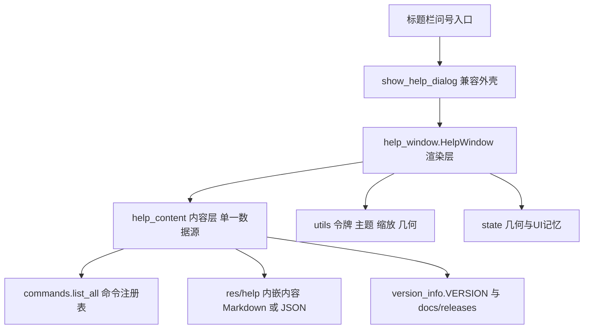
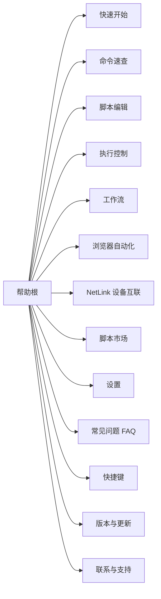
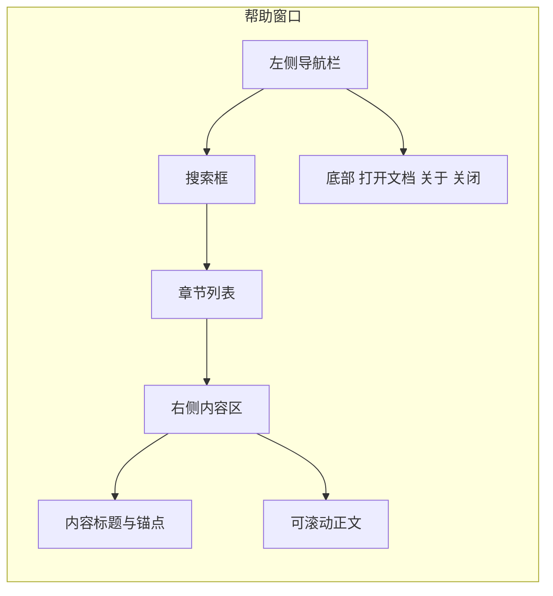

# ACRPA 帮助窗口重构设计

> 版本：v1（设计稿）
> 范围：把现有「单页长文本 + 外链文档」的帮助窗口（[`show_help_dialog`](src/dialogs.py:104)）重构为**结构清晰、内容单一来源、可维护、离线可用的帮助系统**。
> 状态：**仅设计文档**。本轮不修改任何 `src/`、`tools/` 源码，不改动 `使用说明.txt` / `README.md` 等既有文档，仅新增本文件。
> 实施落地：分阶段方案见第 6 节，验收标准见第 8 节。

---

## 0. 一句话结论

帮助系统 = **内容层（单一数据源：命令来自注册表，说明来自内嵌 Markdown/结构化数据）+ 渲染层（左导航 + 右内容区 + 搜索）**；`show_help_dialog()` 保留为兼容入口，内部委托给新模块 `src/help_window.py`。

---

## 1. 问题陈述与设计目标

### 1.1 现存问题（均已核实）

| 编号 | 问题 | 证据 | 影响维度 |
| --- | --- | --- | --- |
| P1 | **命令说明三处并存、易漂移**：注册表 / `使用说明.txt` / README 命令表各自手工维护 | [`commands.py:25`](src/commands.py:25)‑108、`使用说明.txt:8`‑402、[`README.md:190`](README.md:190)‑327 | 内容一致性 |
| P2 | **帮助正文硬编码在函数体内**，新增章节必须改代码 | [`dialogs.py:191`](src/dialogs.py:191)‑262 | 可维护性 |
| P3 | **无搜索 / 无目录 / 无锚点**，只能线性滚动 | [`dialogs.py:247`](src/dialogs.py:247)‑262 | 可发现性 |
| P4 | 命令速查的 `Text` 只读，**无复制按钮/无右键复制** | [`dialogs.py:231`](src/dialogs.py:231)‑262 | 体验 |
| P5 | 「使用说明 / README」靠 `os.startfile` **外弹浏览器/编辑器**，离线或缺文件即失效 | [`dialogs.py:173`](src/dialogs.py:173)‑214 | 可用性 |
| P6 | 几何**硬编码** `500x600+450+150`、`minsize(400,500)`，不记忆 | [`dialogs.py:113`](src/dialogs.py:113) | 体验 |
| P7 | **主题不实时**：`dialogs.C` 仅启动注入 + 切主题重注入；已打开窗口不重绘 | [`ACRPA.py:2026`](src/ACRPA.py:2026)‑2029 | 体验/一致性 |
| P8 | **字体未接入缩放令牌**：直接用 `FONT_*`，未走 `scaled()`/`ui_scale` 内边距 | [`dialogs.py:119`](src/dialogs.py:119)‑262 vs [`utils.py:228`](src/utils.py:228) | 高 DPI 适配 |
| P9 | **`docs/` 系列帮助完全未覆盖**（浏览器/python 扩展/marketplace/netlink） | `docs/*.md` 12 份 | 可发现性 |
| P10 | 版本更新日志**散落三处**（README、使用说明、`docs/releases/*`） | `README.md:619`‑655、`使用说明.txt:340`‑401、`docs/releases/` | 内容一致性 |
| P11 | 无多语言入口（文案全中文硬编码） | [`dialogs.py:123`](src/dialogs.py:123) | 可扩展性 |
| P12 | 陈旧标语：注释仍写「19 commands」 | [`commands.py:24`](src/commands.py:24) | 可维护性 |

### 1.2 设计目标（优先级从高到低）

- **G1 单一内容来源（最高）**：命令速查**必须**从 `commands.list_all()` 运行时生成，禁止再手抄到 `使用说明.txt` / README；非命令类说明采用**数据驱动**的单一源。
- **G2 内容与渲染分离**：文案不写在函数体里，新增章节 = 新增内容条目，不改渲染逻辑。
- **G3 离线可用优先**：所有内容默认**内嵌渲染**（不依赖外网、不依赖外部程序 `startfile`）；外链降级为「可选补充」。
- **G4 可发现性**：左侧章节导航 + 全文搜索/过滤 + TOC 锚点跳转。
- **G5 体验一致**：跟随主题**实时刷新**、接入 `ui_scale/dpi`、**几何位置记忆**、支持复制。
- **G6 低风险、可增量**：保留 `show_help_dialog()` 兼容签名，分阶段可独立验证、可回滚。

### 1.3 非目标（本轮明确不做，划边界）

- 不做在线/联网帮助、不做 Web/H5 帮助页。
- 不引入任何新第三方依赖（不引入 Markdown 渲染库；若采用 Markdown 只用**自研极简子集解析器**）。
- 不重构 `commands.py` 注册表结构（只**消费**它；`register` 签名不变）。
- 不改 `使用说明.txt` / `README.md`（**去重文件**在迁移阶段作为可选收尾，且需另行批准）。
- 本轮不做中英双语实现（仅预留 i18n 接缝）。
- 不改变主窗口标题栏「?」入口的绑定语义（[`ACRPA.py:1828`](src/ACRPA.py:1828)）。

---

## 2. 现状基线（已核对）

| 关注点 | 位置 | 现状 |
| --- | --- | --- |
| 唯一帮助窗口 | [`show_help_dialog`](src/dialogs.py:104)‑268 | 独立 `Toplevel`，`grab_set()` 模态 |
| 几何 | [`dialogs.py:113`](src/dialogs.py:113) | 硬编码 `500x600+450+150`，`minsize(400,500)` |
| 入口 | [`ACRPA.py:1825`](src/ACRPA.py:1825)‑1838 | 标题栏「?」Label → `show_help_dialog()`；无菜单/快捷键/托盘入口 |
| 依赖注入 | [`dialogs.init_ctx`](src/dialogs.py:42)‑59 | 启动注入 `root/C/fonts/app_root/res_dir` |
| 主题重注入 | [`ACRPA.py:2026`](src/ACRPA.py:2026)‑2029 | 仅 `dialogs.C = C`；已开窗口不重绘 |
| 主题刷新范式 | [`netlink_window.refresh_theme`](src/netlink_window.py:337)、[`settings_window.refresh_theme`](src/settings_window.py:127) | 窗口存在则重刷 —— **可复用** |
| 折叠卡片 / 左导航 / 角标 | [`_make_collapsible_card`](src/settings_window.py:332)、[`_register_nav_card`](src/settings_window.py:386)、[`_make_badge`](src/settings_window.py:286) | 设置窗口范式 —— **可复用** |
| 「关于」卡排版 | [`settings_window.py:1678`](src/settings_window.py:1678)‑1706 | 联系/版本排版参考 |
| 命令注册表 | [`commands.py:20`](src/commands.py:20)‑108 | `list_all()` 返回 `(name, desc, params, handler)`；插件运行时追加 [`engine.py:1979`](src/engine.py:1979)‑1986 |
| 缩放令牌 | [`utils.scaled`](src/utils.py:228)、`ui_scale` clamp [0.8,1.5] | 已用于 `_btn` 内边距 |
| 几何越界校验 | [`utils.geometry_in_screen`](src/utils.py:794) | 设置窗口记忆复用 |
| 几何记忆配置 | [`state._config_schema`](src/state.py:44)‑45 | `win_geometry` / `main_geometry` 先例 |
| 打包资源 | [`ACRPA.spec:8`](ACRPA.spec:8) | `datas` 含 `res/`、`使用说明.txt`、`VERSION` |

---

## 3. 目标架构

### 3.1 分层与依赖方向



| 层 | 职责 | 依赖 | 是否可无 GUI 测试 |
| --- | --- | --- | --- |
| **内容层 `help_content.py`** | 提供章节树、搜索索、命令速查数据；**纯数据、无 tkinter** | `commands`、`version_info`、stdlib | ✅ 可（headless） |
| **渲染层 `help_window.py`** | 建窗、左导航 + 右内容区、搜索、复制、主题/缩放刷新 | `help_content`、`utils`、`state` | 部分（建窗需 Tk） |
| **兼容外壳** | 保留 `dialogs.show_help_dialog()` 签名，内部委托渲染层 | 渲染层 | ✅ |

**关键约束**：内容层 `import help_content` **不得**引入 tkinter；渲染层**不得**硬编码任何帮助文案。

### 3.2 单一数据源策略（核心）

#### (a) 命令速查 —— 唯一来源是注册表

命令速查不再有任何人工副本。渲染层直接：

```text
commands.list_all() -> [ (name, desc, params, handler) ... ]
```

- 命令 **名称/说明/参数** 三列即注册表三要素，逐条渲染为可搜索、可复制的条目。
- **分类**不再用「前 10 条 = 基础操作」这种位置魔法（现状 [`dialogs.py:249`](src/dialogs.py:249)‑250），改为**显式分类映射**（见下）。
- 插件命令由 [`engine.py:1979`](src/engine.py:1979)‑1986 运行时追加；帮助窗口**每次打开时重新调用 `list_all()`**，天然包含插件命令。

#### (b) 命令分类：不改注册表结构，用「外置分类表」映射

`register()` 签名保持不变（G6 低风险）。分类通过**可选的外置映射**完成：

```text
res/help/command_groups.json
{
  "基础操作": ["找图","区域找图","点图",...,"截屏"],
  "流程控制": ["如果","否则","结束如果","循环开始","循环结束","跳出循环"],
  "窗口管理": [...] ,
  "变量与数据处理": ["设置变量","读取剪贴板","字符串处理","数学运算"],
  "OCR": [...], "AI 增强": [...], "工作流": [...],
  "浏览器自动化": [...],
  "_fallback": "更多操作"
}
```

- 映射命中 → 归入对应章节；未命中（含**插件新增命令**）→ 落入 `_fallback` 分组「更多操作」，**永不丢失**。
- 若映射文件缺失/解析失败 → **整体回退**为「全部命令」单组，UI 不崩、命令不少（降级策略）。
- 该文件是**分类的唯一来源**；`commands.py` 里的 `# ── ... ──` 注释**不再是权威**。

#### (c) 消除三处漂移的具体策略

| 副本 | 处理方式 | 阶段 |
| --- | --- | --- |
| `src/commands.py` 注册表 | **保留为唯一命令源**（不变） | — |
| `使用说明.txt`（402 行） | 迁移为**内嵌帮助内容**（结构化条目）；文件本身**本轮不动**，迁移尾声可选择降级为「快速开始」精简版（需另行批准） | 阶段 3 |
| `README.md:190`‑327 命令总表 | README 面向仓库/Gitee 读者，**保留**；但**改为由脚本生成**（见下），消除手抄 | 阶段 4（可选） |
| `README/使用说明/docs/releases` 版本日志 | 版本与更新章节**以 `version_info.VERSION` + `docs/releases/*.md` 为源**，运行时汇总 | 阶段 3 |

**防漂移机制（关键）**：新增自动化校验脚本 `tools/_test_help_consistency.py`：

1. 断言帮助窗口渲染出的命令集合 == `commands.list_all()` 名称集合（**双向相等**，缺一即 `[FAIL]`）。
2. 断言 README 命令总表中的命令集合 ⊇ 注册表集合（若选择保留 README 表）。
3. 断言 `使用说明.txt` 中出现的命令名均在注册表内（陈旧条目报警）。

这样「三处漂移」由**测试守卫**，而非人工纪律。

### 3.3 非命令内容的数据形态

采用**结构化数据 + 轻量 Markdown 子集**的混合：

- **结构化数据（推荐主格式）**：每章一个 `.md` 或一个 JSON 条目，字段含 `id / title / source / body`。
- 正文采用**极简 Markdown 子集**（仅支持 `# 标题`、`- 列表`、`| 表格 |`、`**粗体**`、`` `代码` ``），由**自研小渲染器** `help_render.py` 映射到 tkinter `Text` 标签（复用现有 `tag_configure` 思路 [`dialogs.py:241`](src/dialogs.py:241)‑245）。
- 理由：**零新依赖**（G3/1.3 非目标）；子集可控、渲染可测；避免引入第三方 Markdown 库带来的打包与许可成本（对照 `ACRPA.spec:13` 已 `excludes` 掉 `markdown`/`docutils`）。

> 形态二选一由第 9 节待确认问题拍板；架构对两者兼容（内容层对外只暴露 `get_sections()` 接口）。

### 3.4 新增 / 改动文件布局建议

```text
src/
  help_content.py     # 新增：内容层（章节树/搜索索引/命令分组；无 tkinter）
  help_window.py      # 新增：渲染层（HelpWindow 类 + refresh_theme）
  dialogs.py          # 修改：show_help_dialog() 改为薄委托（保留签名与命名）
  ACRPA.py            # 修改：主题切换时调用 help_window.refresh_theme()（仿 netlink）
  state.py            # 修改：_config_schema 增 help_geometry / help_last_section（加键即可）
res/help/             # 新增内容目录（随包分发，离线可用）
  command_groups.json
  00-快速开始.md
  01-命令速查.md        # 仅占位说明，正文由注册表生成
  ...
ACRPA.spec            # 修改：datas 增加 ('res/help','res/help')
tools/
  _smoke_help_window.py      # 新增验收：窗口可开/章节齐全/计数一致
  _test_help_consistency.py  # 新增验收：三处漂移守卫
```

**与既有代码的接缝（兼容）**：

| 接缝 | 设计 |
| --- | --- |
| 入口 | [`show_help_dialog()`](src/dialogs.py:104) **签名与函数名不变**，内部 `from help_window import open_help; return open_help()`；失败回退到旧实现（阶段 1 保留旧代码路径） |
| 依赖注入 | 复用 [`dialogs.init_ctx`](src/dialogs.py:42)；`help_window` 通过 `dialogs.C / dialogs.root / dialogs.RES_DIR` 读取，或接受显式参数（二选一，见待确认问题） |
| 主题 | 在 [`ACRPA._refresh_theme`](src/ACRPA.py:2024)‑2035 处追加 `help_window.refresh_theme()`（与 `netlink_window` 同范式） |
| 配置 | [`state._config_schema`](src/state.py:16) 增键 → 自动生成 `state.HELP_GEOMETRY` 与 `Config` 属性（复用现有机制） |
| 资源 | [`ACRPA.spec:8`](ACRPA.spec:8) `datas` 增加 `res/help`；运行时走 `RES_DIR`/`sys._MEIPASS` 回退（沿用 [`dialogs.py:127`](src/dialogs.py:127)‑132 的多路径回退模式） |

---

## 4. 内容组织（信息架构）

### 4.1 章节树



### 4.2 章节 → 内容来源 → 渲染方式

| # | 章节 | 内容来源（单一源） | 内嵌渲染 | 备注 |
| --- | --- | --- | --- | --- |
| 1 | 快速开始 | `使用说明.txt:1`‑7 的 6 条须知 + 新增 | ✅ | 迁移自 `使用说明.txt` 头部，含脚本格式说明（[`README.md:182`](README.md:182)） |
| 2 | **命令速查** | **`commands.list_all()`** + `res/help/command_groups.json` | ✅ 动态生成 | 核心；按分类分组，条目可复制；含参数列 |
| 3 | 脚本编辑 | `docs/*` + 新增 | ✅ | Excel 列约定、`.xls` 限制、图片路径约束 |
| 4 | 执行控制 | [`docs/执行控制tab设计方案.md`](docs/执行控制tab设计方案.md) 摘要 | ✅ | 运行/暂停/单步/录制 |
| 5 | 工作流 | 新增（`workflow` 能力摘要） | ✅ | 工作流命令已在注册表 |
| 6 | 浏览器自动化 | [`docs/浏览器使用说明.md`](docs/浏览器使用说明.md) + [`docs/浏览器后端增强设计.md`](docs/浏览器后端增强设计.md) 摘要 | ✅ | P0/P1/P2 命令来自注册表，说明来自 docs |
| 7 | NetLink 设备互联 | [`docs/netlink-总览与部署指南.md`](docs/netlink-总览与部署指南.md) 等 8 份摘要 | ✅ | 当前**完全未覆盖**（P9） |
| 8 | 脚本市场 | [`docs/marketplace-v2-使用说明.md`](docs/marketplace-v2-使用说明.md) 摘要 | ✅ | |
| 9 | 设置 | [`src/settings_window.py`](src/settings_window.py:370) `_NAV_ITEMS` 生成目录 | ✅ 半动态 | 章节树由设置导航项派生，避免二次漂移 |
| 10 | 常见问题 FAQ | 新增（硬编码问题 → 数据条目） | ✅ | 结构 `Q/A` 列表 |
| 11 | 快捷键 | `res/help/command_groups.json` 同级 `hotkeys.json` 或 `state` 默认值 | ✅ | 与 `hotkey_run/pause/stop`（[`state.py:52`](src/state.py:52)‑54）一致 |
| 12 | 版本与更新 | `version_info.VERSION` + `docs/releases/*.md` | ✅ 运行时汇总 | 消除 P10 三处散落 |
| 13 | 联系与支持 | 现状 [`dialogs.py:162`](src/dialogs.py:162)‑168 文案**迁移为数据** | ✅ | 保留微信二维码 / 邮箱 / 版本 |

> 「命令速查」以外的章节**内容均为新增或从 `docs/` 摘要迁移**，且以「数据条目」落盘于 `res/help/`，满足 G2。

---

## 5. UI/UX 方案

### 5.1 布局



- **左栏（约 180–220px）**：搜索框 + 章节列表（滚动），选中高亮（复用 [`settings_window._on_nav_click`](src/settings_window.py:392) 的高亮范式）。
- **右栏**：内容区，顶部章节标题 + 可选 TOC 锚点行；正文为可滚动 `Text`/`Canvas`；命令速查条目带「复制」按钮。
- 复用设置窗口的 **左导航 + 右内容** 范式（[`settings_window.py:459`](src/settings_window.py:459)‑465）。

### 5.2 关键交互

| 需求 | 方案 | 复用/依据 |
| --- | --- | --- |
| 搜索/过滤 | 输入即时过滤左栏章节；**命令速查**下按命令名/描述/参数过滤条目；高亮命中 | `commands.list_all()` + 内存过滤，无需索引库 |
| 目录/TOC | 章内 `# 标题` 生成锚点行，点击 `Text.see()` 定位 | [`Text.see`](src/dialogs.py:239) 思路 |
| 复制 | 命令条目「复制」按钮 → 剪贴板写入命令名+参数；`Text` 支持 `Ctrl+C` | 现有 `pyperclip`/`clipboard` 能力；按钮工厂 [`utils._btn`](src/utils.py:316) |
| 主题实时刷新 | 新增 `help_window.refresh_theme()`，窗口存在则递归重刷 bg/fg 与 `Text` 各 tag 前景 | 仿 [`netlink_window.refresh_theme`](src/netlink_window.py:337)、[`settings_window.refresh_theme`](src/settings_window.py:127)；接入点 [`ACRPA.py:2030`](src/ACRPA.py:2030)‑2035 |
| 跟随缩放 | 内边距走 [`utils.scaled`](src/utils.py:228)；字号走命名 `FONT_*`（随 `set_ui_scale` 自动重配） | [`utils.set_ui_scale`](src/utils.py:277) |
| 几何记忆 | 保存/恢复 `WxH+X+Y` 到 `state.HELP_GEOMETRY`；恢复前用 [`utils.geometry_in_screen`](src/utils.py:794) 越界校验 | 仿 [`settings_window.py:443`](src/settings_window.py:443)‑455 |
| 记忆上次章节 | `state.HELP_LAST_SECTION`；重启回到上次章节 | 仿 `state.last_tab`（[`state.py:43`](src/state.py:43)） |
| 内嵌 vs 外链 | **全部内嵌**；仅「打开使用说明 / 查看 README」保留为**可选**外链按钮（离线时置灰 + tooltip 说明） | 修 P5 |
| 键盘/焦点 | `Esc` 关闭（保留 [`dialogs.py:264`](src/dialogs.py:264)）；`Ctrl+F` 聚焦搜索；`↑/↓` 导航章节；`Tab` 焦点顺序合理 | 新增 |
| 可达性 | 控件带 `attach_tooltip`（[`utils.attach_tooltip`](src/utils.py:365)）；对比度沿用主题 token；避免仅靠颜色区分 | 复用 token |

### 5.3 模态策略

现状为模态 `grab_set()`（[`dialogs.py:114`](src/dialogs.py:114)），用户在帮助打开时无法操作主界面。建议**改为非模态**（可边看边操作），并保留「关闭」按钮；若担心行为变化，可在阶段 2 用配置项切换（见待确认问题）。

---

## 6. 迁移计划（分阶段、可独立验证、可回滚）

| 阶段 | 目标 | 涉及文件 | 可独立验证的产物 | 回滚点 |
| --- | --- | --- | --- | --- |
| **阶段 0（准备）** | 定义内容层接口与内容目录骨架；不改行为 | 新增 `src/help_content.py`、`res/help/*`、`ACRPA.spec` datas | `_test_help_consistency.py` 可跑通命令集合校验 | 删除新文件即回滚 |
| **阶段 1（兼容外壳）** | `show_help_dialog()` 委托新渲染层，**旧实现保留为 fallback** | 改 `src/dialogs.py`；新增 `src/help_window.py` | `_smoke_help_window.py`：窗口可开 + 命令数与 `list_all()` 一致 | 恢复 `dialogs.py` 旧函数体（一处改动） |
| **阶段 2（体验）** | 左导航 + 搜索 + 复制 + 主题实时 + 缩放 + 几何记忆 | `src/help_window.py`、`src/ACRPA.py`（追加 refresh 调用）、`src/state.py`（加 2 个键） | smoke：搜索命中、主题切换后配色变化、几何持久化、缩放生效 | 关闭新增项/回退 `state` 键（加键不影响旧数据） |
| **阶段 3（内容）** | 章节齐全：FAQ/快捷键/版本更新/NetLink/市场等 | `res/help/*.md`、`src/help_content.py` | smoke：章节数 ≥ 目标值且均非空 | 内容文件可整体回退 |
| **阶段 4（收尾，可选，需批准）** | 消重：`使用说明.txt`/README 命令表改为脚本生成或标注「自动生成」 | `README.md`、`使用说明.txt`、生成脚本 | `_test_help_consistency.py` 全绿 | 还原文本文件 |

**向后兼容要点**：

1. `show_help_dialog()` 名称、位置（`src/dialogs.py`）、调用方（[`ACRPA.py:1828`](src/ACRPA.py:1828)）**均不变**。
2. 阶段 1 的旧实现作为 `_show_help_dialog_legacy()` 暂存，异常时自动回退 —— 保证「新窗口崩了也不会没帮助」。
3. `state` 新增配置键遵循 [`_config_schema`](src/state.py:16) 约定，旧 `config.json` 自动补默认值，**无需迁移脚本**。
4. `help_window` 对 `res/help/` 缺失做**降级**：无内容目录时仅渲染命令速查（仍可用）。

---

## 7. 风险与取舍

| 风险 | 说明 | 缓解措施 |
| --- | --- | --- |
| 自研 Markdown 子集渲染复杂度 | 需处理标题/列表/表格/行内样式，易有边界 | 只支持**白名单子集**；渲染器单独可测（headless 断言生成文本）；复杂排版改用结构化条目规避 |
| 打包遗漏资源 | 新增 `res/help/` 若不入 `datas` 则离线失效 | 阶段 0 即更新 [`ACRPA.spec:8`](ACRPA.spec:8)；smoke 增加「冻结环境资源存在性」检查；沿用 `_MEIPASS` 回退 |
| 体积增长 | 内嵌 12 章内容 + 二维码 | 内容为纯文本（KB 级）；图片仅二维码；排除大图 |
| 内容源形态反复 | Markdown vs JSON 二选一未定 | 内容层只暴露 `get_sections()`，**渲染层与形态解耦**，可后期替换 |
| 主题实时刷新遗漏 | `Text` 的 `tag_configure` 前景需重刷 | `refresh_theme()` 内显式重刷 tag（对照 [`dialogs.py:241`](src/dialogs.py:241)‑245） |
| 模态→非模态行为变化 | 用户可能依赖模态 | 保留配置开关；默认跟随现状，阶段 2 再评估 |
| 插件命令分类落空 | 插件命令不在 `command_groups.json` | `_fallback` 分组兜底；每次打开重读 `list_all()` |
| 多语言 | 全中文硬编码 | 本轮**不做**；仅预留 `res/help/<lang>/` 目录与文案取用函数，避免后期大改 |
| 性能 | `list_all()` + 内容加载 | 惰性加载 + 打开时一次性构建；条目数 <1k，无需索引 |

---

## 8. 验收标准与测试策略

复用项目 `tools/` 下 `_smoke_*/_test_*` 的 `[OK]/[WARN]/[FAIL]` + 退出码（0 成功 / 非 0 失败）约定（参考 [`tools/_smoke_launch_app.py`](tools/_smoke_launch_app.py:1)）。

### 8.1 自动化验收点

| 编号 | 验收点 | 判定 | 依赖 |
| --- | --- | --- | --- |
| A1 | 帮助窗口能打开（headless/建窗不抛异常） | `[OK]` | Tk 可用 |
| A2 | 章节齐全：章节数 ≥ 13 且各章正文非空 | `[OK]` | 内容层 |
| A3 | **命令数一致**：渲染命令集合 == `commands.list_all()` 名称集合（含插件） | `[OK]`，不一致 `[FAIL]` | `help_content` |
| A4 | 命令分类覆盖：所有命令均归属某分组（含 `_fallback`） | `[OK]` | `command_groups.json` |
| A5 | 搜索命中：给定关键字返回预期章节/命令 | `[OK]` | 渲染层/内容层 |
| A6 | 主题跟随：切换主题后各 widget `bg/fg` 变化且无异常 | `[OK]` | `refresh_theme` |
| A7 | 缩放跟随：`ui_scale` 变化后内边距/字号生效 | `[OK]` | `utils.scaled` |
| A8 | 几何记忆：保存后重启恢复；越界回退默认 | `[OK]` | `state`+`geometry_in_screen` |
| A9 | 离线可用：**无外网、无外部文件**时窗口内容完整 | `[OK]` | 内嵌渲染 |
| A10 | 三处漂移守卫：`使用说明.txt`/README 命令名均属注册表 | 无陈旧条目 | 一致性脚本 |
| A11 | 向后兼容：`show_help_dialog()` 仍存在且可调用 | `[OK]` | `dialogs` |

### 8.2 测试脚本

- `tools/_smoke_help_window.py`：覆盖 A1–A5、A9、A11（建窗 + 断言，输出 `.out`）。
- `tools/_test_help_consistency.py`：覆盖 A3、A4、A10（纯数据，无需 GUI，可在 CI 跑）。
- 现有 `_smoke_dark_mode.py` / `_smoke_main_geometry.py` 思路可扩展覆盖 A6/A8。

---

## 9. 待确认问题（需主任务/用户拍板）

| # | 问题 | 备选 | 建议 |
| --- | --- | --- | --- |
| Q1 | 非命令内容最终采用 **Markdown 子集** 还是 **结构化 JSON**？ | (a) Markdown 子集（可读、易改） (b) JSON 条目（渲染确定性强） | 建议 (a) Markdown 子集，渲染层与形态解耦 |
| Q2 | 是否**内嵌渲染 `docs/` 全部文档**，还是仅摘要 + 保留外链？ | (a) 全部内嵌 (b) 摘要 + 外链补充 | 建议 (b)，控制体积与维护成本 |
| Q3 | 帮助窗口保持**模态**还是改为**非模态**？ | (a) 非模态 (b) 模态（现状） | 建议 (a) 非模态，可开关兜底 |
| Q4 | 是否本轮引入**中英双语**？ | (a) 暂不做，仅预留 (b) 直接做 | 建议 (a) |
| Q5 | 是否允许在阶段 4 **修改 `使用说明.txt` / `README.md`**（去重/标注自动生成）？ | (a) 允许 (b) 永不改 | 需用户明确授权 |
| Q6 | 命令分类以 `res/help/command_groups.json` 外置，还是给 `register()` 增**可选 `group` 参数**？ | (a) 外置映射（不改注册表） (b) 扩注册表签名 | 建议 (a)，零破坏 |
| Q7 | 「联系与支持」的微信二维码/邮箱是否继续内嵌打包？ | (a) 是 (b) 仅在线 | 建议 (a) 离线可用 |
| Q8 | 版本更新章节数据源：`docs/releases/*.md` 运行时汇总，还是收敛为单份 `CHANGELOG`？ | (a) 汇总现有 (b) 新建单一 CHANGELOG | 建议 (a)，避免新增维护点 |

---

## 10. 附录：接口草案（设计级，非实现）

### 10.1 内容层 `help_content.py`

```text
get_sections() -> [ Section(id, title, source, icon) ]
get_section_body(section_id) -> [ Block(kind, text, meta) ]
get_commands_grouped() -> [ Group(title, [ Command(name, desc, params) ]) ]
search(keyword) -> [ (section_id, hit_type, label, anchor) ]
get_version_notes() -> [ (version, notes) ]
```

- 全部**无 tkinter 依赖**，可在 headless 断言（支撑 A3/A4/A10）。

### 10.2 渲染层 `help_window.py`

```text
open_help(modal=False, section=None)   # 打开/聚焦帮助窗口
refresh_theme()                        # 主题切换时重刷（仿 netlink_window）
```

### 10.3 兼容外壳 `dialogs.show_help_dialog()`

```text
def show_help_dialog():
    try:
        import help_window
        return help_window.open_help()
    except Exception:
        return _show_help_dialog_legacy()   # 阶段 1 保留
```

---

> 本文档为**唯一设计事实来源**，供后续评审 / 实现阶段使用。实现须严格遵循第 1.3 节边界与第 6 节阶段划分。
