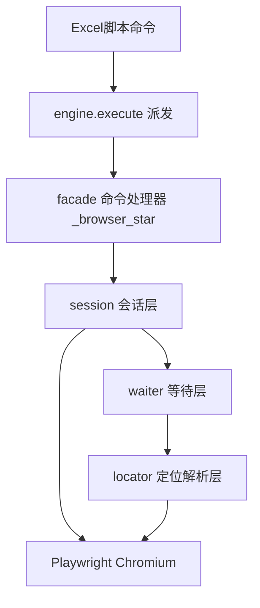
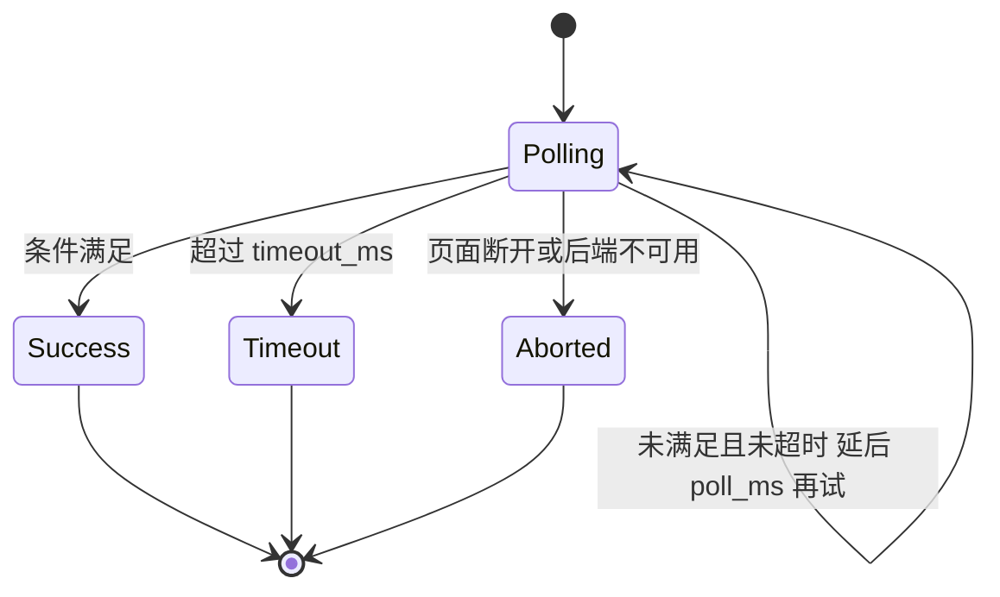
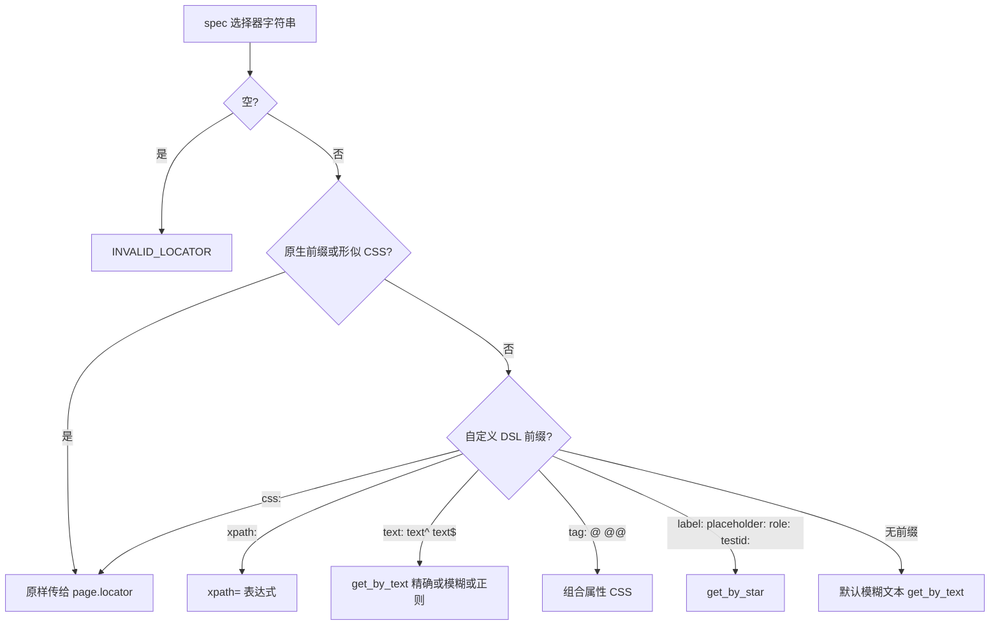
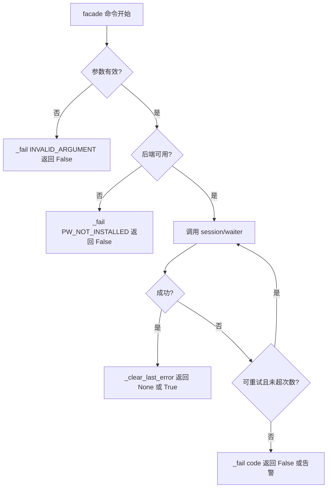
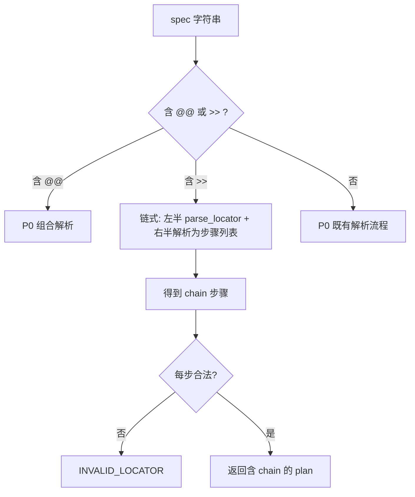
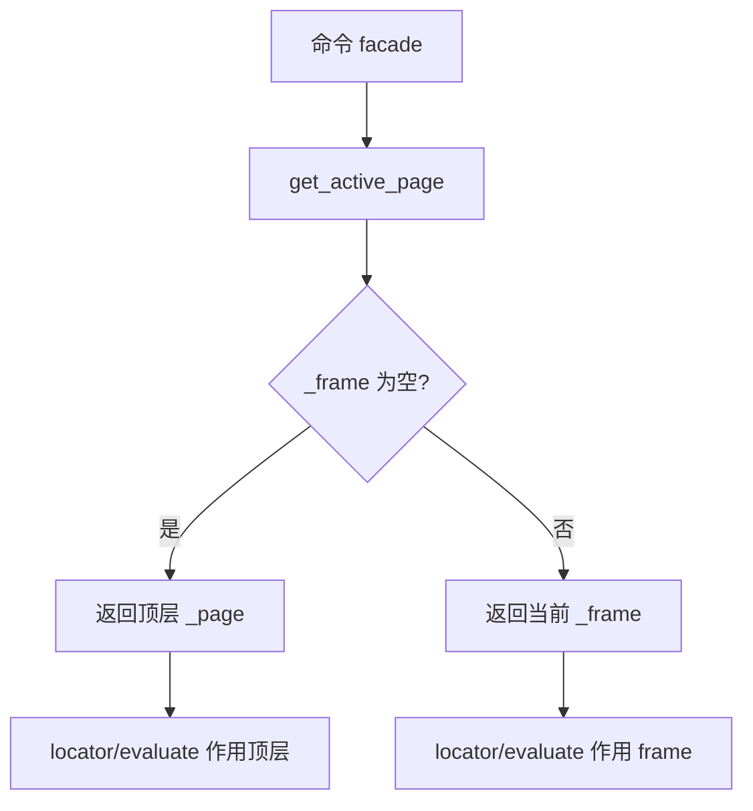
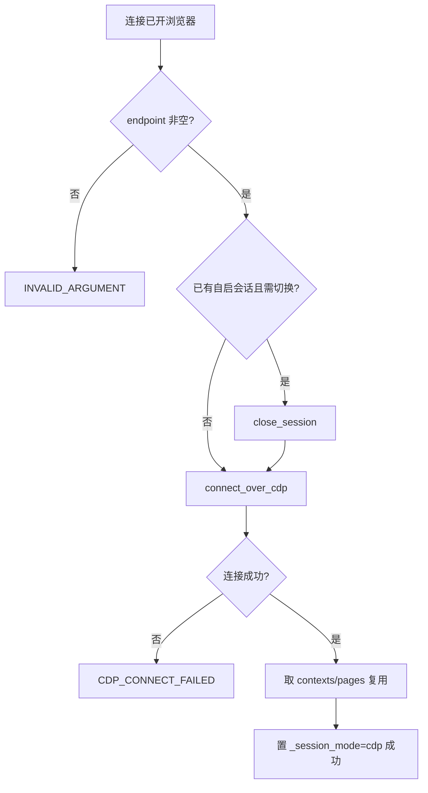

# ACRPA 浏览器后端增强设计

> 版本：v2（设计稿）
> 范围：在既有 Playwright 浏览器后端之上做**加性增强**：P0（定位 DSL、统一等待、会话句柄、执行 JS、Cookie、扩展截图）已交付；**本轮补全 P1**（DSL 链式/相对定位、iframe、标签页、下载上传）与 **P2**（CDP 接管、接口监听、codegen→DSL 录制转换器）的**详细规格**。
> 状态：**仅设计文档**。本轮不写实现代码、不修改 `src/` 任何源码、不改动其它既有文档。
> 实施落地：P0 见第 11 节批次；P1 见第 13 节；P2 见第 14 节。

---

## 0. 净室重写原则与许可约束（必读、硬约束）

本设计的语法/思路参考了公开的第三方浏览器自动化库（下称"参考库"）的**公开语法与公开 API 命名习惯**，但：

1. **净室重写（clean-room）**：本设计的算法、数据结构、函数实现、错误处理逻辑**全部独立设计、独立实现**，不复制、不翻译、不移植参考库的任何源码。
2. **禁止代码片段引入**：ACRPA 仓库中**不得**出现参考库的任何源文件、源码片段、逐行翻译、内部常量表或测试数据。
3. **仅借鉴公开的"语法与概念"**：可借鉴的是**面向用户的语法形式**（如 `text=`、`xpath:` 这类前缀约定）与**通用工程思路**（"状态枚举 + 轮询 + 超时"、"全局设置开关"），这些是行业通行做法，不构成对其实现的复制。
4. **许可隔离**：参考库（DrissionPage）的 LICENSE 禁止商业使用。因此：
   - ACRPA **不引入**其为依赖，**不 vendor** 其代码；
   - 本设计**不引用**其文件路径作为实现依据（仅作为"语法互操作性"的对照说明）；
   - 若后续需要新增第三方依赖，必须先完成许可审查（见第 3.4 节结论：本设计**不新增任何第三方依赖**）。
5. 本文档中出现的一切"映射到 Playwright"的描述，均以 **Playwright 官方公开 API** 为准，不涉及参考库实现。

> 结论：本方案对参考库保持**零代码依赖、零代码拷贝**，仅做"语法层面的兼容选择"，由 ACRPA 独立实现。

---

## 1. 背景与现状基线（已核对）

### 1.1 现有实现

| 关注点 | 位置 | 现状 |
| --- | --- | --- |
| 引擎 | [`browser_backend.py:2`](src/browser_backend.py:2) | Playwright(Chromium) |
| 全局单例懒加载 | [`_playwright/_browser/_page`](src/browser_backend.py:31) | 模块级 globals |
| 可用性探测（仅 import，不启动） | [`_check_playwright_available`](src/browser_backend.py:38) | 结果缓存到 `_available` |
| 懒启动页面 | [`_get_page`](src/browser_backend.py:51) | `chromium.launch(headless, slow_mo)` 在 [82-86](src/browser_backend.py:82) |
| 清理 | [`_cleanup`](src/browser_backend.py:100) / [`browser_close`](src/browser_backend.py:123) | 关闭 page/browser/playwright |
| 状态查询 | [`browser_get_status`](src/browser_backend.py:320) | 返回 available/connected |
| 命令：打开网页 | [`_browser_navigate`](src/browser_backend.py:133) | `wait_until=domcontentloaded`，写回 `browser_url/browser_title` |
| 命令：浏览器点击 | [`_browser_click`](src/browser_backend.py:167) | `page.click(selector, timeout=15000)` |
| 命令：浏览器输入 | [`_browser_input`](src/browser_backend.py:195) | `page.fill`，支持 `${var}`（[220-227](src/browser_backend.py:220)） |
| 命令：等待元素 | [`_browser_wait_element`](src/browser_backend.py:235) | 仅 visible/hidden，默认超时 10.0s |
| 命令：浏览器截图 | [`_browser_screenshot`](src/browser_backend.py:277) | `full_page=False`；page 或元素 |
| 命令注册 | [`commands.py:80-85`](src/commands.py:80) | 5 条，无 handler |
| handler 绑定 | [`engine.py:1930-1942`](src/engine.py:1930) | `try/except ImportError` 静默降级 |
| 配置 | [`state.py:60-62`](src/state.py:60) | `browser_headless=True`、`browser_slow_mo=0` |
| 打包 | [`build.py:28`](build.py:28) / [`ACRPA.spec:9`](ACRPA.spec:9) / [`requirements.txt`](requirements.txt) | playwright 不随包分发（用户可选安装） |
| 工作流复用 | [`workflow.py:387`](src/workflow.py:387) | 通用 handler 派发，浏览器命令天然可复用 |
| 录制 | [`recorder.py:1`](src/recorder.py:1) | **无浏览器录制**（仅键鼠钩子） |

### 1.2 handler 调用约定（增强必须遵守的契约）

- 派发点：[`engine.execute`](src/engine.py:693) → [`_invoke_handler`](src/engine.py:83)。
- 签名：`h(row, script_dir)`；若 handler 形参 ≥3，则追加注入 [`AcrpaAPI`](src/engine.py:83)。
- **row 双接口**（关键）：
  - `row.args` 存在（[`acrpa_api._Row`](src/acrpa_api.py:47)、[`ScriptData`](src/scriptdata.py:12)）：`args[0]` = **命令名后的第一个参数**；
  - 否则按 xlrd 风格：`row[0]` = **命令名**，`row[i].value` = 第 i 个参数，故参数 i 对应 `row[i+1]`；
  - [`RowAdapter`](src/engine.py:118) 只有 `cells/__getitem__`，**没有 `.args`**（`__slots__` 限制）。
- 成功判定：[`success = handler_result is not False`](src/engine.py:722)。**只有显式 `return False` 才算失败**，`None`/无返回值视为成功。
- 失败后行为：按 [`self.retry`](src/engine.py:717) 重试；最终失败触发停止（若 `stop_on_error`）+ 失败截图（[737-747](src/engine.py:737)）。
- 变量：`engine.variables` 是 dict（[`engine.py:309`](src/engine.py:309)），直接赋值即写回；`${var}` 替换由 handler 自行完成。
- 配置：`_config_schema` 加键（[`state.py:16`](src/state.py:16)）→ 自动生成 `state.<UPPER>` 全局（[135-136](src/state.py:135)）与 `Config` 属性（[146-](src/state.py:146)）。

### 1.3 现存问题（增强动机）

1. 仅支持 CSS 与原生 `text=`，缺少 `xpath:`、属性、tag、role 等统一 DSL。
2. 等待只有 visible/hidden 两态，无 attached/detached/clickable/url/title/download。
3. 无 JS 执行能力（无法读取页面计算值、绕过复杂交互）。
4. 无 Cookie 读写（无法复用登录态、导出抓包）。
5. 截图不可整页、不可指定保存路径、无写回变量。
6. 失败仅靠日志，**脚本无法用稳定代码判断失败原因**。

---

## 2. 设计目标与非目标

**目标**

- G1 建立**定位 DSL 层**，统一"字符串 → Playwright 选择器"，全命令复用，且对既有 CSS / `text=` **零破坏**。
- G2 建立**统一等待层**（状态枚举 + 超时 + 轮询）。
- G3 建立**会话层**（页面/上下文/（后续）tab·iframe 句柄 + Cookie + JS），对外暴露稳定 API。
- G4 落地 P0 四类能力：**执行 JS（写回变量）/ 截图扩展 / 等待扩展 / Cookie 读写**。
- G5 定义**异常分类 + 稳定失败短语（写入变量）**，与 engine `return False` 约定一致。
- G6 **保持 playwright 可选安装模型**：未安装时一切照旧、静默降级。

**非目标（本轮不做）**

- 不引入任何新第三方依赖。
- 不改现有 5 条命令的**名称/参数/语义**（只做加性扩展）。
- 不做浏览器录制（P2 规划）。
- 不动 `src/` 之外与本设计无关的内容。

---

## 3. 总体架构

### 3.1 分层与依赖方向

采用**单文件内部分层**（P0 决策，见 3.4）：`src/browser_backend.py` 内部分为 4 段，自上而下单向依赖：



| 层 | 职责边界 | 依赖 | 是否依赖 playwright |
| --- | --- | --- | --- |
| **locator 定位解析层** | 把 DSL 字符串解析为**声明式定位计划**（纯函数，不触网） | 仅 stdlib | ❌ 不依赖 |
| **waiter 等待层** | 状态枚举 + 超时/轮询封装，统一"等待某条件成立" | locator、session 传入的 page | ✅ 运行时 |
| **session 会话层** | 页面/上下文/（后续）tab·iframe 句柄；Cookie 读写；JS 执行；生命周期 | playwright（**函数内延迟 import**） | ✅ 运行时 |
| **facade 命令处理器** | 从 row 取参、`${var}` 替换、调用下层、写回变量、返回 True/None/False | 全部下层 | 仅转发 |

**关键约束**：`import browser_backend` 时**不得**触发 `import playwright`（保持 [`_check_playwright_available`](src/browser_backend.py:38) 的探测语义）。所有 `import playwright.*` 均发生在函数体内（沿用现有写法）。

### 3.2 各层内部结构

**（1）locator 定位解析层**

```python
def parse_locator(spec: str) -> dict:
    """把 DSL/选择器字符串解析为定位计划（纯函数，可单测）。
    返回 {"engine": "playwright"|"get_by_text"|"get_by_role"|..., ...} 或
         {"engine": "error", "code": "INVALID_LOCATOR", "message": ...}
    """

def build_locator(page, plan: dict):
    """按 plan 构造 Playwright Locator 对象；纯转发，不做业务判断。"""
```

解析计划（plan）字段约定：

| 字段 | 说明 |
| --- | --- |
| `engine` | `playwright`（原样传给 `page.locator`）/ `get_by_text` / `get_by_role` / `get_by_label` / `get_by_placeholder` / `get_by_test_id` |
| `raw` | 直通 `page.locator()` 的原始串（engine=playwright 时） |
| `text` / `role` / `name` / `exact` / `regex` | `get_by_*` 的参数 |
| `attr` | 属性名（`@attr=value`、`tag:@attr`） |

**（2）waiter 等待层**

```python
WAIT_STATES = ("visible", "hidden", "attached", "detached",
               "clickable", "enabled", "url", "title", "download", "navigation")

def parse_wait_state(text: str) -> str:
    """中文/英文/同义词 → 归一化状态码（纯函数，可单测）。"""

def wait_for(page, plan, state="visible", timeout_ms=15000,
             poll_ms=200, expect=None) -> tuple:
    """统一轮询等待。返回 (ok: bool, code: str, detail: str)。
    优先使用 Playwright 原生 wait_for_selector；其余状态用轮询 page.evaluate。
    """
```

等待流程（状态机）：



**（3）session 会话层**

```python
def _ensure_session():            # 复用现有 _get_page 逻辑，扩展为 context+page
def get_active_page():            # 当前活动 page（后续支持 tab）
def _run_js(script, arg=None, as_expr=False) -> tuple:   # (ok, value_or_code, detail)
def cookies_get_all() -> list:                            # context.cookies()
def cookies_set(items: list) -> tuple:                    # context.add_cookies(items)
def close_session():              # 等价现有 _cleanup（保留旧名）
```

> 现有模块级 globals（`_page/_browser/_playwright`）**保留**，`browser_get_status` [320](src/browser_backend.py:320) 行为不变；session 层在内部新增 `_context` 句柄（P0 用 `browser.new_context()` 或直接用 `page.context`，默认走后者以避免改变现有启动行为）。

**（4）facade 命令处理器**（统一实现模式）

```python
def _browser_xxx(row, script_dir=""):
    arg = _row_arg(row, 0, "")                 # 双接口取参
    if not arg:
        return _fail("INVALID_ARGUMENT", "浏览器xxx: 缺少参数")
    page = _get_page()
    if not page:
        return _fail("PW_NOT_INSTALLED", "浏览器后端不可用")
    try:
        ...                                    # 调用下层
        _clear_last_error()
        return True                            # 或 None
    except Exception as e:
        return _fail("...", "浏览器xxx失败: {}".format(e))
```

公共小工具（facade 段）：

```python
def _row_arg(row, idx, default=""):   # 双接口统一取参
def _resolve_vars(text):              # ${var} 替换（复用现有实现抽取）
def _write_var(name, value):          # engine.variables[name] = value
def _fail(code, message):             # 写 browser_last_error 等变量 + log1 + return False
def _clear_last_error():              # 清空错误变量
```

### 3.3 变量写回与错误变量（贯穿所有命令）

| 变量 | 含义 | 写入时机 |
| --- | --- | --- |
| `browser_url` | 当前 URL | 打开网页（沿用，[158](src/browser_backend.py:158)） |
| `browser_title` | 当前标题 | 打开网页（沿用，[159](src/browser_backend.py:159)） |
| `browser_last_error` | **稳定失败码**（见第 6 节） | 任意命令失败时；成功时清空为 `""` |
| `browser_last_message` | 人类可读失败描述 | 同上 |
| `<目标变量名>` | 命令结果 | 执行 JS / 读取 Cookie 等按需 |

> 说明：Excel 脚本无法读取 handler 返回值，故用 `browser_last_error` 承载"稳定失败短语"，脚本可用 `如果, ${browser_last_error} == ELEMENT_NOT_FOUND` 之类的条件判断（配合既有"如果"命令）。

### 3.4 为什么不引入新第三方依赖

1. **保持可选安装模型**：playwright 目前不打包、不写入 `requirements.txt`（[`requirements.txt`](requirements.txt)、[`build.py:28`](build.py:28)、[`ACRPA.spec:9`](ACRPA.spec:9)）。任何新依赖都会破坏这一模型并增大体积。
2. **DSL 解析用 stdlib 足够**：`re`（前缀/正则匹配）、`json`（Cookie/结果序列化）、`urllib.parse`（header 形式 Cookie 解析）。
3. **许可风险**：参考库 LICENSE 禁商用，绝不能作为依赖引入（见第 0 节）。
4. **分层不依赖包**：locator/waiter 为纯函数，可脱离浏览器单测（见第 10 节），无需 `pytest`/`selenium` 等额外工具。

---

## 4. 定位 DSL 规范

### 4.1 解析顺序（保序，向后兼容优先）



**规则 R1（向后兼容）**：若 spec 以原生 Playwright 前缀开头或"形似 CSS"，则**原样直通** `page.locator(spec)`。原生前缀集合：

`text=`、`xpath=`、`css=`、`role=`、`#`、`.`、`[`、`*`、`>`，以及包含 CSS 显著字符（`# . [ ] > : * ,` 或空格）的串。

→ 既有脚本 `#login-btn`、`.result`、`text=登录`、`xpath=//div` **语义完全不变**。

**规则 R2（自定义 DSL 仅作用于本方案前缀）**：只有下列自定义前缀才进入转换。

### 4.2 DSL 语法表

| DSL 前缀 | 语义 | 示例 | 映射到 Playwright | engine 值 |
| --- | --- | --- | --- | --- |
| 无前缀（非 CSS） | 默认**模糊文本**（包含匹配） | `登录按钮` | `page.get_by_text("登录按钮", exact=False)` | `get_by_text` |
| `css:` / `css=` | 强制 CSS | `css:#id > .cls` | `page.locator("#id > .cls")` | `playwright` |
| `xpath:` / `xpath=` | XPath | `xpath://button[text()="登录"]` | `page.locator("xpath=//button[text()=\"登录\"]")` | `playwright` |
| `text=` | 文本**精确**（兼容既有语义：直通） | `text=登录` | `page.locator("text=登录")` | `playwright` |
| `text:` | 文本**包含**（模糊） | `text:登录` | `page.get_by_text("登录", exact=False)` | `get_by_text` |
| `text^` | 文本**开头**匹配 | `text^登 录` | `page.get_by_text(re.compile("^登\\ 录"))` | `get_by_text` |
| `text$` | 文本**结尾**匹配 | `text$完成` | `page.get_by_text(re.compile("完成$"))` | `get_by_text` |
| `tag:` | 标签名（可叠加属性） | `tag:button` | `page.locator("button")` | `playwright` |
| `tag:xx@a=v` | 标签 + 属性等值 | `tag:input@type=submit` | `page.locator("input[type=submit]")` | `playwright` |
| `@attr` | 属性存在 | `@data-id` | `page.locator("[data-id]")` | `playwright` |
| `@attr=val` | 属性等值 | `@name=user` | `page.locator("[name=user]")` | `playwright` |
| `@@` 组合 | 多条件 AND | `tag:button@@text:提交` | 组合：`page.locator("button").filter(has_text="提交")` | `playwright` |
| `role:` | ARIA role（可带 name） | `role:button[name=登录]` | `page.get_by_role("button", name="登录")` | `get_by_role` |
| `label:` | 表单 label | `label:用户名` | `page.get_by_label("用户名")` | `get_by_label` |
| `placeholder:` | 占位符 | `placeholder:请输入手机号` | `page.get_by_placeholder("请输入手机号")` | `get_by_placeholder` |
| `testid:` | `data-testid` | `testid:submit-btn` | `page.get_by_test_id("submit-btn")` | `get_by_test_id` |

> 兼容性矩阵（**必须成立**）：
> - `#id` / `.cls` / `[attr=x]` / `div > span` → 直通 CSS，行为不变（R1）。
> - `text=登录` → 直通，行为不变（R1）。
> - `xpath=//...` → 直通，行为不变（R1）。
> - `text:登录` / `text^...` / `text$...` 等为**新增**能力，不影响旧脚本。

### 4.3 解析示例（输入 → 计划）

| 输入 | plan（简化） |
| --- | --- |
| `#login-btn` | `{"engine":"playwright","raw":"#login-btn"}` |
| `text=登录` | `{"engine":"playwright","raw":"text=登录"}` |
| `text:登录` | `{"engine":"get_by_text","text":"登录","exact":False}` |
| `text^登 录` | `{"engine":"get_by_text","regex":"^登\\ 录","exact":True}` |
| `tag:input@type=submit` | `{"engine":"playwright","raw":"input[type=submit]"}` |
| `role:button[name=登录]` | `{"engine":"get_by_role","role":"button","name":"登录"}` |
| `登录按钮` | `{"engine":"get_by_text","text":"登录按钮","exact":False}` |

---

## 5. 命令清单

### 5.1 P0 命令（本轮落地）

命名风格与既有"打开网页 / 浏览器点击 / 浏览器输入 / 等待元素 / 浏览器截图"一致。

| 命令名 | 参数（★=可选 / 默认） | 语义 | 返回 / 写回变量 | 失败短语（code） |
| --- | --- | --- | --- | --- |
| **浏览器执行JS**（别名 **执行JS**） | `<脚本>`, ★`<目标变量名>`, ★`<是否表达式:是/否=否>` | 在当前页执行 JS；表达式模式包裹为 `() => (脚本)` 并取返回值 | 成功：结果写回 `<目标变量名>`（若给出）；无目标变量则仅执行副作用。返回 `None` | `JS_ERROR` / `PW_NOT_INSTALLED` / `INVALID_ARGUMENT` |
| **浏览器截图**（扩展） | `<名称>`, ★`<目标: page/视口=page | 整页/full | 定位表达式>`, ★`<保存路径>`, ★`<写回变量名>` | 截图：视口 / 整页 / 元素 | 成功：写回 `${浏览器截图路径}`（默认）或指定变量名为文件路径 | `SCREENSHOT_ERROR` / `ELEMENT_NOT_FOUND` / `PW_NOT_INSTALLED` |
| **等待元素**（扩展） | `<选择器>`, ★`<超时秒数=10>`, ★`<状态=出现>` | 等待定位元素/页面达到指定状态 | 成功 `None`；失败保持旧语义（仅告警，不置 False）以兼容 | `TIMEOUT` / `INVALID_LOCATOR` |
| **浏览器读取Cookie** | ★`<目标变量名=cookie>`, ★`<格式: json/header/netscape=json>`, ★`<保存路径>` | 导出当前上下文 Cookie | 成功：字符串写回目标变量；若给路径则同时落盘 | `COOKIE_ERROR` / `PW_NOT_INSTALLED` |
| **浏览器设置Cookie** | `<来源: 变量名或文件路径>`, ★`<域名>` | 解析来源并注入上下文 | 成功 `None` | `COOKIE_ERROR` / `INVALID_ARGUMENT` / `PW_NOT_INSTALLED` |

#### 5.1.1 浏览器执行JS 细节

- `as_expr=是`：把脚本包成表达式 `() => (脚本)`，通过 `page.evaluate` 取回值 → 写回变量。
- `as_expr=否`（默认）：直接 `page.evaluate(脚本)`，如需传参可后续 P1 扩展。
- 返回值类型：直接存入 `engine.variables`（dict/list/number/str 均可；dict/list 保持对象，`${}` 替换时自然 `str()`）。
- 目标变量名省略时：只执行，不写回（仍返回成功）。
- 失败（JS 抛错）：`_fail("JS_ERROR", ...)`，同时 `engine.variables["browser_last_error"]="JS_ERROR"`。

```
浏览器执行JS, document.title, page_title, 是
浏览器执行JS, () => document.querySelectorAll('a').length, link_count, 否
```

#### 5.1.2 浏览器截图 细节（向后兼容）

| 调用形态 | 行为 |
| --- | --- |
| `浏览器截图, result, page` | 旧用法：视口截图（`full_page=False`），文件名 `browser_result_<ts>.png` |
| `浏览器截图, result` | 目标缺省 = `page`（旧缺省语义保持一致） |
| `浏览器截图, result, 整页` | 新增：`full_page=True` |
| `浏览器截图, header, #header` | 旧用法：元素截图（选择器） |
| `浏览器截图, header, tag:h1, D:\shot\a.png` | 新增：元素截图 + 指定保存路径 |
| `浏览器截图, result, page, , shot_path` | 指定写回变量名 |

- 保存目录默认沿用 `screenshots`（[`state.CONFIG_PATH`](src/state.py:216) 同级，[303](src/browser_backend.py:303)）。
- 元素定位复用 DSL 层；`page`/`视口` → 视口；`整页`/`full` → 整页；其余 → DSL 定位。

#### 5.1.3 等待元素 状态表

| 参数值（中文/英文同义） | 归一化 | 实现要点 |
| --- | --- | --- |
| 出现 / 可见 / visible | `visible` | `wait_for_selector(state="visible")` |
| 消失 / 隐藏 / hidden | `hidden` | `wait_for_selector(state="hidden")` |
| 存在 / 附加 / attached | `attached` | `state="attached"` |
| 移除 / 删除 / detached | `detached` | `state="detached"` |
| 可点击 / clickable | `clickable` | 轮询：可见 + enabled + 元素稳定 |
| 可用 / enabled | `enabled` | 轮询：`is_enabled()` |
| URL变动 / url | `url` | 轮询 `page.url != expect`（`expect` 取自第 4 参数） |
| 标题变动 / title | `title` | 轮询 `page.title() != expect` |
| 下载开始 / download | `download` | P0 预留（P1 落地），命中前返回 `INVALID_ARGUMENT` |
| 导航 / navigation | `navigation` | P0 预留（P1 落地） |

> **向后兼容关键**：第 3 参数缺省 = `出现`（visible）；`消失` → hidden。旧脚本 `等待元素, .result, 10, 出现` 完全等价。

### 5.2 P1 / P2 命令清单（详细规格见第 13 / 14 节）

**P1（本轮实施，详细规格见第 13 节）**

| 命令名 | 参数摘要 | 一句话语义 |
| --- | --- | --- |
| 切换框架 | `<定位表达式/索引/main>` | 进入 iframe（DSL / 索引）或回主文档 |
| 返回主框架 | 无 | 回到顶层 frame |
| 新建标签页 | ★`<URL>` | 新建 tab 并切换为活动页 |
| 切换标签页 | `<序号/标题/URL>` | 按序号/标题/URL 切换活动 tab |
| 关闭标签页 | ★`<序号=当前>` | 关闭当前或指定 tab |
| 等待下载 | ★`<目录>`，★`<文件名匹配>`，★`<超时>`，★`<写回变量>` | 等待并保存下载文件 |
| 浏览器上传 | `<定位>`，`<文件1>`，★`<文件2..N>`，★`<清空=是>` | 对 `input[type=file]` 设置本地文件 |

> P1-1（定位 DSL 链式 / 相对定位）为**语法扩展**，**不新增命令**。

**P2（本轮实施，详细规格见第 14 节）**

| 命令名 | 参数摘要 | 一句话语义 |
| --- | --- | --- |
| 连接已开浏览器（别名 接管浏览器） | ★`<endpoint>`，★`<关闭旧会话=是>` | 通过 CDP endpoint 接管已开浏览器 |
| 开始监听 | ★`<URL匹配>`，★`<资源类型>`，★`<上限>` | 监听网络响应入队（抓包） |
| 等待数据包 | ★`<URL匹配>`，★`<数量=1>`，★`<超时>`，★`<写回变量>`，★`<导出路径>` | 等待并取回命中的数据包 |
| 停止监听 | 无 | 停止监听并清空队列 |
| （可选）启动浏览器录制 | 无 | 调用 codegen CLI（转换器见第 14.3 节） |

> 录制核心为**纯函数转换器** `codegen_to_dsl`（非命令）；`启动浏览器录制` 为可选便捷入口。

---

## 6. 错误与重试规范

### 6.1 异常分类与稳定失败短语

所有失败通过 `_fail(code, message)` 统一产出：写 `browser_last_error=<code>`、`browser_last_message=<message>`、`log1(message,"error")`，并 `return False`（新命令）/ 保持旧语义（既有命令，见 6.4）。

| code | 触发场景 | 中文短语（log/ message） |
| --- | --- | --- |
| `PW_NOT_INSTALLED` | playwright 未安装或浏览器后端不可用 | 浏览器后端未安装(Playwright) |
| `BROWSER_LAUNCH_FAILED` | 浏览器启动失败 | 浏览器启动失败 |
| `BROWSER_DISCONNECTED` | 页面/浏览器断开 | 浏览器连接已断开 |
| `INVALID_ARGUMENT` | 参数缺失/非法 | 参数无效 |
| `INVALID_LOCATOR` | DSL 无法解析 | 定位表达式无效 |
| `ELEMENT_NOT_FOUND` | 元素不存在 | 未找到元素 |
| `ELEMENT_NOT_CLICKABLE` | 元素不可点击 | 元素不可点击 |
| `TIMEOUT` | 等待超时 | 等待超时 |
| `JS_ERROR` | JS 执行抛错 | 脚本执行错误 |
| `COOKIE_ERROR` | Cookie 读/写/解析失败 | Cookie 操作失败 |
| `SCREENSHOT_ERROR` | 截图失败 | 截图失败 |
| `NAV_FAILED` | 打开网页失败 | 网页打开失败 |
| `FRAME_NOT_FOUND` | iframe 未找到 | 未找到框架 |
| `TAB_NOT_FOUND` | 标签页未找到 | 未找到标签页 |
| `TAB_FAILED` | 新建/操作标签页失败 | 标签页操作失败 |
| `TAB_CLOSE_FAILED` | 关闭标签页失败 | 关闭标签页失败 |
| `DOWNLOAD_TIMEOUT` | 下载等待超时 | 下载超时 |
| `DOWNLOAD_ERROR` | 下载保存失败 | 下载保存失败 |
| `UPLOAD_ERROR` | 上传设值失败 | 上传失败 |
| `CDP_CONNECT_FAILED` | CDP 连接失败（端口不可达/非 CDP 端点） | 接管浏览器失败 |
| `LISTEN_ERROR` | 监听注册失败 | 监听失败 |
| `CONVERT_ERROR` | codegen 转换失败（strict） | 录制转换失败 |
| `RECORD_ERROR` | 录制入口/CLI 不可用 | 录制失败 |
| `UNKNOWN` | 兜底 | 未知错误 |

> 脚本判断示例（配合"如果"命令）：
> `浏览器点击, #submit` → `如果, ${browser_last_error} == ELEMENT_NOT_FOUND` → 分支处理。

### 6.2 重试 / 静默策略（独立实现，借鉴"全局设置开关"的思路）

在 `browser_backend.py` 内提供轻量 `BrowserSettings`（从 `state` 读取，不新增依赖）：

| 配置键 | 作用 |
| --- | --- |
| `browser_retry` | facade 内部对**瞬态失败**（元素暂不可点/暂未出现）额外重试次数，默认 `1` |
| `browser_retry_interval` | 内部重试间隔秒，默认 `0.5` |
| `browser_silent` | `True` 时，`ELEMENT_NOT_FOUND`/`TIMEOUT` 降级为告警且**不返回 False**，默认 `False` |

> 与 engine 层重试的关系：engine 的重试（[`self.retry`](src/engine.py:717)）发生在 **handler 之外**，返回 `False` 才触发；facade 内部重试用于**吸收瞬态抖动**，避免直接冒泡为命令失败。两者叠加但不冲突。

### 6.3 各命令失败返回值总表

| 命令 | 失败返回值 | 是否写 `browser_last_error` |
| --- | --- | --- |
| 浏览器执行JS（新） | `False` | 是 |
| 浏览器读取Cookie（新） | `False` | 是 |
| 浏览器设置Cookie（新） | `False` | 是 |
| 浏览器截图（扩展） | 保持旧：`return None`（告警） | 是（加性） |
| 等待元素（扩展） | 保持旧：`return None`（告警） | 是（加性） |
| 打开网页 / 浏览器点击 / 浏览器输入 | **不变**（现状 `None`） | 是（加性） |

> **兼容性说明**：既有 5 条命令的失败返回值**不改变**（避免改变 `stop_on_error`/重试行为）；新增的"写 `browser_last_error`"是**纯加性**信息。

### 6.4 失败流程



---

## 7. 配置项设计（`state.py` 新增键）

在 [`_config_schema`](src/state.py:16) 中、紧邻现有 [`browser_headless/browser_slow_mo`](src/state.py:60) 之后追加（**命名风格与既有 `browser_*` 一致**；加键后自动生成 `state.BROWSER_*` 与 `Config` 属性，无需其他改动）：

### P0（本轮必要）

| 键 | 默认 | 类型 | 作用 |
| --- | --- | --- | --- |
| `browser_wait_timeout` | `15.0` | float | 通用等待超时（秒）；用于新命令与 click/input 缺省超时 |
| `browser_poll_interval` | `0.2` | float | waiter 轮询间隔（秒） |
| `browser_full_page_screenshot` | `False` | bool | 截图目标缺省时的整页开关（默认与现状一致=False） |
| `browser_js_timeout` | `15.0` | float | 执行 JS 超时（秒） |
| `browser_retry` | `1` | int | facade 内部瞬态重试次数 |
| `browser_retry_interval` | `0.5` | float | 内部重试间隔（秒） |
| `browser_silent` | `False` | bool | 静默模式（元素缺失/超时不判失败） |

> **默认值安全性**：以上默认值**不改变**现有 5 条命令的行为（等待元素缺省超时仍按参数 `10.0` 保留，见 6.3/5.1.3）。

### P1（本轮实施）

| 键 | 默认 | 类型 | 作用 |
| --- | --- | --- | --- |
| `browser_download_dir` | `""` | str | 下载目录（空=CONFIG_PATH 同级 downloads） |
| `browser_download_timeout` | `15.0` | float | 等待下载缺省超时（秒） |
| `browser_download_overwrite` | `True` | bool | 同名下载文件是否覆盖 |
| `browser_screenshot_dir` | `""` | str | 截图目录覆盖（空=沿用 screenshots） |

### P2（本轮实施）

| 键 | 默认 | 类型 | 作用 |
| --- | --- | --- | --- |
| `browser_cdp_endpoint` | `""` | str | CDP 接管地址（如 `http://127.0.0.1:9222`） |
| `browser_listen_max` | `200` | int | 监听队列上限（超出丢弃最旧） |
| `browser_listen_default_timeout` | `15.0` | float | `等待数据包` 缺省超时（秒） |
| `browser_user_agent` | `""` | str | 自定义 UA（与 Cookie 同步配合，预留） |

---

## 8. 兼容与打包

### 8.1 playwright 未安装时的静默降级

- `import browser_backend` **不得**触发 playwright 导入（所有 playwright import 在函数内，沿用 [74](src/browser_backend.py:74) 模式）。
- `_get_page()` 返回 `None` 时，facade 走 `_fail("PW_NOT_INSTALLED", ...)`（新命令）或沿用旧 `log1` 提示（旧命令）。
- engine 绑定块仍在 `try/except ImportError` 内（[1930-1942](src/engine.py:1930)）→ 模块缺失时静默跳过。

### 8.2 加性改动点（不改现有 5 条命令）

| 文件 | 改动 | 是否加性 |
| --- | --- | --- |
| `src/commands.py` | 在 [85](src/commands.py:85) 后**追加** `register(...)` 新命令行 | ✅ 纯追加 |
| `src/engine.py` | 扩展 [1932-1935](src/engine.py:1932) 的 `from browser_backend import (...)` 列表 + 追加 `_set_handler(...)` | ✅ 纯追加 |
| `src/state.py` | 在 [62](src/state.py:62) 后**追加** schema 键 | ✅ 纯追加 |
| `src/browser_backend.py` | 新增分层函数 + 新命令处理器；**扩展**截图/等待/点击/输入以走 DSL/waiter | ⚠️ 内部重构，外部行为不变 |

> 既有 5 条命令的名称/参数/语义**零改动**（见第 5/6 节兼容矩阵）。

### 8.3 打包（关键决策）

- **P0 决策：不新增文件**，全部落在 `src/browser_backend.py` 内部分层。
  - 原因：`browser_backend` 已被 [`engine.py`](src/engine.py:1932) **静态 import**，PyInstaller 分析会自动收集，**无需**改 [`build.py._PROJECT_MODULES`](build.py:28) 或 [`ACRPA.spec`](ACRPA.spec:9)。新增文件则必须同时改这两处 + 新增 `hiddenimports`，提升风险。
- **playwright 仍不打包**：不加入 `_PROJECT_MODULES`/`hiddenimports`/`requirements.txt`。
  - ⚠️ 注意：`_browser_exec_js` 等处的 `import playwright.*` 位于函数体内；若构建机**恰好装了 playwright**，PyInstaller 可能收集到它 → 体积膨胀。**建议**在 [`ACRPA.spec`](ACRPA.spec:9) 的 `excludes` 中确认/加入 `playwright`、`playwright.*`（若需强制不打包）。此项为**可选加固**，不影响功能。
- 若后续（P1+）要将分层拆成独立模块（如 `src/browser/` 子包），则**必须**同步更新 `build.py` 与 `ACRPA.spec` 的 `hiddenimports`。

---

## 9. 文件级变更清单

### 9.1 [`src/browser_backend.py`](src/browser_backend.py)（主要改动，内部重构 + 新增）

| 新增/修改 | 签名 | 影响范围 | 回归点 |
| --- | --- | --- | --- |
| 新增（locator 层） | `parse_locator(spec) -> dict` | 纯函数 | 单测覆盖全部 DSL |
| 新增（locator 层） | `build_locator(page, plan)` | 所有定位命令 | 与现有 CSS 等价 |
| 新增（waiter 层） | `parse_wait_state(text) -> str` | 等待元素 | 单测：同义词归一 |
| 新增（waiter 层） | `wait_for(page, plan, state, timeout_ms, poll_ms, expect) -> (bool,str,str)` | 等待元素 | 旧 visible/hidden 等价 |
| 新增（session 层） | `_ensure_session()` / `get_active_page()` | 所有命令 | 复用 `_get_page` 语义 |
| 新增（session 层） | `_run_js(script, arg, as_expr) -> (bool,value,detail)` | 执行JS | JS 异常 → JS_ERROR |
| 新增（session 层） | `cookies_get_all() -> list` / `cookies_set(items) -> (bool,str)` | Cookie 命令 | 序列化往返一致 |
| 新增（facade 工具） | `_row_arg` / `_resolve_vars` / `_write_var` / `_fail` / `_clear_last_error` | 所有命令 | 双接口取参正确 |
| 新增（facade 命令） | `_browser_exec_js(row, script_dir="")` | 执行JS | 写回变量 |
| 新增（facade 命令） | `_browser_cookie_get(row, script_dir="")` | 读 Cookie | json/header/netscape |
| 新增（facade 命令） | `_browser_cookie_set(row, script_dir="")` | 写 Cookie | 变量/文件来源 |
| 修改（扩展） | `_browser_screenshot` | 加 整页/路径/写回变量 | 旧 2 参行为不变 |
| 修改（扩展） | `_browser_wait_element` | 加 状态参数 | 旧 出现/消失 不变 |
| 修改（内部） | `_browser_click` / `_browser_input` | 改走 `build_locator` + waiter | 旧 CSS/text= 不变 |
| 修改（内部） | `_browser_navigate` | 复用 `_resolve_vars` | 行为不变 |
| 保留 | `_check_playwright_available` / `_get_page` / `_cleanup` / `browser_close` / `browser_get_status` | — | 对外语义不变 |

### 9.2 [`src/commands.py`](src/commands.py)（纯追加，[85](src/commands.py:85) 之后）

```python
register("浏览器执行JS",   "在页面执行JS并把返回值写入变量",   "脚本, 目标变量名(可选), 是否表达式(是/否)")
register("执行JS",         "在页面执行JS(浏览器执行JS的别名)", "脚本, 目标变量名(可选), 是否表达式(是/否)")
register("浏览器读取Cookie", "导出当前上下文Cookie到变量或文件", "目标变量名(默认cookie), 格式(json/header/netscape), 保存路径(可选)")
register("浏览器设置Cookie", "从变量或文件注入Cookie",         "来源(变量名/文件路径), 域名(可选)")
```

> 等待元素/浏览器截图为**扩展既有命令**，`register` 描述行可同步更新文案（不改名称/参数位序）。

### 9.3 [`src/engine.py`](src/engine.py)（纯追加，[1932-1940](src/engine.py:1932)）

```python
    from browser_backend import (
        _browser_navigate, _browser_click, _browser_input,
        _browser_wait_element, _browser_screenshot,
        _browser_exec_js, _browser_cookie_get, _browser_cookie_set,
    )
    ...
    commands._set_handler("浏览器执行JS", _browser_exec_js)
    commands._set_handler("执行JS", _browser_exec_js)
    commands._set_handler("浏览器读取Cookie", _browser_cookie_get)
    commands._set_handler("浏览器设置Cookie", _browser_cookie_set)
```

### 9.4 [`src/state.py`](src/state.py)（纯追加，[62](src/state.py:62) 之后）

按第 7 节 P0 表格追加 7 个 `browser_*` schema 键。

### 9.5 其它

| 文件 | 改动 |
| --- | --- |
| [`requirements.txt`](requirements.txt) | **不改**（playwright 仍可选） |
| [`build.py`](build.py) / [`ACRPA.spec`](ACRPA.spec) | P0 **不改**（可选加固：excludes 增加 playwright） |
| [`src/recorder.py`](src/recorder.py) | **不改**（浏览器录制属 P2） |
| [`src/workflow.py`](src/workflow.py) | **不改**（通用派发天然复用新命令） |
| 新增测试 | `tools/_test_browser_locator.py`、`tools/_test_browser_waiter.py`、`tools/_test_browser_cookie.py` |
| 新增文档 | 本文件 `docs/浏览器后端增强设计.md` |

---

## 10. 测试方案

### 10.1 无浏览器/无 playwright 的单元测试（纯函数，必做）

新增 `tools/_test_browser_locator.py` 等，直接 `import browser_backend`（不触发 playwright）：

| 测试对象 | 断言要点 |
| --- | --- |
| `parse_locator` | `#id`/`.cls`/`[a=b]`/`div > span` → `engine=playwright` 直通（**向后兼容**） |
| `parse_locator` | `text=登录` → `engine=playwright`（直通，行为不变） |
| `parse_locator` | `text:`/`text^`/`text$`/`tag:`/`@`/`@@`/`role:`/`label:`/`placeholder:`/`testid:` → 预期 plan |
| `parse_locator` | 空串/纯空白 → `INVALID_LOCATOR` |
| `parse_wait_state` | 出现/可见/visible→visible；消失/隐藏/hidden→hidden；attached/detached/clickable/url/title→对应码；未知→回退/报错 |
| `cookies_to_json` / `parse_cookies`（session 静态部分） | JSON 列表 ↔ json 字符串 ↔ header 串**往返一致** |
| `_resolve_vars` | `a${x}b`（x=1）→ `a1b`；缺失变量 → `ab`；无 `${}` → 原串 |
| `_row_arg` | `_Row(args=[...])` 与 `RowAdapter(ScriptData)` **取参一致**；越界 → default |

### 10.2 需浏览器命令的"结构 / SKIP"测试

- **命令注册断言**（无浏览器）：`commands.list_names()` 含 `浏览器执行JS`/`执行JS`/`浏览器读取Cookie`/`浏览器设置Cookie`。
- **handler 绑定断言**（无浏览器）：`commands.get_handler("浏览器执行JS")` 非 `None`（在 engine 已加载的前提下）。
- **AST/结构断言**（无浏览器）：解析 `src/browser_backend.py` 的 AST，断言：
  - 模块级**不存在** `import playwright`（保证懒加载契约）；
  - 存在函数定义 `parse_locator` / `parse_wait_state` / `_browser_exec_js` 等；
  - `src/engine.py` 的 handler 绑定块中包含新命令名（可用 `search_files` 或 AST）。
- **降级断言**：在 `import browser_backend` 后断言 `_check_playwright_available() is False`（CI 无 playwright 时）；若环境已装 playwright，则 **SKIP** 该用例。
- **失败短路断言**：构造 Fake row（缺参数、或 `_get_page` 被 monkeypatch 为 None），断言 `_browser_exec_js(...) is False` 且 `engine.variables["browser_last_error"] == "INVALID_ARGUMENT"` / `"PW_NOT_INSTALLED"`。

### 10.3 真实浏览器手工验收清单（可选，装机环境）

1. 安装：`pip install playwright` + `playwright install chromium`。
2. 打开网页 → 断言 `browser_last_error==""`，`browser_url/browser_title` 正确。
3. 定位 DSL：分别用 `#id`、`text=xx`、`text:xx`、`xpath://...`、`role:button[name=..]` 点击成功。
4. 执行JS：表达式模式取回 `document.title` 写回变量；脚本抛错时 `browser_last_error=JS_ERROR`。
5. 等待元素：`出现/消失/存在/移除/可点击/URL变动/标题变动` 各触发一次。
6. 截图：视口 / 整页 / 元素 / 指定路径 / 写回变量，逐一核对文件存在。
7. Cookie：读取 → 变量（json/header/netscape）；设置 → 注入后刷新仍保持登录态。
8. 降级：卸载 playwright 后运行同脚本，确认无异常抛出、仅提示安装。

---

## 11. P0 实施批次（可独立自测）

### 批次 A — 基础设施层（locator + waiter + 配置 + 工具）

- 交付：`parse_locator` / `build_locator` / `parse_wait_state` / `wait_for` / `BrowserSettings` / `_row_arg` / `_resolve_vars` / `_fail` / `_clear_last_error`；`state.py` 加 P0 配置键。
- 接线（低风险）：让既有 `_browser_click` / `_browser_input` / `_browser_wait_element` **内部**改走 DSV/waiter，但**保持外部语义与返回值不变**。
- **验收**：`_test_browser_locator.py` / `_test_browser_waiter.py` 全绿；无 playwright 环境 `import browser_backend` 成功；既有 5 命令手工跑通且行为一致。

### 批次 B — 既有命令扩展（等待元素 + 浏览器截图）

- 交付：`_browser_wait_element` 增加状态参数（同义词表）；`_browser_screenshot` 支持 整页 / 元素 / 保存路径 / 写回变量。
- **验收**：旧 2 参形态逐字不动（`page`/选择器）；新形态可用；`等待元素` 旧 `出现/消失` 行为不变；`parse_wait_state` 单测覆盖；失败写 `browser_last_error`。

### 批次 C — 新命令（执行JS + Cookie 读写）

- 交付：`_browser_exec_js`（+别名 `执行JS`）、`_browser_cookie_get`、`_browser_cookie_set`；`commands.py` 追加注册；`engine.py` 追加绑定。
- **验收**：`commands.list_names()` 含 4 个新名；`get_handler` 非空；缺参/后端不可用返回 `False` 且 `browser_last_error` 正确；手工验证 JS 写回、Cookie 往返。

> 三批次互不阻塞：A 为 B/C 前置；B、C 可并行（都依赖 A）。

---

## 12. 附录：示例脚本

```
打开网页, https://example.com/login
等待元素, text:用户名, 15, 可见
浏览器输入, #username, ${login_user}
浏览器输入, placeholder:请输入密码, ${login_pwd}
浏览器点击, role:button[name=登录]
等待元素, .dashboard, 20, 存在
浏览器执行JS, () => document.querySelectorAll('.item').length, item_count, 否
浏览器截图, dashboard, 整页, , shot_path
浏览器读取Cookie, cookie_json, json, D:\out\cookies.json
如果, ${item_count} > 0
浏览器点击, text:导出
结束如果
```

---

## 13. P1 详细规格（本轮实施）

> **加性约束（贯穿本章）**：P1 全部为**加性**能力，**不改动**既有命令（打开网页 / 浏览器点击 / 浏览器输入 / 等待元素 / 浏览器截图）与 P0 命令（浏览器执行JS / 执行JS / 浏览器读取Cookie / 浏览器设置Cookie）的**名称 / 参数位序 / 语义 / 返回值**。实现仍落在 [`src/browser_backend.py`](src/browser_backend.py) 的四段内部分层内；[`commands.py`](src/commands.py:91) / [`engine.py`](src/engine.py:1946) / [`state.py`](src/state.py:70) 保持**纯追加**。

### 13.1 P1-1 定位 DSL 进一步统一（nth / 相对定位 / 链式组合）

**目标**：在 §4 既有 DSL 之上，**只新增**三类能力——索引收窄、相对定位、链式组合；解析仍是纯函数 [`parse_locator`](src/browser_backend.py:285)，构造仍是 [`build_locator`](src/browser_backend.py:367)，不改既有前缀语义。

#### 13.1.1 新增语法表

| 语法 | 语义 | 示例 | 映射到 Playwright | 归类 |
| --- | --- | --- | --- | --- |
| `nth:N` / `index:N` | 取第 N 个（**0 基**，负数=从末尾） | `tag:li >> nth:2` | `loc.nth(2)` | 修饰符 |
| `first:` | 等价 `nth:0` | `tag:li >> first:` | `loc.nth(0)` | 修饰符 |
| `last:` | 等价 `nth:-1` | `tag:li >> last:` | `loc.nth(-1)` | 修饰符 |
| `parent:` | 上一级父元素 | `#child >> parent:` | `loc.locator("xpath=..")` | 相对 |
| `child:SPEC` | 子代/后代定位 | `#form >> child:input` | `loc.locator("input")` | 相对 |
| `next:` | 相邻后一个兄弟 | `#a >> next:` | `loc.locator("xpath=following-sibling::*[1]")` | 相对 |
| `prev:` | 相邻前一个兄弟 | `#a >> prev:` | `loc.locator("xpath=preceding-sibling::*[1]")` | 相对 |
| `filter:文本` | 同层按文本过滤 | `tag:li >> filter:完成` | `loc.filter(has_text="完成")` | 修饰符 |
| `has:SPEC` | 同层要求包含某后代 | `tag:div >> has:tag:a` | `loc.filter(has=<locator>)` | 修饰符 |
| `>>` | **链式组合**（左→右逐级收窄） | `#table >> tag:tr >> nth:1` | 逐级 `.locator()/.nth()` | 组合算子 |
| `@@` | **同层 AND 过滤**（P0 既有） | `tag:button@@text:提交` | `.filter(has_text=)` | 组合算子（既有） |

**求值优先级**：`@@` **高于** `>>`（即 `A@@B>>C` 等价 `(A@@B)>>C`）。`nth:` / `first:` / `last:` / `parent:` / `next:` / `prev:` / `filter:` / `has:` **必须**出现在 `>>` 右侧，作为"步骤"作用于左侧结果；**不可**作为独立表达式使用。

#### 13.1.2 plan 字段扩展（旧字段不变，纯增）

| 字段 | 说明 | 是否新增 |
| --- | --- | --- |
| `engine` / `raw` / `text` / `role` / `name` / `exact` / `regex` / `attr` | 见 §3.2（P0 不变） | 否 |
| `chain` | 步骤列表 `[step, ...]` | ✅ |
| `step.op` | `nth` / `first` / `last` / `parent` / `next` / `prev` / `child` / `filter` / `has` | ✅ |
| `step.index` | `nth` 的整数下标（可为负） | ✅ |
| `step.plan` | `child:` / `has:` 的**子定位 plan**（递归 `parse_locator`） | ✅ |
| `step.text` | `filter:` 的文本 | ✅ |

`build_locator(page, plan)` 先按 P0 规则构造基础 Locator，再**顺序**套用 `plan["chain"]` 各项；任一步骤构造失败返回 `None`（由 facade 统一转 `INVALID_LOCATOR`）。

#### 13.1.3 解析顺序（在 P0 §4.1 基础上追加）



**规则 R3（链式优先识别）**：`>>` 的判定**先于**"形似 CSS 直通"。原因：`>` 属 CSS 显著字符，若后判会把 `#a >> div` 误判为 CSS 直通。`@@` 沿用 P0 的优先判定。

#### 13.1.4 向后兼容与非法边界（关键）

| 场景 | 判定 | 结果 |
| --- | --- | --- |
| `#a > div`（单个 `>`） | 含 CSS 显著字符 `>` → 仍按 CSS **直通** | 行为不变（R1） |
| `#a >> div`（双 `>`） | 命中 R3 → 链式 | 新能力 |
| `tag:button@@text:提交` | P0 组合 | 行为不变 |
| `nth:2`（无基串） | 修饰符缺基串 | `INVALID_LOCATOR` |
| `#a >> nth:x` | 下标非整数 | `INVALID_LOCATOR` |
| `#a >> `（右侧空） | 空步骤 | `INVALID_LOCATOR` |
| `>> div`（左侧空） | 缺基串 | `INVALID_LOCATOR` |
| `parent:`（无基串） | 缺基串 | `INVALID_LOCATOR` |
| `child:`（无 SPEC） | 缺子定位 | `INVALID_LOCATOR` |
| `has:xxx` 子定位非法 | 递归解析失败 | `INVALID_LOCATOR` |

> **兼容性结论**：既有 `#id` / `.cls` / `[a=b]` / `div > span` / `text=登录` / `xpath=//...` 以及 P0 全部前缀**语义零变化**；新增 token 仅在**显式出现** `>>`、`nth:`（作为步骤）等时才生效。

#### 13.1.5 解析示例（输入 → plan 片段）

| 输入 | plan（简化） |
| --- | --- |
| `tag:li >> nth:2` | `{"engine":"playwright","raw":"li","chain":[{"op":"nth","index":2}]}` |
| `#table >> tag:tr >> first:` | `{"engine":"playwright","raw":"#table","chain":[{"op":"child","plan":{"engine":"playwright","raw":"tr"}},{"op":"nth","index":0}]}` |
| `#child >> parent:` | `{"engine":"playwright","raw":"#child","chain":[{"op":"parent"}]}` |
| `tag:li >> filter:完成` | `{"engine":"playwright","raw":"li","chain":[{"op":"filter","text":"完成"}]}` |
| `#a >> next:` | `{"engine":"playwright","raw":"#a","chain":[{"op":"next"}]}` |

---

### 13.2 P1-2 iframe 切换

| 命令名 | 参数（★=可选 / 默认） | 语义 | 返回 / 写回 | 失败短语 |
| --- | --- | --- | --- | --- |
| **切换框架** | `<定位表达式>` 或 `<索引>` 或 `main` | 进入 iframe（DSL 定位 / 第 N 个 frame / 回到主文档） | 成功 `None` | `FRAME_NOT_FOUND` / `TIMEOUT` / `INVALID_ARGUMENT` |
| **返回主框架** | 无 | 等价 `切换框架, main` | 成功 `None` | `FRAME_NOT_FOUND` |

**参数判定**：`main`（不区分大小写，含同义 `主文档`/`顶层`）→ 回到顶层；纯数字 → `page.frames[N]`；其余 → DSL 表达式，用 `page.frame_locator(spec)` 或元素句柄 `content_frame()` 定位。定位失败 → `FRAME_NOT_FOUND`（可先用 `等待元素` 等待 iframe 出现）。

**session 层 frame 上下文（关键设计）**：新增模块级 `_frame` 句柄（`None` = 顶层）。

```python
def _ensure_session():    # 扩展：返回"当前活动目标"（Frame 或 Page）
def get_active_page():    # 当前活动目标 = _frame or _page
def get_top_page():       # 始终返回顶层 _page（新增，供整页截图/导航使用）
def _switch_frame(spec):  # 切换 _frame；"main" → None
```

- Playwright 的 `Frame` 与 `Page` **共享**绝大多数定位/求值 API（`locator` / `get_by_*` / `evaluate` / `title`），因此 **P1 既有命令（浏览器点击 / 浏览器输入 / 等待元素 / 浏览器执行JS / 浏览器截图-元素）自动作用于"当前活动目标"**，**无需改动这些命令的代码**——它们本就经 `_ensure_session()` / `get_active_page()` 取目标。
- **例外（须显式用顶层 page）**：`浏览器截图` 的**视口/整页**、`打开网页`（导航总是顶层）、`等待元素` 的 `url`/`title` 状态 → 统一改用 `get_top_page()`。此为**内部改动，外部行为不变**（顶层时二者等价）。
- `切换框架` 失败（frame 未出现）时**保持原 frame 上下文不变**。

**对既有命令的影响**：**默认（未切换框架时）`_frame is None`，所有既有命令行为与 P0 完全一致**；仅当脚本**显式**调用 `切换框架` 后，后续命令才作用于该 frame。**加性、可回退**（`返回主框架` 复位）。



**示例**：
```
浏览器点击, #open-dialog
切换框架, #payment-iframe
等待元素, tag:input@name=cardno, 10, 可见
浏览器输入, tag:input@name=cardno, ${card_no}
返回主框架
浏览器点击, #confirm
```

### 13.3 P1-3 标签页管理

| 命令名 | 参数（★=可选 / 默认） | 语义 | 返回 / 写回 | 失败短语 |
| --- | --- | --- | --- | --- |
| **新建标签页** | ★`<URL>` | `context.new_page()`；给 URL 则导航；**切换为新页** | 成功 `None`；刷新 `browser_url`/`browser_title` | `TAB_FAILED` / `NAV_FAILED` |
| **切换标签页** | `<序号>` 或 `<标题匹配>` 或 `<URL匹配>` | 切换活动页 | 成功 `None`；刷新 `browser_url`/`browser_title` | `TAB_NOT_FOUND` |
| **关闭标签页** | ★`<序号=当前>` | 关闭指定/当前页；关的是活动页则切到最后一个剩余页 | 成功 `None` | `TAB_NOT_FOUND` / `TAB_CLOSE_FAILED` |

**session 层 page 句柄管理**：
- 新增模块级 `_pages`（`list`，创建顺序）与 `_active_index`；`_page` 仍表示"当前活动顶层页"（与 P0 兼容）。
- `新建标签页`：`p = context.new_page()` → `_pages.append(p)` → 置为活动。
- `切换标签页` 匹配规则（**按序**）：纯数字 → 按索引（0 基）；否则先按 `page.title()` 包含匹配，再按 `page.url` 包含匹配；均不命中 → `TAB_NOT_FOUND`。
- `关闭标签页`：`page.close()` → 从 `_pages` 移除；若关闭的是活动页，活动指针回退到 `_pages[-1]`；无剩余页则 `_page=None`（下次命令懒建）。
- **与既有命令关系**：所有既有命令经 `get_active_page()` 取"当前活动页"，**天然作用于切换后的标签页**；`_pages` 为空时 `_ensure_session()` 走原 `_get_page()` 懒启动，**行为不变**。
- **句柄清理**：`_cleanup()` 增加遍历 `_pages` 关闭 + 清空 `_pages`/复位 `_active_index`/`_frame`（**内部扩展，对外语义不变**）。

**示例**：
```
打开网页, https://example.com
新建标签页, https://example.com/report
切换标签页, 0
浏览器点击, text:导出
关闭标签页
```

### 13.4 P1-4 下载 / 上传

#### 13.4.1 下载 —— 命令 **等待下载**

| 参数（★=可选 / 默认） | 说明 |
| --- | --- |
| ★`<保存目录>` | 缺省用 `browser_download_dir`（空则 `CONFIG_PATH` 同级 `downloads`） |
| ★`<文件名匹配>` | 包含匹配；以 `/.../` 包裹视为正则；空=任意 |
| ★`<超时秒数=15>` | 缺省 `browser_download_timeout` |
| ★`<写回变量名>` | 保存后的**绝对路径**写回（缺省 `浏览器下载路径`） |

**语义与净室实现（仅用 Playwright 公开 API）**：
- DSL 为**行式**命令，"触发下载的动作"与"等待下载"通常**分两条命令**。因此**不**依赖把触发动作包进 `expect_download` 上下文，而采用 **session 级事件队列**：session 初始化时对当前 `page` 注册 `page.on("download", handler)`，handler 把 `Download` 对象放入模块级 `_download_queue`。
- `等待下载`：先尝试从队列取；队列空则在超时内 `page.wait_for_event("download", timeout=...)`；命中后按目录/文件名匹配决定是否接受，`download.save_as(path)` 落盘，`path` 写回变量。
- 与 `等待元素` 状态 `download` 的衔接：P0 预留的 `download` 状态在 P1 **委托**到同一队列（命中即成功），**不新增命令**。
- 失败短语：`DOWNLOAD_TIMEOUT`（超时）/ `DOWNLOAD_ERROR`（`save_as` 失败）/ `INVALID_ARGUMENT`。

**配置键**：`browser_download_dir`（str，空=默认）、`browser_download_timeout`（float，默认 `15.0`）、`browser_download_overwrite`（bool，默认 `True`）。

**示例**：
```
浏览器点击, text:下载报表
等待下载, D:\out, 报表, 30, dl_path
```

#### 13.4.2 上传 —— 命令 **浏览器上传**

| 参数（★=可选 / 默认） | 说明 |
| --- | --- |
| `<定位表达式>` | 指向 `input[type=file]`（DSL / CSS / text=） |
| `<文件路径1>` | 至少一个本地文件路径（支持 `${var}`） |
| ★`<文件路径2..N>` | 多文件（传给 `set_input_files` 列表） |
| ★`<是否清空已有=是>` | `是`=仅用本次给定文件（默认）；`否`=保留语义由调用方保证（Playwright `set_input_files` 本体为替换语义） |

**语义**：`locator.set_input_files(files)`（净室，仅公开 API）。文件路径经 `_resolve_vars` 替换并用 `os.path.exists` 校验，缺失文件 → `INVALID_ARGUMENT`。失败短语：`UPLOAD_ERROR` / `ELEMENT_NOT_FOUND` / `INVALID_ARGUMENT`。

**示例**：
```
浏览器上传, tag:input@type=file, D:\发票\a.pdf, D:\发票\b.pdf
```

### 13.5 P1-5 测试方案

**纯函数（可离线断言，必做）**：

| 对象 | 断言要点 |
| --- | --- |
| `parse_locator` 链式 | `#a >> div` → `chain=[{op:child,...}]`；`tag:li >> nth:2` → `nth:2`；`#child >> parent:` → `parent` |
| `parse_locator` 索引糖 | `first:` / `last:` → `nth:0` / `nth:-1` |
| `parse_locator` 非法边界 | 无基串 `nth:2`、`#a >>`、`>> div`、`nth:x` → `INVALID_LOCATOR` |
| `parse_locator` 兼容回归 | `#a > div`（单 `>`）仍 `engine=playwright` 直通（**R3 不误伤**） |
| `parse_frame_selector(text)`（新纯函数） | `main`/`主文档` → `("main", None)`；`2` → `("index", 2)`；其它 → `("locator", spec)` |
| `parse_tab_selector(text)`（新纯函数） | 纯数字 → `("index", n)`；其它 → `("match", text)` |
| `match_download_name(name, pattern)`（新纯函数） | 包含匹配；`/re/` 正则；空 pattern 恒真 |

**需真实浏览器（SKIP 标注）**：`切换框架` 进入/返回、标签页建/切/关、下载落盘、上传设值、`wait_for` 的 `download` 状态。测试在**无 playwright** 时 `SKIP` 并打印原因（沿用 P0 §10.2 的降级断言风格）。

**新增测试文件与断言清单**：

| 文件 | 覆盖 |
| --- | --- |
| `tools/_test_browser_locator_chain.py` | 上表前 4 组（链式 / 索引 / 边界 / 兼容回归） |
| `tools/_test_browser_frame_tab.py` | `parse_frame_selector` / `parse_tab_selector` 纯函数；命令注册断言（`切换框架`/`返回主框架`/`新建标签页`/`切换标签页`/`关闭标签页` 在 `commands.list_names()`） |
| `tools/_test_browser_download.py` | `match_download_name` 纯函数；命令注册断言（`等待下载`/`浏览器上传`）；真实浏览器部分 SKIP |

### 13.6 P1-6 文件级变更清单 + 批次拆分

**文件级清单（全部加性）**：

| 文件 | 改动 | 是否加性 |
| --- | --- | --- |
| [`src/browser_backend.py`](src/browser_backend.py) | locator 段：`parse_locator` 增 `@@`/`>>` 分支与 `nth/first/last/parent/child/next/prev/filter/has` 步骤，`build_locator` 增 `chain` 应用；session 段：`_frame`/`_pages`/`_download_queue` 与 `get_top_page`/`_switch_frame`/tab/download/upload 帮助函数；facade 段：新增命令处理器 | ⚠️ 内部扩展，外部行为不变 |
| [`src/commands.py`](src/commands.py:91) | **追加** `register(...)`：`切换框架`/`返回主框架`/`新建标签页`/`切换标签页`/`关闭标签页`/`等待下载`/`浏览器上传` | ✅ 纯追加 |
| [`src/engine.py`](src/engine.py:1946) | `from browser_backend import (...)` 列表 + `commands._set_handler(...)` **追加** 7 条 | ✅ 纯追加 |
| [`src/state.py`](src/state.py:70) | **追加** 配置键（见 §7 P1） | ✅ 纯追加 |
| 新增测试 | `tools/_test_browser_locator_chain.py`、`tools/_test_browser_frame_tab.py`、`tools/_test_browser_download.py` | ✅ 新增 |

**批次拆分（3 个可独立自测批次）**：

| 批次 | 交付 | 验收点 |
| --- | --- | --- |
| **P1-A 定位链式** | `parse_locator` / `build_locator` 的链式、索引、相对定位 | `_test_browser_locator_chain.py` 全绿；P0 `_test_browser_locator.py` 回归全绿；`#a > div` 仍直通 |
| **P1-B frame + tab** | `切换框架` / `返回主框架` / `新建标签页` / `切换标签页` / `关闭标签页` + session 上下文 | `_test_browser_frame_tab.py` 全绿；未切换时既有命令行为不变；真实浏览器 SKIP 用例已标注 |
| **P1-C 下载 + 上传** | `等待下载` / `浏览器上传` + session 下载队列 | `_test_browser_download.py` 全绿；`等待元素` 的 `download` 状态委托生效 |

> 依赖：P1-A 为 P1-B / P1-C 的前置（相对定位供 frame/tab 复用）；P1-B、P1-C 可并行。

---

## 14. P2 详细规格（本轮实施）

> **加性约束**：P2 全部为加性；**不改动**任何既有命令的名称/参数/语义。录制转换器为**纯函数**，可离线单测；CDP / 监听仅用 Playwright 公开 API，净室重写。

### 14.1 P2-1 CDP 接管已开浏览器

| 命令名 | 参数（★=可选 / 默认） | 语义 | 失败短语 |
| --- | --- | --- | --- |
| **连接已开浏览器**（别名 **接管浏览器**） | ★`<endpoint=配置>`，★`<是否关闭旧会话=是>` | `chromium.connect_over_cdp(endpoint)` 接管已运行 Chrome/Edge，复用其 context/page | `CDP_CONNECT_FAILED` / `PW_NOT_INSTALLED` / `INVALID_ARGUMENT` |

**语义与 session 模式**：
- 新增模块级 `_session_mode`（`"launch"`=自启 | `"cdp"`=接管）。`连接已开浏览器` 置 `"cdp"`；自启路径（`_get_page` 的 `chromium.launch`）置 `"launch"`。
- 接管流程（净室）：`browser = pw.chromium.connect_over_cdp(endpoint)`；取 `browser.contexts[0]`（无则 `new_context()`）；取 `context.pages[0]`（无则 `new_page()`）；`_browser/_context/_page/_pages` 指向接管对象。
- **与自启互斥/切换**：若当前已是自启会话且 `是否关闭旧会话=是`，先 `close_session()` 再接管；`=否` 时若已有活动会话直接复用（不重复连接）。接管后再执行 `打开网页` 等命令作用于接管的页面。
- **失败短语判定**：连接异常（端口不通 / 非 CDP 端点 / 握手失败）→ `CDP_CONNECT_FAILED`，`browser_last_message` 附原始异常（如 `ECONNREFUSED`）。`endpoint` 为空且配置为空 → `INVALID_ARGUMENT`。

**获取 endpoint 指引**：
- Windows 启动带调试端口：`chrome.exe --remote-debugging-port=9222 --user-data-dir="D:\cdp-profile"`（须用**独立 user-data-dir**，否则已开实例不会开启端口）。
- endpoint 取 `http://127.0.0.1:9222`；可用 `http://127.0.0.1:9222/json/version` 验证。

**配置键**：`browser_cdp_endpoint`（str，默认 `""`）。



### 14.2 P2-2 接口监听 / 抓包

| 命令名 | 参数（★=可选 / 默认） | 语义 | 失败短语 |
| --- | --- | --- | --- |
| **开始监听** | ★`<URL匹配>`，★`<资源类型>`，★`<队列上限=配置>` | 对当前页注册 `page.on("response")`，命中过滤后入队 | `LISTEN_ERROR` |
| **等待数据包** | ★`<URL匹配>`，★`<数量=1>`，★`<超时秒数=15>`，★`<写回变量名>`，★`<导出路径>`，★`<导出格式=json>` | 从队列取/等待命中数据包，写回或落盘 | `TIMEOUT` / `INVALID_ARGUMENT` |
| **停止监听** | 无 | 移除监听、清空队列 | — |

**语义与净室实现（仅公开 API）**：
- `开始监听` 用 `page.on("response", handler)` 收集**响应元数据**（`url` / `status` / `method` / `resource_type` / `headers`）；URL 匹配支持**包含**（默认）与**正则**（`/.../` 包裹）；资源类型过滤（`document`/`xhr`/`fetch`/`script`/`image`/`stylesheet` 或 `全部`）。
- **队列 / 超时 / 去重 / 内存上限（关键约束）**：
  - 模块级 `_listen_queue`（`collections.deque`）+ `_listen_filters` + `_listen_handler`。
  - **去重键** = `(method, url, status)`；`等待数据包` 的 `数量` 可累计取多次。
  - **内存上限** `browser_listen_max`（默认 `200`）：入队超限**丢弃最旧**（`deque(maxlen=...)`），防止长跑脚本内存膨胀。
  - 数量/超时：`等待数据包` 累计命中 `≥数量` 或到 `超时秒数` 即返回；超时 → `TIMEOUT`。
  - **不采集 body**（避免大对象与兼容问题）；如需 body，脚本可对命中的 `url` 再用 `浏览器执行JS` 取。
- 导出去重后结果：`写回变量名`（字符串，JSON 列表）；`导出路径` 给定时落盘（格式 `json`）。
- **与既有命令配合**：典型用法——`开始监听` 命中登录/token 接口 → `等待数据包` 取回 JSON 写变量 → `浏览器执行JS` 解析 token → `浏览器设置Cookie` / 后续请求复用登录态。

**配置键**：`browser_listen_max`（int，默认 `200`）、`browser_listen_default_timeout`（float，默认 `15.0`）。

**纯函数**：`match_response(items, pattern, mode)`、`dedup_key(item)`、`parse_resource_types(text)`（可离线单测）。

**示例**：
```
开始监听, /api/login, xhr
浏览器点击, text:登录
等待数据包, /api/token, 1, 20, token_json
浏览器执行JS, JSON.parse(${token_json}).data.token, token, 否
停止监听
```

---

### 14.3 P2-3 浏览器录制（codegen → DSL 转换器）

**交付物边界（明确）**：
1. **核心 = 纯函数转换器** `codegen_to_dsl(code_text, strict=False) -> (rows, warnings)`：
   - 输入：Playwright `codegen` 生成的 Python/pytest 代码**文本**；
   - 输出：`rows`（`list[dict]`，形如 `{"cmd": "浏览器点击", "args": [...]}`，可直接转 `ScriptData`）+ `warnings`（未识别行清单）；
   - **不依赖 playwright、不触网**，可离线单测。
2. **落地适配函数**（可含轻量依赖）：把 `rows` 转 [`ScriptData`](src/scriptdata.py:5) 并追加到状态（见下）。
3. **可选便捷入口**：`启动浏览器录制`——调用 `playwright codegen` CLI（`subprocess`），**依赖 playwright CLI**，缺失时降级为 `RECORD_ERROR` 并提示手动 `playwright codegen -o rec.py`，**不因缺少 CLI 而失败退出**。

**映射规则表**：

| codegen 调用 | ACRPA 命令 | 参数映射 | 备注 |
| --- | --- | --- | --- |
| `page.goto("...")` | `打开网页` | `[url]` | — |
| `page.click("sel")` / `locator.click()` | `浏览器点击` | `[selector]` | selector 走 DSL 直通（CSS / text= 原样） |
| `page.fill("sel", "v")` | `浏览器输入` | `[selector, value]` | value 引号做转义还原 |
| `page.press("sel", "Enter")` | `浏览器点击` + `按键` | `[selector]` + `[key]` | 拆两行 |
| `frame_locator("f")...locator("x")` | `切换框架` + 定位命令 | `切换框架,[f]` 后接子定位 | 产出两行 |
| `page.expect_download()` | `等待下载` | `[目录缺省, 匹配缺省, 超时缺省, 变量缺省]` | codegen 常与之配对 |
| `page.evaluate("...")` | `浏览器执行JS` | `[script, 变量?, 否]` | — |
| `context.add_cookies([...])` | `浏览器设置Cookie` | `[json字符串, 域名?]` | JSON 序列化 |
| `page.screenshot(path=...)` | `浏览器截图` | `[名称, page/元素, 路径]` | — |
| `page.wait_for_timeout(ms)` | `等待` | `[秒]` | ms→秒 |
| 其它 / 无法识别 | 跳过 + `warnings.append(line)` | — | `strict=True` 时改为抛错 `CONVERT_ERROR` |

**转换产物落地方式（三选一，默认 1）**：
1. **追加到脚本录制动作**（推荐）：`rows → ScriptData → state.recorded_actions.append(sd)`，与键鼠录制同一通道，直接出现在脚本编辑器。
2. **写回变量**：`engine.variables["browser_recorded_dsl"] = "\n".join(...)`（文本形式，便于查看/复制）。
3. **写 `.txt`**（可选）：供人工审阅或后续转 `.xls`；**不**直接交 `代码` 命令自动执行（`代码` 执行 txt/Python，语义不同）。

**recorder.py 接入点（不改 GUI）**：在 [`src/recorder.py`](src/recorder.py) **新增**薄适配函数（**不改**现有键鼠录制函数、不改窗口代码）：

```python
def convert_and_append(code_text, strict=False):
    """codegen 文本 → rows → ScriptData → 追加到 state.recorded_actions。返回 (added, warnings)。"""
def record_browser_codegen(code_text):
    """便捷包装：调用转换并记录日志（供菜单/外部入口调用）。"""
```

> 转换器本体 `codegen_to_dsl` 放在 [`src/browser_backend.py`](src/browser_backend.py)（纯函数、无 playwright 依赖），`recorder.py` 仅做"取文本→转换→追加"的薄适配，**避免 GUI 与服务端耦合**。

**失败短语**：`CONVERT_ERROR`（strict 模式或输入非法）、`RECORD_ERROR`（CLI 入口不可用）。

### 14.4 P2-4 测试方案

**纯函数（可离线断言，必做）**：

| 对象 | 输入 → 期望 |
| --- | --- |
| `codegen_to_dsl` | `page.goto("https://a.com")` → `[{"cmd":"打开网页","args":["https://a.com"]}]` |
| `codegen_to_dsl` | `page.fill('input[name=q]', "hello")` → `[{"cmd":"浏览器输入","args":["input[name=q]","hello"]}]` |
| `codegen_to_dsl` | `frame_locator` → 先 `切换框架` 再定位（两行） |
| `codegen_to_dsl` | `context.add_cookies([...])` → `浏览器设置Cookie` 且 `args[0]` 为合法 JSON |
| `codegen_to_dsl` | 含未知调用 → 出现在 `warnings`，不产出对应 row |
| `match_response` / `dedup_key` / `parse_resource_types` | 过滤与去重正确 |
| `parse_frame_selector` / `parse_tab_selector`（P1 复用） | 归一化正确 |

**需真实环境（SKIP 标注）**：`连接已开浏览器`（需本机 CDP 端点）、`开始监听`/`等待数据包`（需真实网络响应）、`启动浏览器录制` CLI（需 playwright CLI）。

**新增测试文件**：

| 文件 | 覆盖 |
| --- | --- |
| `tools/_test_browser_codegen_convert.py` | `codegen_to_dsl` 映射用例 + `warnings`；`ScriptData` 适配 |
| `tools/_test_browser_listen.py` | `match_response` / `dedup_key` / `parse_resource_types` 纯函数；命令注册断言 |
| `tools/_test_browser_cdp.py` | endpoint 解析与命令注册断言；真实连接 SKIP |

### 14.5 P2-5 文件级变更清单 + 批次拆分

**文件级清单（全部加性）**：

| 文件 | 改动 | 是否加性 |
| --- | --- | --- |
| [`src/browser_backend.py`](src/browser_backend.py) | session 段：CDP、监听队列、`codegen_to_dsl` 纯函数；facade 段：`连接已开浏览器`/`开始监听`/`等待数据包`/`停止监听`/（可选）`启动浏览器录制` 命令处理器 | ⚠️ 内部扩展，外部行为不变 |
| [`src/recorder.py`](src/recorder.py) | **新增** `convert_and_append` / `record_browser_codegen`（薄适配，不改既有函数与 GUI） | ✅ 纯追加 |
| [`src/commands.py`](src/commands.py:91) | **追加** `register(...)`：`连接已开浏览器`/`接管浏览器`/`开始监听`/`等待数据包`/`停止监听`/（可选）`启动浏览器录制` | ✅ 纯追加 |
| [`src/engine.py`](src/engine.py:1946) | `_set_handler(...)` **追加**绑定 | ✅ 纯追加 |
| [`src/state.py`](src/state.py:70) | **追加** P2 配置键 | ✅ 纯追加 |
| 新增测试 | `tools/_test_browser_codegen_convert.py`、`tools/_test_browser_listen.py`、`tools/_test_browser_cdp.py` | ✅ 新增 |

**批次拆分**：

| 批次 | 交付 | 验收点 |
| --- | --- | --- |
| **P2-A 录制转换器** | `codegen_to_dsl` 纯函数 + `recorder.py` 薄适配 | `_test_browser_codegen_convert.py` 全绿；`import browser_backend` 仍不触发 playwright |
| **P2-B CDP 接管** | `连接已开浏览器` + session 模式切换 | `_test_browser_cdp.py` 纯函数全绿；真实连接 SKIP 标注；失败短语 `CDP_CONNECT_FAILED` |
| **P2-C 接口监听** | `开始监听`/`等待数据包`/`停止监听` + 队列/去重/上限 | `_test_browser_listen.py` 全绿；`browser_listen_max` 超限丢弃最旧生效 |

> 依赖：P2-A 与 P2-B / P2-C **互不依赖**，可并行；P2-B / P2-C 均复用 P0 session 层。

---

## 15. 变更记录

| 版本 | 日期 | 说明 |
| --- | --- | --- |
| v1 | 设计稿 | 初版：三层架构、DSL、P0/P1/P2 命令、异常与失败码、配置、兼容与打包、测试、批次 |
| v2 | 设计稿 | 补全 P1（DSL 统一 / iframe / 标签页 / 下载上传）与 P2（CDP 接管 / 接口监听 / 录制转换器）详细规格、命令清单、语法表、异常码、配置键、测试方案与实施批次 |
